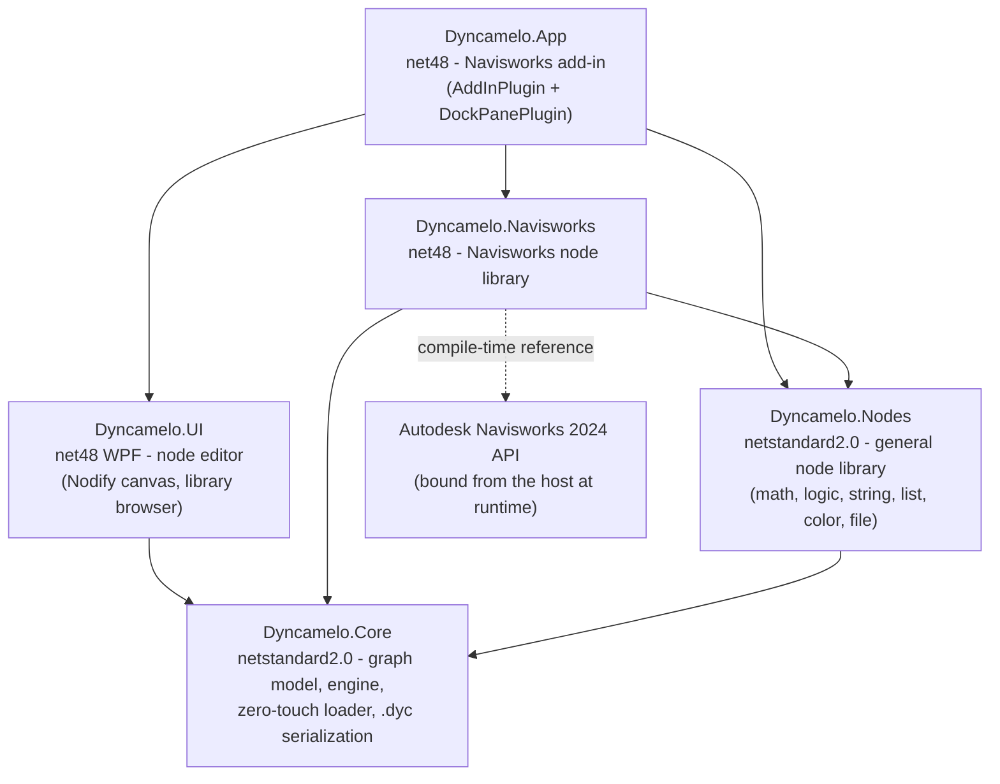

# Dyncamelo

**Dynamo-style visual programming for Autodesk Navisworks.**

<!-- Badges: enabled once CI workflows land in .github/workflows -->
[](https://github.com/mrshoma99-rgb/dyncamelo/actions)
[](https://github.com/mrshoma99-rgb/dyncamelo/actions)
[](LICENSE)
[](#requirements)

Dyncamelo brings the visual-programming workflow that Dynamo made famous in Revit to **Autodesk Navisworks 2024**. Wire nodes together on a canvas, watch data flow from outputs into inputs, and let the dataflow engine run your graph against the live Navisworks document — no code, no macros, no SDK boilerplate.

> Search a federated model by property, color-code it by system, bulk-create selection sets, dump quantities to CSV, triage clashes by rule, and batch-generate viewpoints — as reusable, shareable `.dyc` graph files.

<!-- SCREENSHOT PLACEHOLDER: replace with a canvas screenshot once the editor is running in Navisworks.

-->
*Screenshot coming soon — the editor is under active development.*

---

## What's new in 0.3 — the "plugin parity" wave

- **Custom property tabs** — `Properties.SetCustom` writes user-defined, searchable, schedulable property tabs that travel with the NWF/NWD; with lacing and `Table.JoinByKey` this is spreadsheet→model data enrichment (iConstruct SmartProperties territory).
- **Native Excel** — `Excel.ReadFromFile` / `Excel.WriteToFile` handle .xlsx directly, zero new dependencies, headless-capable.
- **BCF 2.1 exchange** — export clash results/viewpoints as .bcfzip issues and import them back: the vendor-neutral bridge to BIMcollab, Newforma Konekt, Revizto and ACC Coordination.
- **Clash management** — batch rename tests/results, comments on results, grouping by status or by the model's own grid ("B-3 : Level 2"), a one-node summary matrix, and between-run **clash delta snapshots** (new / resolved / persisting).
- **Transforms & distance** — move/rotate/reset permanent transform overrides; true mesh surface-to-surface `Distance.BetweenItems` with witness points.
- **Tree ops & comments** — rename viewpoints/sets, nested folders, move-to-folder, and full Review-tab comment threads on viewpoints, sets and clash items.
- **Document lifecycle** — open/append/refresh/merge/remove-model nodes: the Navisworks Batch Utility as a three-node headless graph.
- **Grids, zones, 4D** — read levels/grid intersections, one-node zone tagging, and TimeLiner auto-attach by property.

**50 new nodes** (see the [full changelog](docs/WHATS_NEW_0.3.md)); v0.2 brought the editor quality-of-life wave and doubled the library ([WHATS_NEW_0.2.md](docs/WHATS_NEW_0.2.md)).

## Features

- **Dynamo-like editor** — a node canvas (built on [Nodify](https://github.com/miroiu/nodify)) docked inside Navisworks: searchable node library, drag-to-wire connectors, pan/zoom, notes, watch nodes.
- **Real dataflow engine** — eager evaluation, topological execution, and dirty propagation: change one slider and only its downstream nodes re-run. Manual and Automatic run modes.
- **Replication ("lacing")** — feed a list into a scalar input and the node maps over it, exactly like Dynamo: Shortest by default, Longest and Cross-Product per node.
- **Robust by design** — a failing node surfaces a per-node Warning/Error state; it never crashes the graph run or Navisworks.
- **Deep Navisworks node library** — properties/QTO extraction and custom property writing, Find-Items-grade search, selection sets, color/transparency/hide overrides, transforms, saved viewpoints, clash triage/grouping/deltas, BCF 2.1 exchange, grids, TimeLiner, CSV/Excel/report export. See the full [node catalog](docs/NODE_LIBRARY.md) (250+ nodes implemented as of v0.3).
- **Zero-touch extensibility** — write a `public static` C# method, tag it with `[NodeName]`/`[NodeCategory]`, drop the DLL in the Packages folder, and it appears in the library. No base classes required. See [Extending Dyncamelo](docs/EXTENDING.md).
- **Portable graphs** — graphs are saved as versioned JSON (`.dyc`) that is friendly to diffing and source control.
- **Proprietary** — © 2026 BIMCamel, all rights reserved. Third-party components ship under their own permissive licenses (see [THIRD-PARTY-NOTICES.md](THIRD-PARTY-NOTICES.md)).

## Architecture at a glance



`Dyncamelo.Core` and `Dyncamelo.Nodes` have **zero** UI or Navisworks dependencies — they compile and test anywhere (including Linux CI). Everything Navisworks-specific lives in `Dyncamelo.Navisworks`; everything WPF lives in `Dyncamelo.UI`/`Dyncamelo.App`. Details in [docs/ARCHITECTURE.md](docs/ARCHITECTURE.md).

## Requirements

- **To run:** Autodesk Navisworks Manage or Simulate **2024** on Windows.
- **To build:** Windows 10/11 with **Visual Studio 2022** (with ".NET desktop development" workload) or the **.NET 8 SDK**. No Navisworks installation is needed to build — the Navisworks API is referenced through compile-time-only NuGet packages.

## Quick start

### 1. Build from source (Windows)

```powershell
git clone https://github.com/mrshoma99-rgb/dyncamelo.git
cd dyncamelo
dotnet build Dyncamelo.sln -c Release
dotnet test Dyncamelo.sln -c Release
```

Or open `Dyncamelo.sln` in Visual Studio 2022 and build the `Release` configuration.

> **Linux/macOS note:** `Dyncamelo.Core`, `Dyncamelo.Nodes`, `Dyncamelo.Navisworks`, and the test projects build off-Windows (netstandard2.0/net8.0; the Navisworks library compiles against reference assemblies). The WPF projects (`Dyncamelo.UI`, `Dyncamelo.App`) require Windows, so `dotnet build Dyncamelo.sln` only succeeds there; CI builds the full solution on `windows-latest` and the non-WPF projects on `ubuntu-latest`:
>
> ```bash
> dotnet build src/Dyncamelo.Core/Dyncamelo.Core.csproj
> dotnet build src/Dyncamelo.Nodes/Dyncamelo.Nodes.csproj
> dotnet build src/Dyncamelo.Navisworks/Dyncamelo.Navisworks.csproj
> dotnet build src/Dyncamelo.Cli/Dyncamelo.Cli.csproj
> dotnet test tests/Dyncamelo.Core.Tests/Dyncamelo.Core.Tests.csproj
> dotnet test tests/Dyncamelo.Nodes.Tests/Dyncamelo.Nodes.Tests.csproj
> dotnet test tests/Dyncamelo.Integration.Tests/Dyncamelo.Integration.Tests.csproj
> ```
>
> You can also run headless graphs (no Navisworks needed) with the cross-platform CLI:
>
> ```bash
> dotnet run --project src/Dyncamelo.Cli -- run samples/hello-math.dyc
> ```
> See [samples/README.md](samples/README.md) for the bundled example graphs.

### 2. Install into Navisworks 2024

Copy the build output of `Dyncamelo.App` into a plugin folder named **exactly like the plugin assembly**:

```
C:\Program Files\Autodesk\Navisworks Manage 2024\Plugins\Dyncamelo.App\
    Dyncamelo.App.dll
    Dyncamelo.UI.dll
    Dyncamelo.Navisworks.dll
    Dyncamelo.Nodes.dll
    Dyncamelo.Core.dll
    Nodify.dll
    Newtonsoft.Json.dll
```

(Adjust the path for Navisworks Simulate. A packaged installer/release zip is on the [roadmap](docs/IMPLEMENTATION_PLAN.md).)

### 3. Open the editor

Start Navisworks 2024, open a model, and launch **Dyncamelo** from the **BIMCamel** ribbon tab (application-bundle install — see [`dist/README.md`](dist/README.md)) or from the *Tool add-ins* tab (classic Plugins-folder install). The editor opens as a dockable pane. Now follow the [Getting Started guide](docs/GETTING_STARTED.md) to build your first graph:

> *Find every item whose Material contains "Concrete", color it red, and save it as a selection set* — about six nodes, no code.

## Documentation

| Document | What it covers |
|---|---|
| [Getting Started](docs/GETTING_STARTED.md) | Install, editor tour, your first graph, lacing, saving/loading `.dyc` |
| [Node Library](docs/NODE_LIBRARY.md) | The full node catalog: ports, behavior, Navisworks API mapping, tiers |
| [Architecture](docs/ARCHITECTURE.md) | Projects, engine pipeline, zero-touch loading, `.dyc` format, threading |
| [Extending Dyncamelo](docs/EXTENDING.md) | Write your own node pack; custom NodeModel nodes with custom UI |
| [Implementation Plan](docs/IMPLEMENTATION_PLAN.md) | Vision, milestones M0-M5, engineering decisions, testing strategy, risks |
| [Contributing](CONTRIBUTING.md) | Dev setup, code style, PR workflow |

## Roadmap summary

| Milestone | Theme | Highlights |
|---|---|---|
| **M0 Foundation** | Engine + libraries | Graph model, dataflow engine (dirty propagation, lacing, coercion), zero-touch loader, `.dyc` format, general node library, green tests on Linux |
| **M1 MVP editor** | Editor in Navisworks | Dock pane with Nodify canvas, node browser, run modes, save/load, first Navisworks nodes end-to-end |
| **M2 Full MVP node set** | The 88 MVP nodes | Search, properties/QTO, selection sets, appearance, viewpoints, clash read-out; all reference workflows runnable |
| **M3 Beta** | Depth + reporting | Clash triage writes, TimeLiner, image/CSV report export, node packages loaded from folders |
| **M4 v1.0** | Power + reach | IronPython/Roslyn script nodes, Navisworks 2024-2026 multi-targeting, localization |
| **M5 Community** | Ecosystem | Package manager, sample graph gallery |

Full milestone breakdown with exit criteria and risks: [docs/IMPLEMENTATION_PLAN.md](docs/IMPLEMENTATION_PLAN.md).

## Contributing

Contributions are very welcome — nodes, engine work, docs, sample graphs, bug reports. Start with [CONTRIBUTING.md](CONTRIBUTING.md). Core engine and general-node changes can be developed and tested on any OS; only the WPF editor and the in-host smoke tests need Windows/Navisworks.

## License

Dyncamelo is proprietary software — Copyright (c) 2026 BIMCamel, all rights reserved (see [LICENSE](LICENSE)). Releases up to v0.1.1 were MIT-licensed; that grant remains valid for copies obtained under it. Third-party components: [THIRD-PARTY-NOTICES.md](THIRD-PARTY-NOTICES.md).

Dyncamelo is not affiliated with or endorsed by Autodesk. Autodesk, Navisworks, Revit, and Dynamo are trademarks of Autodesk, Inc. The Autodesk Navisworks API assemblies are referenced at compile time only and are never redistributed with Dyncamelo; at runtime the API is provided by your licensed Navisworks installation.
