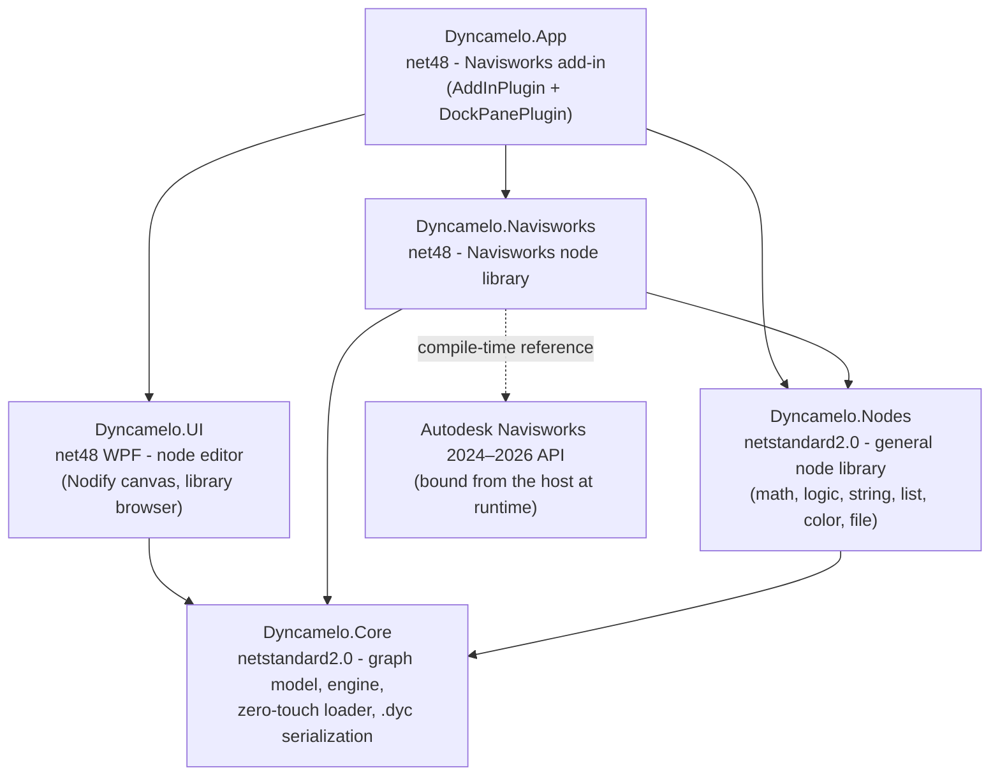

# Dyncamelo

**Dynamo-style visual programming for Autodesk Navisworks.**

[](https://github.com/mrshoma99-rgb/dyncamelo/actions/workflows/build.yml)
[](https://github.com/mrshoma99-rgb/dyncamelo/actions/workflows/release.yml)
[](LICENSE)
[](#requirements)
[](https://github.com/mrshoma99-rgb/dyncamelo/releases/latest)

> ## Part of CamelWorks
> Dyncamelo ships inside **[CamelWorks](https://github.com/mrshoma99-rgb/Camelworks-navisworks-plugin)**,
> which installs it alongside the coordination, data and delivery apps and the
> [BIMCamel IFC exporter](https://github.com/mrshoma99-rgb/bimcamel-ifc-exporter) — one installer,
> one **BIMCamel** ribbon tab. CamelWorks' *Automate ▸ Graphs* tab runs a `.dyc` graph against the
> open document without opening this editor, and opens this editor when one needs changing.
>
> **Install [CamelWorks](https://github.com/mrshoma99-rgb/Camelworks-navisworks-plugin/releases/latest)
> to get all three.** Dyncamelo on its own, from this repository's releases, works exactly as it
> always has — the bundles sit side by side and share the ribbon tab either way.

> ## Source-available — free to use, not to sell
> Dyncamelo is licensed under **Apache 2.0 with the Commons Clause** (see [LICENSE](LICENSE)). In plain words: **use it freely — at home or at work, companies included** — read the source, modify it, contribute, and share it for free. What you may **not** do is *sell* it: selling Dyncamelo itself, or a product or service whose value derives substantially from it, requires a written agreement with BIMCamel. (Because of the selling restriction this is "source-available" rather than OSI-certified open source.)

Dyncamelo brings the visual-programming workflow that Dynamo made famous in Revit to **Autodesk Navisworks 2024, 2025 & 2026**. Wire nodes together on a canvas, watch data flow from outputs into inputs, and let the dataflow engine run your graph against the live Navisworks document — no code, no macros, no SDK boilerplate.

> Search a federated model by property, color-code it by system, bulk-create selection sets, dump quantities to CSV, triage clashes by rule, and batch-generate viewpoints — as reusable, shareable `.dyc` graph files.

<!-- SCREENSHOT PLACEHOLDER: replace with a canvas screenshot once the editor is running in Navisworks.

-->
*Screenshot coming soon — the editor is under active development.*

---

## What's new in v0.12–v0.23 — site safety & spatial analysis

- **Fall-hazard analysis suite** — `FallHazard.FloorOpeningMap` renders a whole-floor heat map of openings from the real model mesh (limit-pivoting gradient, user colours, printed gap-over-limit labels, one saved viewpoint per flagged opening), and `FallHazard.EdgeHandrailCheck` classifies every edge around a void as **dangerous / protected / safe** — with real handrail length-along-edge coverage, a min-passage rule, user colours and printed overages for reports. Both take a **`units`** input so metre inputs stay honest in feet-based documents.
- **Spatial clustering** — `Proximity.Cluster` groups touching geometry into logical elements (a ladder made of loose shapes becomes ladder #1, #2, …), stamps each item's number as a searchable custom property in the same run, and has a precise `mesh` mode that confirms every connection with the Clash engine's exact clearance.
- **Viewpoint intelligence & markups** — `Viewpoint.VisibleItems` answers "does this view actually show these elements?" (camera-frustum test, flexible set/list/name inputs); the experimental `Markup.*` nodes draw text, arrows, ellipses, clouds and numbered tag substitutes onto saved viewpoints via the hidden Navisworks redline API.
- **Color toolkit** — seeded `Color.Random` / `Color.RandomList` (stable across re-runs, golden-angle distinct), `Color.Gradient` between two colors, and `Color.ByValues` + `Appearance.ColorByValues` for one-node color-coding by parameter value with a legend.
- **Ordering, the industry way** — `Flow.Then` pins the execution order of side-effect nodes as a real data dependency (the Dynamo Passthrough pattern); a Captured Selection node snapshots the live selection and replays it every run.
- **Editor quality of life** — Space-bar quick node search at the cursor, port tooltips generated from the API docs on all **314 nodes**, an inline **Watch Image** node for the analysis PNGs, an index gutter on Watch List, click-to-expand preview bubbles, a proper Boolean switch, and Create/Modify/Info grouping with symbols throughout the library.
- **One BIMCamel ribbon** — a single tab shared with the IFC exporter, unified About window, and an update check when the editor opens.

Full details in [docs/WHATS_NEW_0.23.md](docs/WHATS_NEW_0.23.md). Earlier waves: v0.10–0.11 universal loops, live element preview & viewpoint organizing; v0.4 instant library search & curated samples; v0.3 "plugin parity"; v0.2 editor quality-of-life — see [docs/](docs/).

## Features

- **Dynamo-like editor** — a node canvas (built on [Nodify](https://github.com/miroiu/nodify)) docked inside Navisworks: searchable node library, drag-to-wire connectors, pan/zoom, notes, watch nodes.
- **Real dataflow engine** — eager evaluation, topological execution, and dirty propagation: change one slider and only its downstream nodes re-run. Manual and Automatic run modes.
- **Replication ("lacing")** — feed a list into a scalar input and the node maps over it, exactly like Dynamo: Shortest by default, Longest and Cross-Product per node.
- **Robust by design** — a failing node surfaces a per-node Warning/Error state; it never crashes the graph run or Navisworks.
- **Per-item workflows** — a universal loop (`Loop.Item` → body → `Loop.Collect`) runs any nodes once per item, in order, so stateful "isolate → zoom → save viewpoint → next" jobs work with the real nodes, not just pure data mapping. `Flow.Then` pins side-effect order explicitly when two writes must happen in sequence.
- **Spatial & safety analysis** — fall-hazard heat maps and edge/handrail classification straight from the model mesh, touching-geometry clustering with custom-property stamping, camera-frustum visibility tests, and exact clash-engine distances.
- **Deep Navisworks node library** — properties/QTO extraction and custom property writing, Find-Items-grade search, selection sets, color/transparency/hide overrides (permanent and viewpoint-scoped), transforms, saved viewpoints (incl. experimental redline markups), IFC export, clash triage/grouping/deltas, BCF 2.1 exchange, grids, TimeLiner, CSV/Excel/report export. See the full [node catalog](docs/NODE_LIBRARY.md) (**314 nodes across 37 categories**, machine-inventoried in [docs/dyncamelo-nodes.json](docs/dyncamelo-nodes.json)).
- **Zero-touch extensibility** — write a `public static` C# method, tag it with `[NodeName]`/`[NodeCategory]`, drop the DLL in the Packages folder, and it appears in the library. No base classes required. See [Extending Dyncamelo](docs/EXTENDING.md).
- **Portable graphs** — graphs are saved as versioned JSON (`.dyc`) that is friendly to diffing and source control.
- **Source-available** — Apache 2.0 + Commons Clause: free to use, including commercially at work; only *selling* Dyncamelo or products built from it is reserved to BIMCamel. Third-party components ship under their own permissive licenses (see [THIRD-PARTY-NOTICES.md](THIRD-PARTY-NOTICES.md)).

## Part of the BIMCamel toolset

- **[CamelWorks](https://github.com/mrshoma99-rgb/Camelworks-navisworks-plugin)** — the coordination,
  data and delivery suite: clash, issues, model audit, revision compare, properties, quantities,
  sets, exports and the site tools. **It ships Dyncamelo and the IFC exporter inside its own
  installer**, so one download puts all three on one ribbon tab, and its Automate ▸ Graphs tab runs
  Dyncamelo graphs without opening the editor.
- **[BIMCamel IFC Exporter](https://github.com/mrshoma99-rgb/bimcamel-ifc-exporter)** — free, fast
  **Navisworks → IFC** export (IFC4 / IFC2x3): streaming engine, geometry instancing, property
  sets, classifications and georeferencing. Website:
  [bimcamel.com/Export-Navisworks-to-Ifc](https://www.bimcamel.com/Export-Navisworks-to-Ifc).
  Both plug-ins install the same way and share the **BIMCamel** ribbon tab when installed together.
- **[bimcamel.com](https://www.bimcamel.com)** — browser-based IFC tools (validate, compare,
  upgrade / downgrade schema…).

## Architecture at a glance


```mermaid
graph TD
    APP["Dyncamelo.App<br/>net48 - Navisworks add-in<br/>(AddInPlugin + DockPanePlugin)"]
    UI["Dyncamelo.UI<br/>net48 WPF - node editor<br/>(Nodify canvas, library browser)"]
    NAV["Dyncamelo.Navisworks<br/>net48 - Navisworks node library"]
    NODES["Dyncamelo.Nodes<br/>netstandard2.0 - general node library<br/>(math, logic, string, list, color, file)"]
    CORE["Dyncamelo.Core<br/>netstandard2.0 - graph model, engine,<br/>zero-touch loader, .dyc serialization"]

    APP --> UI
    APP --> NAV
    APP --> NODES
    UI --> CORE
    NAV --> CORE
    NAV --> NODES
    NODES --> CORE

    NWAPI["Autodesk Navisworks 2024–2026 API<br/>(bound from the host at runtime)"]
    NAV -.compile-time reference.-> NWAPI
```

`Dyncamelo.Core` and `Dyncamelo.Nodes` have **zero** UI or Navisworks dependencies — they compile and test anywhere (including Linux CI). Everything Navisworks-specific lives in `Dyncamelo.Navisworks`; everything WPF lives in `Dyncamelo.UI`/`Dyncamelo.App`. Details in [docs/ARCHITECTURE.md](docs/ARCHITECTURE.md).

## Requirements

- **To run:** Autodesk Navisworks Manage or Simulate **2024, 2025, or 2026** on Windows.
- **To build:** Windows 10/11 with **Visual Studio 2022** (with ".NET desktop development" workload) or the **.NET 8 SDK**. No Navisworks installation is needed to build — the Navisworks API is referenced through compile-time-only NuGet packages.

## Install (recommended)

Download **[`DyncameloSetup.exe`](https://github.com/mrshoma99-rgb/dyncamelo/releases/latest)** from the latest release and run it. The graphical installer places the bundle in `%APPDATA%\Autodesk\ApplicationPlugins` (per-user, no admin rights) and registers an Add/Remove Programs entry. If Windows SmartScreen appears (unsigned download), choose **More info → Run anyway**. Start Navisworks 2024/2025/2026 and open **Dyncamelo** from the **BIMCamel** ribbon tab.

Silent install/uninstall: `DyncameloSetup.exe /silent` and `DyncameloSetup.exe /uninstall /silent`.

## Build from source (Windows)

```powershell
git clone https://github.com/mrshoma99-rgb/dyncamelo.git
cd dyncamelo
dotnet build Dyncamelo.sln -c Release
dotnet test Dyncamelo.sln -c Release
```

Or open `Dyncamelo.sln` in Visual Studio 2022 and build the `Release` configuration.

> **Linux/macOS note:** `Dyncamelo.Core`, `Dyncamelo.Nodes`, `Dyncamelo.Navisworks`, and the test projects build off-Windows (netstandard2.0/net8.0; the Navisworks library compiles against reference assemblies). The WPF projects (`Dyncamelo.UI`, `Dyncamelo.App`) require Windows, so `dotnet build Dyncamelo.sln` only succeeds there; CI builds the full solution on `windows-latest` and the non-WPF projects on `ubuntu-latest`:
>
> ```bash
> dotnet build src/Dyncamelo.Core/Dyncamelo.Core.csproj
> dotnet build src/Dyncamelo.Nodes/Dyncamelo.Nodes.csproj
> dotnet build src/Dyncamelo.Navisworks/Dyncamelo.Navisworks.csproj
> dotnet build src/Dyncamelo.Cli/Dyncamelo.Cli.csproj
> dotnet test tests/Dyncamelo.Core.Tests/Dyncamelo.Core.Tests.csproj
> dotnet test tests/Dyncamelo.Nodes.Tests/Dyncamelo.Nodes.Tests.csproj
> dotnet test tests/Dyncamelo.Integration.Tests/Dyncamelo.Integration.Tests.csproj
> ```
>
> You can also run headless graphs (no Navisworks needed) with the cross-platform CLI:
>
> ```bash
> dotnet run --project src/Dyncamelo.Cli -- run samples/hello-math.dyc
> ```
> See [samples/README.md](samples/README.md) for the bundled example graphs.

To run a source build in Navisworks without the installer, use the application-bundle layout under `%APPDATA%\Autodesk\ApplicationPlugins\Dyncamelo.bundle` (see [`dist/README.md`](dist/README.md)); the released `DyncameloSetup.exe` sets this up for you.

## Your first graph

Open a model in Navisworks and launch **Dyncamelo** from the **BIMCamel** ribbon tab — the editor opens as a dockable pane. Then follow the [Getting Started guide](docs/GETTING_STARTED.md):

> *Find every item whose Material contains "Concrete", color it red, and save it as a selection set* — about six nodes, no code.

## Documentation

| Document | What it covers |
|---|---|
| [Getting Started](docs/GETTING_STARTED.md) | Install, editor tour, your first graph, lacing, saving/loading `.dyc` |
| [Node Library](docs/NODE_LIBRARY.md) | The full node catalog: ports, behavior, Navisworks API mapping, tiers |
| [Architecture](docs/ARCHITECTURE.md) | Projects, engine pipeline, zero-touch loading, `.dyc` format, threading |
| [Extending Dyncamelo](docs/EXTENDING.md) | Write your own node pack; custom NodeModel nodes with custom UI |
| [Implementation Plan](docs/IMPLEMENTATION_PLAN.md) | Vision, milestones M0-M5, engineering decisions, testing strategy, risks |
| [Contributing](CONTRIBUTING.md) | Dev setup, code style, PR workflow |

## Roadmap summary

| Milestone | Theme | Highlights |
|---|---|---|
| **M0 Foundation** | Engine + libraries | Graph model, dataflow engine (dirty propagation, lacing, coercion), zero-touch loader, `.dyc` format, general node library, green tests on Linux |
| **M1 MVP editor** | Editor in Navisworks | Dock pane with Nodify canvas, node browser, run modes, save/load, first Navisworks nodes end-to-end |
| **M2 Full MVP node set** | The 88 MVP nodes | Search, properties/QTO, selection sets, appearance, viewpoints, clash read-out; all reference workflows runnable |
| **M3 Beta** | Depth + reporting | Clash triage writes, TimeLiner, image/CSV report export, node packages loaded from folders |
| **M4 v1.0** | Power + reach | IronPython/Roslyn script nodes, Navisworks 2024-2026 multi-targeting, localization |
| **M5 Community** | Ecosystem | Package manager, sample graph gallery |

Full milestone breakdown with exit criteria and risks: [docs/IMPLEMENTATION_PLAN.md](docs/IMPLEMENTATION_PLAN.md).

## Feedback

Dyncamelo is developed by BIMCamel and is open to the community: bug reports, feature requests and pull requests are all welcome. Open a [GitHub issue](https://github.com/mrshoma99-rgb/dyncamelo/issues), read [CONTRIBUTING.md](CONTRIBUTING.md) before sending a PR, or reach us at [bimcamel.com](https://www.bimcamel.com/plugins/dyncamelo).

## License

Dyncamelo is **source-available** under the **Apache License 2.0 with the Commons Clause** (see [LICENSE](LICENSE)): you may use it freely — personally and professionally, companies included — modify it, and redistribute it for free, but the right to **sell** the software, or any product or service whose value derives substantially from it, is reserved to BIMCamel (contact us for a commercial agreement). Licensing history: releases up to v0.1.1 were MIT-licensed and v0.1.2–v0.26.1 were proprietary; each grant applies to copies obtained while it was in effect. Third-party components ship under their own licenses: [THIRD-PARTY-NOTICES.md](THIRD-PARTY-NOTICES.md).

Dyncamelo is not affiliated with or endorsed by Autodesk. Autodesk, Navisworks, Revit, and Dynamo are trademarks of Autodesk, Inc. The Autodesk Navisworks API assemblies are referenced at compile time only and are never redistributed with Dyncamelo; at runtime the API is provided by your licensed Navisworks installation.
