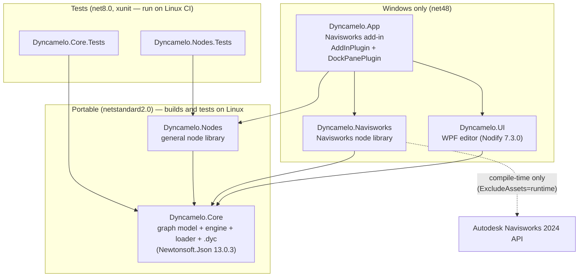
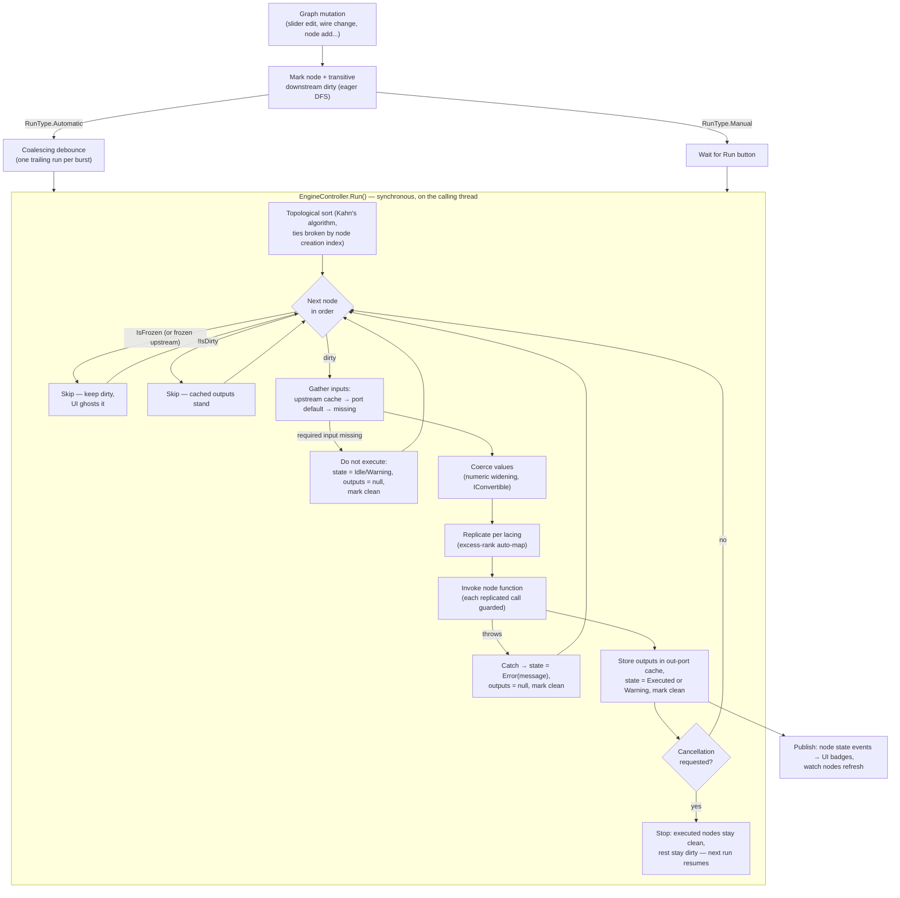

# Dyncamelo Architecture

How Dyncamelo is put together: the solution layout, the graph model, the execution engine pipeline, zero-touch node loading, the `.dyc` file format, the threading model, and the extension points. The milestone plan and rationale for the decisions below live in [IMPLEMENTATION_PLAN.md](IMPLEMENTATION_PLAN.md).

---

## 1. Solution layout and dependencies

Five projects, strictly layered. The rule that generates the whole structure: **the engine knows nothing about Navisworks or WPF, and node libraries know nothing about the editor.**



| Project | Target | Contents | May reference |
|---|---|---|---|
| `Dyncamelo.Core` | netstandard2.0 | `NodeModel`, ports, connectors, workspace; execution engine; replication; coercion; zero-touch loader; `.dyc` serializer; core value types (`Point`, `Vector`, `BoundingBox`, `Color`) | Newtonsoft.Json only |
| `Dyncamelo.Nodes` | netstandard2.0 | General-purpose zero-touch nodes (Math, Logic, String, List, Dictionary, Color, DateTime, File/CSV, Geometry) and UI-agnostic interactive `NodeModel`s (sliders, Watch, Note, List.Create) | Core only |
| `Dyncamelo.Navisworks` | net48 | All Navisworks nodes; boundary converters (Core geometry ↔ `Point3D`/`Vector3D`/`BoundingBox3D`/`Api.Color`); transaction/undo scoping host | Core + compile-time Navisworks API packages |
| `Dyncamelo.UI` | net48, WPF | Nodify canvas, node library browser, inline editors/views for interactive nodes, run controls, state badges | Core (+ Nodes for interactive-node view models) |
| `Dyncamelo.App` | net48, WPF | `AddInPlugin` (ribbon entry), `DockPanePlugin` (hosts the editor), composition root: loads node libraries, wires engine to document events | everything above |

The Navisworks API is provided at compile time by `Speckle.Navisworks.API 2024.0.0` and `Chuongmep.Navis.Api.Autodesk.Navisworks.Timeliner 2023.0.7`, both with `ExcludeAssets="runtime"`; at runtime the add-in binds the genuine assemblies of the host Navisworks installation (they are not strong-named, so the 2023-surface TimeLiner reference binds to the host's 2024 DLL — caveat tracked in the [plan](IMPLEMENTATION_PLAN.md#9-known-caveats-tracked-honestly)). `Microsoft.NETFramework.ReferenceAssemblies` (`PrivateAssets="all"`) lets the net48 projects compile with the .NET 8 SDK on Linux.

## 2. Graph model (`Dyncamelo.Core`)

The workspace is a directed acyclic graph:

- **`NodeModel`** — one node instance. Owns `InPort[]` / `OutPort[]`, a `LacingStrategy` (`Auto`/`Shortest`/`Longest`/`CrossProduct`), `IsDirty`, `IsFrozen`, a `NodeState` (`Idle`/`Executed`/`Warning`/`Error` + message), canvas position, and a stable creation index (used for deterministic execution order). Zero-touch nodes are wrapped by a generic `NodeModel` produced by the loader; interactive nodes subclass `NodeModel` directly.
- **Ports** — typed. An **input port** carries: name, advisory CLR type, declared rank (inferred from the type, §4), optional default value (from an optional parameter), and *at most one* incoming connector (Dynamo rule). An **output port** carries name, type, and the **value cache** — the last computed value, which is the only channel between nodes.
- **`Connector`** — joins exactly one out-port to one in-port. At connect time the workspace runs a reverse DFS from the source node; if the target is reachable, the connector would create a cycle and is **rejected at connect time** — cycles can never reach the engine.
- **Annotations** — notes/groups; persisted, never executed.

**Mutation = dirty.** Any of: editing an interactive node's value, connecting/disconnecting a port, adding a node, changing lacing, un-freezing, deleting a node (which dirties every consumer of its outputs). The mutating operation immediately sets `IsDirty = true` on the affected node **and on all transitive downstream nodes** (a simple, idempotent DFS over connectors). Propagation happens eagerly at mutation time — not at run time — so "what will re-run" is always inspectable and the UI can ghost/badge pending nodes cheaply.

## 3. Engine pipeline

The engine is a direct interpreter — no AST, no VM. One run:



Contract worth stating twice: **changing one slider re-executes exactly that slider's node and its transitive downstream — nothing else.** Cached out-port values serve every clean node.

Other engine rules:

- **Never throw out of the run loop.** Every per-node exception becomes that node's `Error` state; the run always completes (or cancels cleanly).
- **Cancellation** is checked *between* nodes, never inside one. A cancelled run leaves executed nodes clean and the rest dirty, so the next run resumes correctly with no extra bookkeeping.
- **Freeze**: a frozen node and everything downstream is excluded from execution; their dirty flags are preserved and the UI shows them ghosted with stale values (Dynamo behavior).
- **Run modes**: `RunType { Manual, Automatic }` per workspace (enum kept extensible for a future `Periodic`). Automatic requests a run on every dirty-marking mutation through a coalescing debounce, so a slider drag yields one trailing run.

## 4. Replication ("lacing")

Replication is what makes a scalar node work on lists without a loop node.

- **Rank** of a value: scalar = 0, `List<object>` = 1, list of lists = 2, ...
- **Declared rank** of an input port is inferred from the zero-touch parameter type: `double`/`string`/`ModelItem` → 0; `IList<T>`/`IEnumerable<T>`/`List<T>` → 1; `IList<IList<T>>` → 2. `Dictionary<string, object>` → 0 (one value).
- **Excess rank** = actual rank − declared rank, floored at 0. **Replication happens only over excess rank** — this is exactly why `List.Count(List<object>)` consumes the whole list unmapped while `Math.Round(double)` maps over the same list.
- **Auto-map (one replicated input):** invoked once per element along the excess dimensions; results collected preserving nesting (recursive — a rank-2 list into a rank-0 port yields a rank-2 result). A `null` element yields a `null` result element plus a node **Warning**; the other elements still compute.
- **Multiple replicated inputs** — the node's `LacingStrategy` pairs them; rank-0 (non-excess) arguments are **broadcast** unchanged to every invocation:

| Strategy | Pairing | `[1,2,3] + [10,20]` |
|---|---|---|
| **Shortest** (default; `Auto` aliases it) | zip; length = min | `[11, 22]` |
| **Longest** | zip; shorter list repeats its **last element** (an empty list cannot extend → empty output + Warning) | `[11, 22, 23]` |
| **Cross-Product** | nested loops; **leftmost replicated port is the outermost loop**; depth grows by (replicated inputs − 1) | `[[11,21,31],[12,22,32]]` |

- **Coercion** applies per invocation: numeric widening (`int → double`), `IConvertible` conversions, `object` accepts anything. Coercion failure → node Warning/Error per case, never a crash.

## 5. Zero-touch node loading

A node library is a plain assembly. The loader reflects over it and turns attributed `public static` methods into node definitions:

```csharp
namespace MyPack;

public static class Concrete
{
    [NodeName("Concrete.BarWeight")]
    [NodeCategory("MyPack.Concrete")]
    [NodeDescription("Weight in kg of a rebar of the given diameter and length.")]
    public static double BarWeight(double diameterMm, double lengthM, double density = 7850)
    {
        double areaM2 = Math.PI * Math.Pow(diameterMm / 2000.0, 2);
        return areaM2 * lengthM * density;
    }
}
```

Loader rules:

- **Discovery**: public static methods carrying `[NodeName]` in public static classes. `[NodeCategory]` places the node in the library tree; `[NodeDescription]` becomes the tooltip/help text.
- **Ports**: each parameter becomes an input port (name = parameter name, advisory type = parameter type, declared rank inferred per §4). **Optional parameters become defaulted ports** — unconnected, they supply their default; connected, the wire wins. The return value becomes the output port.
- **Multi-output**: a method returning `Dictionary<string, object>` and tagged `[MultiReturn("a", "b")]` gets one output port per named key.
- **Document defaulting**: in `Dyncamelo.Navisworks`, `Document` parameters resolve to the active document when unconnected, so most graphs never wire `Document.Current` explicitly.
- **Isolation**: a library that fails to load (bad image, missing dependency, duplicate node names) is reported and skipped — it never takes down the editor. Duplicate `[NodeName]`s within one load are rejected with a clear message.
- **Sources**: built-in libraries (`Dyncamelo.Nodes`, `Dyncamelo.Navisworks`) are loaded by `Dyncamelo.App` at startup; from M3, `%APPDATA%\Dyncamelo\Packages\<PackName>\` folders are scanned the same way (see [EXTENDING.md](EXTENDING.md)).

Interactive nodes (sliders, Watch, Note, `List.Create`'s growable ports, Color Picker, File Path) can't be expressed as a static function; they subclass `NodeModel` in Core/Nodes and get a WPF view in `Dyncamelo.UI` via `DataTemplate` (§8, extension point 4).

## 6. The `.dyc` file format

A `.dyc` file is a versioned JSON envelope (UTF-8, Newtonsoft.Json). Shape of format version 1.0 (the Core serializer is normative; this documents the contract):

```json
{
  "formatVersion": "1.0",
  "appVersion": "0.1.0",
  "id": "3f2b7c9e-8d41-4c2a-9f1e-5a6b7c8d9e0f",
  "name": "Color concrete red",
  "description": "",
  "runType": "Manual",
  "nodes": [
    {
      "id": "a1b2c3d4-0001-4000-8000-000000000001",
      "type": "Dyncamelo.Nodes.Input.StringInput",
      "kind": "nodeModel",
      "name": "String",
      "x": 120.0,
      "y": 240.0,
      "lacing": "Shortest",
      "isFrozen": false,
      "data": { "value": "Concrete" }
    },
    {
      "id": "a1b2c3d4-0002-4000-8000-000000000002",
      "type": "Dyncamelo.Navisworks.SearchNodes.ByPropertyContains@Dyncamelo.Navisworks",
      "kind": "zeroTouch",
      "name": "Search.ByPropertyContains",
      "x": 420.0,
      "y": 240.0,
      "lacing": "Shortest",
      "isFrozen": false,
      "data": {}
    }
  ],
  "connectors": [
    {
      "id": "c0000001-0000-4000-8000-000000000001",
      "fromNode": "a1b2c3d4-0001-4000-8000-000000000001",
      "fromPort": "text",
      "toNode": "a1b2c3d4-0002-4000-8000-000000000002",
      "toPort": "value"
    }
  ],
  "annotations": [
    { "id": "d0000001-0000-4000-8000-000000000001", "kind": "note", "x": 100.0, "y": 120.0, "text": "Find all concrete and color it red" }
  ]
}
```

Contract notes:

- **`formatVersion`** governs the schema; **`appVersion`** records the writer (diagnostics only).
- **Node identity**: `kind` distinguishes zero-touch entries (`type` = declaring type + method, `@assembly-simple-name`) from `NodeModel` entries (`type` = CLR type name). Renamed nodes ship with a mapping table so old graphs load.
- **`data`** is the node's own state bag: interactive values (slider value/min/max/step, string text, color, note text, `List.Create` port count). Zero-touch nodes usually persist `{}` — their behavior is fully defined by wiring plus port defaults.
- **Ports are referenced by name**, not index — adding a defaulted parameter to a node does not break existing graphs.
- **Tolerant reader**: unknown properties are ignored (not fatal); missing optional properties get defaults; a node whose `type` cannot be resolved (missing pack) loads as an **unresolved placeholder** that is preserved on save. Out-port values are *not* persisted — a loaded graph is fully dirty and computes fresh on first run.
- Everything culture-invariant; GUIDs lowercase; canvas coordinates are doubles in device-independent units.

## 7. Threading model

The full statement lives in the [plan, §7](IMPLEMENTATION_PLAN.md#7-threading-model); the architecture-level summary:

1. All Navisworks API calls happen on the **host main thread** — the API is not thread-safe.
2. The engine is **synchronous on the calling thread**: no worker threads, no parallel node execution.
3. The editor triggers runs from its WPF **dispatcher thread, which is the Navisworks main thread** for a docked pane — so Navisworks nodes execute on the correct thread *by construction*, with no marshalling layer.
4. Responsiveness comes from **cancellation between nodes** and the Automatic-mode **coalescing debounce**, not from background threads.
5. Navisworks **write nodes run inside a transaction/undo scope** owned by the node host in `Dyncamelo.Navisworks` (one undo entry per run); all mutations go through the documented `Document*` edit APIs so the host UI stays in sync.
6. Debug builds **assert the expected thread** at the Navisworks node-host boundary.

## 8. Extension points

Designed-in seams, in increasing order of effort:

1. **A new zero-touch node** — one attributed static method in `Dyncamelo.Nodes` (pure) or `Dyncamelo.Navisworks` (API-touching). No engine, UI, or serializer changes. This is the default way to grow the product.
2. **A node pack** — a separate DLL referencing `Dyncamelo.Core` (and the compile-time Navisworks packages if needed), dropped into `%APPDATA%\Dyncamelo\Packages\<PackName>\` (M3+). Same loader, full error isolation, per-pack enable/disable. Tutorial: [EXTENDING.md](EXTENDING.md).
3. **Custom value types** — nodes may exchange any CLR type; the engine treats unknown types as opaque `object`s (rank 0). Provide a good `ToString()` for Watch.
4. **A custom interactive node** — subclass `NodeModel` (declare ports, persist state into `data`, implement evaluation) and supply a WPF `DataTemplate` in the UI layer keyed by the model type. Sliders/Watch/Note are implemented through exactly this seam — it is proven, not speculative.
5. **Engine consumers** — the engine publishes node-state/run-lifecycle events; the UI's badges/log are one subscriber. Headless hosts (CLI graph runner, future test harnesses) can drive `EngineController` directly since Core has no UI dependency.
6. **Future, planned seams** — script nodes (IronPython/Roslyn NodeModels, M4), Navisworks 2025/2026 compat shims behind `NAVIS*` build constants (M4), the package-manager registry (M5). Each is listed in the [roadmap](IMPLEMENTATION_PLAN.md#3-milestone-roadmap) so current code avoids blocking them.

## 9. Error-handling philosophy

- A node that **throws** → `Error` state with the exception message; run continues; downstream of a failed node does not execute with garbage (missing upstream values behave like unconnected required inputs).
- A **recoverable issue** (property not found, parse failure, divide by zero, empty list in Longest lacing) → `Warning` state, `null` (or documented sentinel like `NaN`) result, run continues. During replication, warnings aggregate ("312 of 5,000 items missing property") instead of spamming.
- The graph run **never crashes the host**. Anything that escapes these rules is a Dyncamelo bug by definition and a release blocker.
