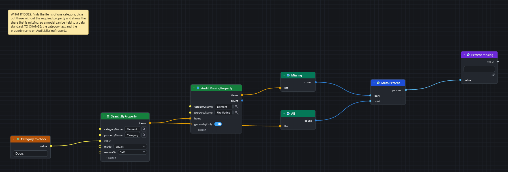

# Recipes by role

Short node chains for the jobs people use CamelGraph for. Each recipe names the nodes (find them with the library search or `Ctrl+Shift+P`) and says what to wire; the sample graphs in [`samples/`](../samples/README.md) show some of them built. Every node named here is in the [node catalogue](NODE_CATALOG.md); a name that is not there fails the check described at the end of this page.

Two ideas make most of these short:

* **A list on a single-value input runs the node once per item** (lacing), so `Properties.Value` wired to a list of items gives a list of values, and `Math.Formula` over a list of numbers gives a list of results.
* **A table is one wire.** `Table.FromRows`, `Table.FromDictionaries`, `Properties.ToTable` and `Table.FromExcelFile` make one; `Table.Filter`, `Table.Sort`, `Table.GroupBy`, `Table.Join` and friends change it; `Watch Table`, `Table.ToExcelFile`, `Table.ToCsvFile`, `Report.Html` and `Table.ToText` show or publish it.

## BIM coordinator

**Clash matrix from selection sets.** `SelectionSets.All` (twice, filtered by name with `List.FilterByValue`) → `ClashTest.Create` with *cross product* lacing: one test per pair of sets.

**Triage and report.** `Clash.Tests` → `Clash.SummaryTable` (clash counts per test and status, as `rows` and `headers`) → `Table.FromRows` → `Report.Html` → `Text.WriteToFile`. Add `Table.Sort` before the report to put the test with the most clashes first. For one test floor by floor, take it with `List.GetItemAtIndex` and use `Clash.GroupResultsByLevel` (it takes the test, your level names and their elevations); `ClashTest.Results` and `Clash.FilterByStatus` work on the results of a test.

**Keep a history.** `DateTime.Now` → `DateTime.Format` for the file name; `Clash.SnapshotToFile` each week, `Clash.CompareSnapshots` against last week's file; `CSV.AppendToFile` adds one row of totals per run instead of overwriting.

**Only act when something is there.** `List.Count` of the new results → `Logic.Compare` (`>` 0) → `Flow.When` → the export or the e-mail step. When the condition is false everything after `Flow.When` is skipped and shown idle, not red.

**Edit a test without re-creating it.** `ClashTest.ByName` → `ClashTest.Duplicate` → `ClashTest.Edit` (tolerance), then `ClashTest.Run`.

## BIM manager

**Data completeness KPI.** `Search.ByProperty` for the category → `Audit.MissingProperty` for the required property → `List.Count` (missing) and `List.Count` (all) → `Math.Percent` → `Watch`.

**What data does this model have?** `Selection.Current` (or a search) → `Properties.Discover` → `Watch Table`: every category and property with how many items carry it and sample values. Use it before writing any search, so names are not guessed.

**Naming rule.** `Properties.ToTable` with the Name and category columns → `Table.Filter` (`regex`, `!matches` or `isEmpty`) → `Watch Table` for the offenders, `Table.ToExcelFile` for the list to send.

**Status colours.** `Logic.Switch` maps a status text to a colour name, and a whole column of statuses to a column of colours (a list on `value` is looked up element by element); or `Color.Palette` (colour-blind safe) with `Appearance.ColorByValues`.

**Track change between two states.** `Model.Snapshot` on the item set (a GUID → property values map) saved with `JSON.WriteToFile`; later `JSON.ReadFromFile` and `Snapshot.Diff` against a fresh snapshot.

## Model maintainer / compiler

**Compile the newest files.** `Directory.FindFiles` (pattern `*.nwc;*.nwd`, sort *modified*, descending) → `Document.AppendFiles` → `Document.Save`. Put `Flow.Try` after a risky step so one bad file is logged with `Log.Write` instead of stopping the run.

**Keep a log.** `Log.Write` appends a time-stamped line (`INFO`, `WARN`, `ERROR`); feed it the message from `String.Format` (`{0} files appended in {1} s`).

**Housekeeping on disk.** `File.Info` (size, modified) for a report, `File.Copy` / `File.Move` for archiving, `Zip.Create` for the deliverable. These change files, so the Script Player asks before running a script that holds them.

**Sets and views.** `SelectionSet.Info` (kind, item count) over `SelectionSets.All` finds empty or stale sets; `SelectionSet.Duplicate` and `SavedViewpoint.Update` re-use what exists.

## Automation and bulk actions

**One script, many inputs.** Give the script *input nodes* (`Number`, `Integer`, `Date`, `Choice`, `File Path`, `Directory Path`) and open it in the **Script Player**: the form is built from them, the values are remembered, and the same script runs from the ribbon, the Player or `CamelGraph.Run.DYNC` (Automation API / Batch Utility).

**Run another program, call a service.** `System.Run` (exit code, output, error) and `Web.Get` / `Web.Post` (status, body); both need `Flow.Try` around them if a failure should not stop the graph. `Flow.Wait` gives an external tool time to finish writing.

**Pick the branch.** `Logic.Choose` (by position) or `Logic.Switch` (by matching value) for more than two ways; `If` for two. They only pick a value: every branch is computed whichever is picked, so to skip nodes use `Flow.When`.

## Open BIM integration

**IFC GlobalId bridge.** `ModelItem.IfcGuid` gives an item's 22-character IFC GlobalId; `IFC.GuidDecode` / `IFC.GuidEncode` convert to and from the standard GUID other tools use; `Search.ByGuid` finds the items for a list of either form (the ones it could not find come out of a second socket).

**COBie / classification sheets.** `Table.FromExcelFile` → `Table.Join` against `Properties.ToTable` on the GUID column → `Properties.SetCustom` per row writes the classification onto the items.

**IDS-style requirement check.** A requirements sheet (category, property, expected pattern) read with `Table.FromExcelFile`; for each row `Search.ByProperty` + `List.FilterByValue` (`regex`) → failing items to `Table.ToExcelFile` with the reason.

## Model data and quantities

**Quantity take-off.** `Search.ByProperty` → `Properties.ToTable` (`@Name`, `Item.Category`, `Length`, `Area`) → `Table.GroupBy` (by category; `count`, `sum:Length`, `sum:Area`) → `Table.Sort` → `Table.ToExcelFile`. `Table.AddFormulaColumn` adds a column such as `Length * Width / 1000000`.

**Cross-tab.** `Table.Pivot` with rows = level, columns = status and *count*: clashes (or items) by level and status.

**Distribution.** `List.Histogram` for the bins, `List.Statistics` for count / min / max / average / median in one node, `List.CountValues` for "how many of each".

**Duplicates.** `List.Duplicates` over the GUID or mark list; `Table.Distinct` on a table.

## Model manipulation

**Focus on a set.** `Appearance.Focus` leaves the chosen items as they are and ghosts the rest; `Appearance.Reset` or `Appearance.ResetAll` undoes it.

**Everything but the selection.** `Selection.Invert` → `Appearance.Hide`; `Selection.Remove` takes items out of the current selection.

**Standard views.** `Camera.SetStandardView` (top, front, iso …) zoomed to a set, then `Viewpoint.SaveCurrent` per level.

**Move and scale.** `ModelItem.MoveTo` puts an assembly's centre on a point; `ModelItem.Scale` scales about a point (a transform override, not a change to the model file).

---

*Checked by a script:* every node name above exists in `docs/camelgraph-nodes.json` (or is an input node / plugin id). The same is done for [`plans/node-library-gaps.md`](plans/node-library-gaps.md).
