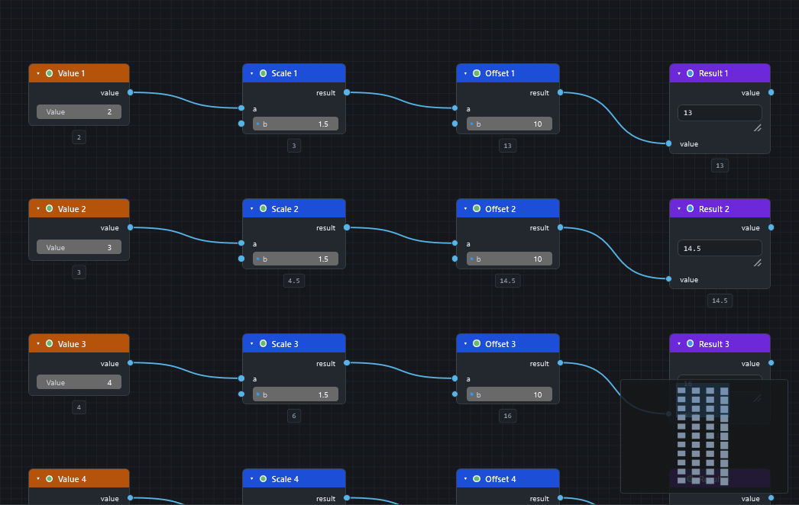
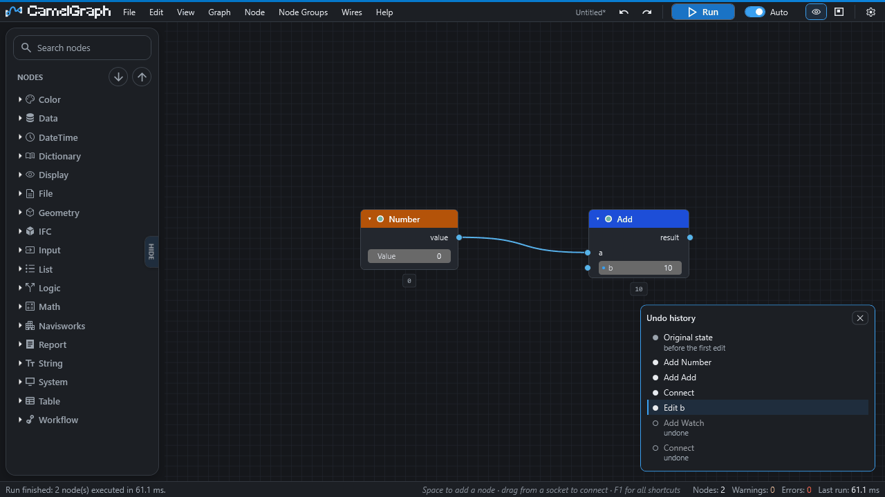
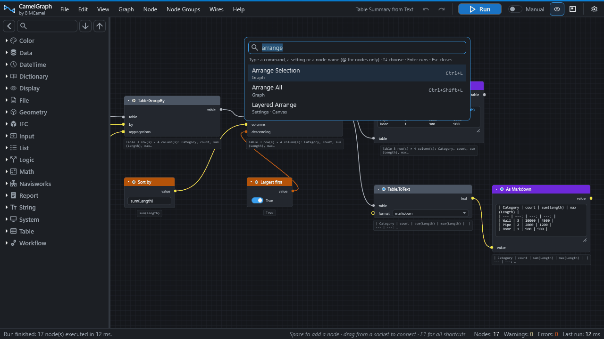

# The editor: canvas and nodes

The Dyncamelo editor is a pane inside Navisworks where you build a script by placing nodes on a canvas and joining them with wires.

This page tours the editor window and everything you do on the canvas. The node library has its own page ([Node library and search](library-and-search.md)), and every key is listed in the [keyboard and mouse reference](shortcuts.md).

## Opening the editor

Open a model in Navisworks, then click **Dyncamelo** on the **BIMCamel** ribbon tab. The button shows or hides the editor pane. It is a normal Navisworks dock pane, so you can dock it, float it or put it on a second monitor.

Every function of the editor can be reached four ways: a **menu**, a **shortcut**, the **command palette** (++ctrl+shift+p++) and the **Settings** page. If you cannot remember where something is, open the palette and type a word of its name.

## The window at a glance

| Area | What it holds |
|---|---|
| Header bar (one row, with a thin blue strip on top) | The BIMCamel logo and "Dyncamelo by BIMCamel" on the left, then the menus **File, Edit, View, Graph, Node, Node Groups, Wires, Help** (each shows the shortcut beside every command; File also holds **Recent Files** and **Sample Graphs**, Graph holds **Frame Colour**). On the right: the name of the open script (a `*` after it means there are unsaved changes; the file name follows once the script has been saved) and the buttons. In a narrow pane the "Dyncamelo by BIMCamel" text and then the script name make room for the menus and buttons; hover the logo for the version. |
| Buttons on the right of the header | Undo, Redo, **Run** (the blue main button), **Auto / Manual** (a switch like the ones on Boolean nodes), value previews on/off, minimap on/off, and the **Settings** gear. |
| Library panel (left) | The list of nodes. See [Node library and search](library-and-search.md). |
| Canvas (middle) | Where nodes and wires live. |
| Status bar (bottom) | A message on the left (what you just did, or what a run did), a hint line, and on the right the number of **Nodes**, the **Warnings** and **Errors** counts and the **Last run** time in milliseconds. |

A run blocks Navisworks while it works, so during a run a dark overlay shows which node is working (for example `12 / 40 — name`) and reminds you that ++esc++ cancels it. See [Running scripts](running-graphs.md).

## The canvas

**Moving around**

* **Pan** by dragging with the right or the middle mouse button.
* **Zoom** with the mouse wheel. **View ▸ Zoom In** and **Zoom Out** do the same from the menu.
* **Fit to Screen** brings the whole script into view. It is in the View menu and the canvas right-click menu, and ++home++ does it from the keyboard.
* ++shift+f++ (**Frame Selected**) zooms to what you have selected.
* The **minimap** is a small overview in the bottom-right corner (picture below). Drag its frame to pan and use the wheel to zoom. It appears by itself once a script has 40 or more nodes; ++ctrl+m++ or the map button in the menu bar switches it on and off, and **Settings ▸ Canvas ▸ Minimap** chooses Automatic, Always or Never.
* **Bookmarks** save a view so you can come back to it (see below).

**Grid.** The canvas draws grid lines, and nodes snap to the grid when you drag them. Both can be switched off in [Settings](settings.md) under Canvas.

**Zoomed far out.** When you zoom out a long way, nodes shrink to just their title bars and wires become straight lines, so very large scripts stay responsive. Zoom back in and everything returns.

**Right-click on empty canvas** offers Add Note Here, Copy, Paste, Duplicate, Group Selection (a frame, see below), Arrange Selection, Run and Fit to Screen.

## The start screen

While the canvas is empty (when the editor opens, or after you delete every node) the middle of the canvas shows a start screen:

* the Dyncamelo name and the **installed version** (the letter `v` followed by the version number);
* a **bimcamel.com** button that opens the Dyncamelo page on the BIMCamel website, https://www.bimcamel.com/plugins/dyncamelo;
* when the once-a-day update check has found a newer release, a notice saying which version is available and which one you have, with a **Get it** button that opens the download page;
* **cards**. **New script** starts an empty script. Under it come your four newest **recent scripts** (the card shows the file name and its folder). If you have none yet, a line says the scripts you open or save will appear there. Below that, an **Examples** row offers up to six of the sample scripts that ship with Dyncamelo, "Getting Started" first.

Click a card to open it. The cards disappear as soon as you add a node or open a script. After you press **New script** only a short hint remains ("an empty canvas" and the ways to add a first node). The same two links also live in the Help menu (**BIMCamel Website** and **Get the Newest Version…**).

You can switch the start screen off with **Settings ▸ Appearance ▸ Start screen on an empty canvas**.

## Nodes

A node is one step of the script. It has a title bar, **inputs** on the left and **outputs** on the right. Add nodes from the library (++space++ over the canvas is the fastest way), then fill in or wire their inputs. How sockets are coloured and shaped is explained in [Inputs, outputs and kinds](ports-and-kinds.md).

| To… | Do this |
|---|---|
| Move a node | Drag it. Drag a selection to move several together. |
| Rename a node | Double-click its title. |
| Read what a node does | Hover its title for the description. The small dot beside the title tells whether the node creates, modifies or only reads (Create, Modify, Info). |
| Pick a colour | Click the colour swatch on a colour input. The popup has swatches and an eyedropper that can take any colour on the screen, the Navisworks view included. |
| Change the width | Drag the node's right edge; double-click the edge for automatic width. **View ▸ Reset Node Width** does the same for the selected nodes. |
| Collapse or expand | ++h++, the arrow in the title bar, or the node's right-click menu. A collapsed node becomes a capsule that still has its sockets, so it can still be wired. **View ▸ Collapse All Nodes** and **Expand All Nodes** act on everything. |
| Hide the inputs you are not using | ++ctrl+h++ hides optional inputs that have no wire; click the row that stands in for them to show them again. **Settings ▸ Editing ▸ Hide unused inputs by default** makes it the rule. |
| Put typed-in values back to defaults | **Node ▸ Reset Inputs to Default**, or hover a single number field and press ++backspace++. |
| See the value a node produced | After a run, a small bubble under each node previews the result; click it to expand. Hover a socket to see its type and the value it holds. The preview button in the menu bar (or Settings ▸ Appearance) switches the bubbles off. |
| Ask "why didn't this run?" | Select the node and press ++i++. The status bar explains in words whether it is frozen, muted, failed, waiting for an input or just waiting for the next Run, and names the node responsible when it is another one. |
| Find the node in the library | Right-click it and choose **Find in Library**. |

**Node states.** A node that failed shows an error and a node that ran with a recoverable problem shows a warning. The **Warnings** and **Errors** counts in the status bar are buttons: click them (or press ++ctrl+shift+e++) to list every node that failed or warned in the last run, errors first. Click a row to jump to that node; ++f8++ and ++shift+f8++ step through the problems.

**Mute and freeze.** Both stop a node from running, but they behave differently around it.

* A **muted** node (++m++, badge MUTED) is bypassed. Each of its outputs passes along the first input of a matching kind, and everything after it still runs. Use it to switch a step off inside a live chain, such as a filter or a recolour.
* A **frozen** node (++shift+m++, badge FROZEN) is held. It and everything after it are skipped by runs and keep the results of their last run. Use it to stop a slow branch from being recalculated while you work elsewhere.

Both are undoable and saved with the script. The node's right-click menu also offers **Lacing** (Auto, Shortest, Longest, Cross Product), which decides how lists pair up (see [Concepts](concepts.md)).

**Selecting.** Click a node, or drag a selection rectangle across empty canvas. ++ctrl+a++ selects everything. These help in a busy script:

| Key | Selects |
|---|---|
| ++l++ | everything downstream of the selection |
| ++shift+l++ | everything upstream of the selection |
| ++shift+g++ | every node of the same kind as the selection |
| Arrow keys | the nearest node in that direction, so you can tour a script without the mouse |

With a node selected, its wires are drawn heavier and all others fainter, so you can follow a connection through a crowded script (**Settings ▸ Canvas ▸ Highlight the wires of the selected node**).

**Arrange.** ++ctrl+l++ tidies the selected nodes into columns that follow the direction of the data; ++ctrl+shift+l++ does the whole script. The block stays roughly where it was.

## Wires

* **Connect** by dragging from an output socket to an input socket. While you drag, sockets that cannot take the wire fade out. An input takes one wire, except the long pill-shaped **multi-input** sockets, which take as many as you like and combine them into one list. Drag from a pill to take off the wire under the pointer; use **Wires ▸ Move Wire Earlier / Later** to reorder them.
* **Dashed wire.** A dashed wire feeds a list into an input that wants a single value, so the node runs once per item.
* **Drop a wire on empty canvas** and the node search opens, showing only nodes that can accept it. Picking one adds it and connects it in one step.
* **Move a connection.** Drag from an input that already has a wire to pick the wire up. Drop it on another input to move it, hold ++shift++ while dropping on an occupied input to swap the two, or drop it on empty canvas to remove it. **Wires ▸ Swap Links** swaps two selected wires.
* **Insert a node into a wire.** Drag a node that has no wires of its own over a wire; the wire lights up. Drop it and the data now passes through the node, and the nodes after it shift right to make room (**Settings ▸ Editing ▸ Make room when inserting on a wire**). You can also drag a node straight from the library onto a wire, or select one node and one wire and use **Node ▸ Insert Into Selected Wire**. It is one undo step.
* **Cut wires.** Hold ++alt+shift++ and drag across them. Hold ++ctrl++ as you release to mute the cut wires instead of removing them.
* **Mute a wire.** Select it and use **Wires ▸ Mute / Unmute Selected Wires**. A muted wire is ignored by the run and the input falls back to its own value, a quick way to switch a branch off without deleting it.
* **Connect Selected Nodes** (++f++) joins two or more selected nodes from left to right, best matching sockets first.
* **Delete and Reconnect** (++ctrl+delete++) removes a node but joins its inputs to its outputs, keeping the chain intact.
* **Reroutes.** Double-click a wire to add a small waypoint that bends it, or use **Wires ▸ Add Reroute to Selected Wires**. Deleting a reroute keeps the wire (**Settings ▸ Editing ▸ Deleting a reroute keeps the wire**).
* Right-click a wire and choose **Disconnect** to remove it.

## Notes and frames

* A **note** is a yellow sticky note for explaining a script to the next person. Use **Graph ▸ Add Note**, right-click empty canvas and choose **Add Note Here**, or double-click the canvas if you set that in Settings. Type straight into it.
* A **frame** is a coloured rectangle with a title that sits behind a few nodes. Select the nodes and press ++ctrl+g++ (the menu calls this **Group Selection**). Click the title to rename it, drag the coloured bar to move the frame together with its nodes, and drag its resize handle to change its size. ++ctrl+shift+g++ (**Fit Frame to Contents**) shrinks or grows it to wrap its nodes, ++ctrl+shift+u++ (**Ungroup**) removes the frame and leaves the nodes, and **Graph ▸ Frame Colour** (or the frame's right-click menu) offers Blue, Green, Amber, Red, Purple and Gray.

Frames are only for tidiness. For a reusable piece of script with its own inputs and outputs, see [Node groups](node-groups.md).

## Copy, paste, duplicate and delete

* ++ctrl+c++, ++ctrl+x++ and ++ctrl+v++ copy, cut and paste the selected nodes together with the wires between them. Dyncamelo keeps its own clipboard inside the editor, so pasting does not use the Windows clipboard. Repeated pastes are offset a little each time.
* ++ctrl+d++ **duplicates** the selection (with the wires between the copied nodes), placing the copy slightly offset from the original.
* ++delete++ removes the selection.

## Undo, redo and history

++ctrl+z++ undoes and ++ctrl+y++ (or ++ctrl+shift+z++) redoes; the menu-bar buttons do the same and their tooltips name the edit. Undo covers edits to the script only. It does **not** reverse changes a run has already made in Navisworks, and the status bar says so.

++ctrl+shift+h++ (**Undo History…**) lists every step. Click a step to jump back or forward to exactly that point; steps you undid appear dimmed until you make a new edit.

!!! warning "Undo is for the script, not the model"
    The editor's undo does not reverse what a run already changed in Navisworks. Save the model before you try something new, and use the nodes made for it, such as `Appearance.Reset`. Inside a [node group](node-groups.md), each level keeps its own history.

## Bookmarks

++ctrl+k++ (**Bookmark This View…**) names the current position and zoom and saves it **in the script file**. ++ctrl+shift+k++ (**Canvas Bookmarks…**) lists them: click one to go there, click the ✕ to remove it. They are handy for touring a big script, for example "inputs", "filters", "export".

## Finding a node on the canvas

++ctrl+f++ (**Find Node on Canvas…**) opens the command palette already set to search the nodes in your script. Type part of a name and press ++enter++: the node is selected and scrolled into view. (This is different from ++space++, which adds a new node from the library.)

## The command palette

++ctrl+shift+p++ opens the command palette. Type a word and the list shows matching **commands**, matching **settings** (choosing one opens the Settings page on it) and matching **nodes on your canvas**. Use the up and down arrows, press ++enter++ to run the highlighted entry and ++esc++ to close. Start the text with `@` to list only canvas nodes. The palette only lists commands that can run right now.

!!! tip "Lost? Open the palette"
    If you cannot remember where a function is, press ++ctrl+shift+p++ and type a word of its name. Every command is there, with its shortcut at the right.

## Hints and the status bar

The status bar's hint line follows what you are doing: the keys for the selected nodes, what releasing a dragged wire will do, how to leave a node group. It hides itself first when the pane is narrow. ++f1++ opens a sheet of every keyboard shortcut and mouse gesture, showing the keys currently in force, including any you have changed. **Settings ▸ Appearance** switches the hints off and sets the **Window scale** (90 to 150 per cent) for high-resolution screens or a small pane.

## Where to go next

* [Node library and search](library-and-search.md): find and add nodes.
* [Saving and opening scripts](saving-opening.md): `.dyc` files, autosave and recovery.
* [Settings](settings.md) and the [keyboard and mouse reference](shortcuts.md).
* [Node groups](node-groups.md): reusable pieces of script.
* [How-to guides](howto/read-errors-and-warnings.md) for reading errors and warnings, and for [speeding up a slow graph](howto/speed-up-slow-graph.md).
