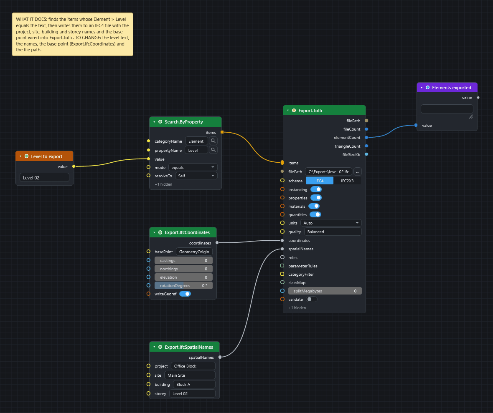
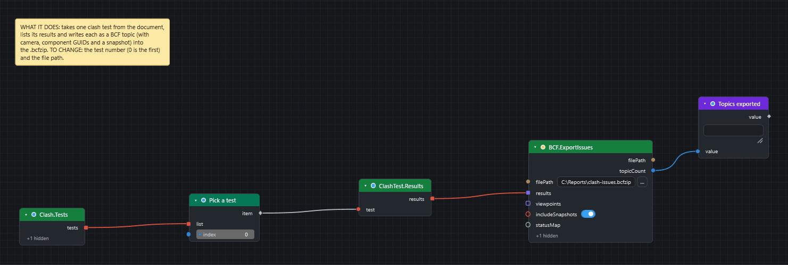
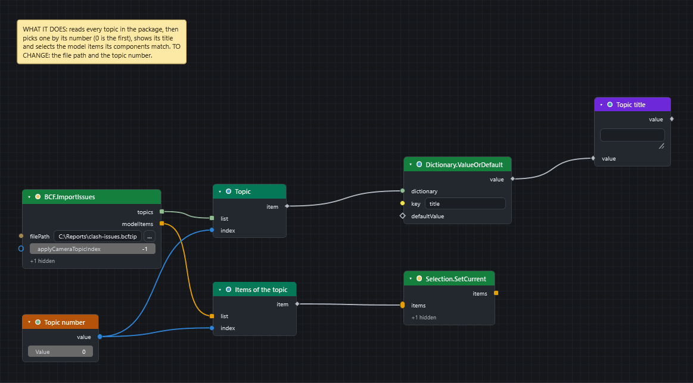
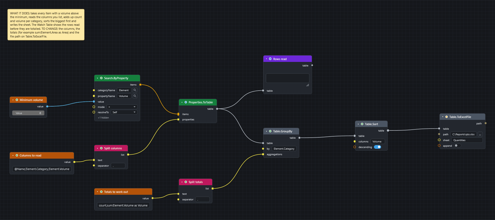

# IFC, BCF, Excel and CSV

How data gets into and out of a CamelGraph graph. Every node named here is in the [node library](nodes/index.md) with its inputs and outputs.

| Format | Read | Write |
|---|---|---|
| **IFC** | Navisworks reads IFC itself; `Document.AppendFiles` adds files to the model. IFC identity (GlobalIds) is handled by `ModelItem.IfcGuid`, `IFC.GuidDecode`, `IFC.GuidEncode` and `Search.ByGuid`. | `Export.ToIfc` and its option nodes |
| **BCF** (issues) | `BCF.ImportIssues` (BCF 2.0 and 2.1) | `BCF.ExportIssues` (BCF 2.1) |
| **Excel** (`.xlsx`) | `Table.FromExcelFile`, `Excel.ReadFromFile` | `Table.ToExcelFile`, `Excel.WriteToFile` |
| **CSV** | `Table.FromCsvFile`, `CSV.ReadFromFile` | `Table.ToCsvFile`, `CSV.WriteToFile`, `CSV.AppendToFile`, `Export.ToCsv` |
| **Reports** | | `Report.Html`, `Report.Markdown`, `Table.ToText`, `Export.ClashReportCsv`, `Export.ClashReportHtml` |
| **Navisworks files and pictures** | `Document.Open`, `Document.AppendFiles` | `Export.NWD`, `Export.ViewpointImage` |
| **JSON** | `JSON.ReadFromFile` | `JSON.WriteToFile` |

!!! warning "Use a full path for every file a graph writes"
    Give a full path, for example `C:\Users\you\Documents\report.xlsx`. The working folder of Navisworks is its install folder under `Program Files`, which ordinary users cannot write to, so a relative path fails with "access denied" ([Troubleshooting](troubleshooting.md#a-file-node-fails-with-access-denied-or-writes-to-the-wrong-place)). Paste a path without the quotes that Explorer's *Copy as path* adds. Graphs that write files are marked, and the Script Player asks before it runs one.

## IFC

### Bringing IFC in

Navisworks opens and appends IFC files by itself. To add several files in a graph, use `Directory.FindFiles` (a pattern such as `*.ifc;*.nwc`, sorted by date) into `Document.AppendFiles`, then `Document.Save` or `Export.NWD`. `Document.Open` replaces the current contents of the document instead of appending.

### IFC identity: GlobalIds

IFC elements are identified by a 22-character **GlobalId** (`0$WU4A9R19$vKWO$AdOnKA`) that other tools show as a standard GUID (`3f81e10a-25b0-49ff-9520-63f2a763150a`).

| Node | What it does |
|---|---|
| `ModelItem.IfcGuid` | The 22-character GlobalId of an item (from its GlobalId / IfcGUID / IFC GUID / Guid property, otherwise its InstanceGuid encoded the same way); `null` when it has neither. A list of items gives a list of ids. |
| `IFC.GuidDecode` | 22-character GlobalId to a lower-case hyphenated GUID. |
| `IFC.GuidEncode` | Standard GUID to the 22-character GlobalId. |
| `Search.ByGuid` | Finds the items for a list of GUIDs (text, 22-character GlobalIds or GUID values) in **one pass** over the model, and gives the ids it could not find on a second output, `missing`. It walks every item once, so give it the whole list at once, not one id at a time. |

### Writing IFC: `Export.ToIfc`

`Export.ToIfc` writes model items to an IFC file with the BIMCamel IFC exporter engine, which ships inside CamelGraph (nothing else to install). It writes a spatial tree, geometry instancing, property sets, materials, base quantities and georeferencing.

The simplest graph:

```
Search.ByProperty ──items──▶ Export.ToIfc (filePath: C:\Exports\steel.ifc)
```



Step by step, with a graph to download: [Export model items to IFC](howto/export-to-ifc.md).

Only `items` and `filePath` are required. The other inputs are optional:

| Input | Default | Meaning |
|---|---|---|
| `items` | required | The model items to export (resolved to leaf geometry). |
| `filePath` | required | Destination `.ifc` path. The folder is created when missing. |
| `schema` | `IFC4` | `IFC4` or `IFC2x3`. |
| `instancing` | on | Reuse repeated geometry as mapped items (smaller files). |
| `properties` | on | Write Navisworks properties as IFC property sets. |
| `materials` | on | Write element colours as surface styles and materials. |
| `quantities` | on | Compute base quantities (volume, area, length) from the mesh. |
| `units` | `Auto` | Source units: `Auto` (from the model), or Millimeters, Centimeters, Meters, Feet, Inches. |
| `quality` | `Balanced` | `Balanced`, `Small file` or `High detail`: sets the weld tolerance and coordinate precision. |
| `splitMegabytes` | 0 | Split the output into parts near this size (0 is a single file). |
| `validate` | off | Run the built-in structural validator on each written file. |
| `categoryFilter` | all | Export only these property categories. |
| `document` | active | The document. |

Outputs: `filePath`, `fileCount`, `elementCount`, `triangleCount` and `fileSizeKb`, so you can show or log what was written.

Five small nodes build the optional **option objects**. Wire each into the matching input of `Export.ToIfc`:

| Option node | Wire into | What it sets |
|---|---|---|
| `Export.IfcSpatialNames` | `spatialNames` | Names of the project, site, building and the default storey. |
| `Export.IfcCoordinates` | `coordinates` | Base point (`GeometryOrigin`, `ModelOrigin` or `Custom` with eastings, northings and elevation in metres), rotation, and whether to write IFC4 georeferencing. |
| `Export.IfcRoles` | `roles` | Which source properties become the IFC type, building storey, material and classification reference. |
| `Export.IfcSetClassMap` | `classMap` | An IFC class for every item of named selection or search sets (set name to class, with an optional predefined type). `Export.IfcClasses` lists the class names it accepts ("Wall", "Beam", "Door"…). |
| `Export.IfcParameterRule` | `parameterRules` (collect several into a list) | Rename or relocate a source property into a target property set and name. |

IFC export reads the geometry of every item and can take a while on a large model, so switch Auto off and run it with ++f5++. To write several IFC files from one graph, use one `Export.ToIfc` per file, or put it inside a loop (`Loop.Item` to `Loop.Collect`).

## BCF issues

BCF is the vendor-neutral format for issues: a `.bcfzip` of topics, each with a title, status, comments, a camera and the elements involved. It is the bridge to BIMcollab, Konekt, Revizto and Autodesk Construction Cloud.

### Export: `BCF.ExportIssues`

```
Clash.Tests ─▶ List.GetItemAtIndex ─▶ ClashTest.Results ─▶ BCF.ExportIssues (results)
```



| Input | Meaning |
|---|---|
| `filePath` (required) | Destination `.bcfzip` (or `.bcf`). The folder is created when missing. |
| `results` | Clash results, or result groups, to export as topics (from `ClashTest.Results`). |
| `viewpoints` | Saved viewpoints to export as topics, instead of or besides results. |
| `includeSnapshots` | Render a `snapshot.png` per topic (on by default; slower on long result lists). |
| `statusMap` | A dictionary from Navisworks status to BCF status, for example `{"New": "Open", "Approved": "Closed"}`. Unmapped statuses use the default: New and Active become Open, Reviewed becomes In Progress, Approved and Resolved become Closed. |

Outputs: `filePath` and `topicCount`. Things to know:

* Each topic carries a markup, a camera viewpoint, the GUIDs of the elements, and the snapshot.
* **Elements are identified by their IFC GlobalId when the item has one, and by its InstanceGuid otherwise.** For models that did not come from IFC this is lossy: another tool may not find the same element. Add IFC GlobalIds to the source model when the receiver must match elements.
* **Cameras are written in metres**, as the BCF convention says, whatever units the model uses.

### Import: `BCF.ImportIssues`

Reads a BCF 2.0 or 2.1 package. Outputs:

* `topics`: a list of dictionaries, one per topic, with `guid`, `title`, `status`, `type`, `description`, `creationAuthor`, `creationDate`, `comments`, `commentAuthors`, `commentDates`, `componentGuids`, `camera` (with `isPerspective`, `position`, `direction`, ++up++, `fieldOfView`, `viewToWorldScale`) and `hasSnapshot`;
* `modelItems`: a list with one list of model items for each topic, in the same order as `topics`: the items the topic's components resolve to, matched by IFC GlobalId first, then InstanceGuid.

`applyCameraTopicIndex` applies one topic's camera to the current view (the default, `-1`, leaves the view alone). To jump to issue 3, set it to `2`.

The return leg of an issue round trip is built from the outputs: pick one topic's list from `modelItems` with `List.GetItemAtIndex` and wire it into `Selection.SetCurrent` to select that topic's elements (a whole `modelItems` list would select topic after topic and leave only the last one selected), or use the topic statuses with `ClashResult.SetStatus` to update clash results.

```
BCF.ImportIssues ─ modelItems ─▶ List.GetItemAtIndex (topic number) ─▶ Selection.SetCurrent
                 └ topics ─────▶ List.GetItemAtIndex (topic number) ─▶ Dictionary.ValueOrDefault (title) ─▶ Watch
```



!!! tip "Step by step"
    [Send clashes to BCF and read an issue list back](howto/clash-issues-bcf.md) builds both graphs.

## Excel

CamelGraph reads and writes `.xlsx` files itself, so **Excel does not have to be installed**. `.xls` (the old format) is not supported.

| Node | Notes |
|---|---|
| `Table.ToExcelFile` | Writes a table with its column names. `sheet` names the worksheet; `append` adds a sheet to an existing workbook. |
| `Table.FromExcelFile` | Reads a worksheet into a table. `firstRowIsHeader` controls the column names. |
| `Excel.WriteToFile` | Writes rows (and optional headers). `append` adds a sheet to an existing workbook; **styles and formulas that were not written by Dyncamelo are not preserved**. |
| `Excel.ReadFromFile` | Gives `rows`, `headers` and `sheetNames`. **Dates arrive as Excel serial numbers.** |

Tables are the easiest way in: `Properties.ToTable` reads the named properties of items into a table (use `Category.Property` names such as `Element.Category`, or `@Name`, `@Path`, `@Guid`), and the `Table.*` nodes then filter, sort, group, join, pivot and format it before `Table.ToExcelFile` writes it.

A **quantity take-off** in five nodes:

```
Search.ByProperty ─▶ Properties.ToTable ─▶ Table.GroupBy ─▶ Table.Sort ─▶ Table.ToExcelFile
                     (@Name, Item.Category,   (by category;     (largest      (C:\...\qto.xlsx)
                      Length, Area)            count, sum)       first)
```



[Take quantities out to Excel](howto/quantity-takeoff-to-excel.md) builds this graph step by step.

To **bring a spreadsheet into the model**, read it with `Table.FromExcelFile`, join it to `Properties.ToTable` on a GUID or mark column with `Table.Join`, and write each row onto the items with `Properties.SetCustom`. That writes a user-defined tab that is searchable and schedulable and travels with the NWF or NWD; the source files are never modified. [Write spreadsheet data onto model items](howto/write-excel-data-onto-items.md) shows the wiring.

## CSV

| Node | Notes |
|---|---|
| `Table.ToCsvFile`, `Table.FromCsvFile` | Tables in and out. Numbers become numbers; everything else stays text. `delimiter` is a comma unless you change it. |
| `CSV.WriteToFile` | Writes a list of rows. Overwrites; creates missing folders. |
| `CSV.AppendToFile` | Adds rows to a file, writing the optional headers only when the file is new or empty: one row of totals per run. |
| `CSV.ReadFromFile` | Reads rows (numeric cells become numbers). |
| `Export.ToCsv` | One row per model item: a name column plus the property columns you list. Useful for quantity take-offs. |
| `Export.ClashReportCsv` | One-node clash report: test, group, result, status, distance, assignee, both item paths and GUIDs, and the clash point. Excel-ready. |

## Reports

* **`Report.Html`** builds a self-contained, printable HTML report (light and dark) from tables and text; a line starting with `# ` becomes a heading. Write it with `Text.WriteToFile`, or paste it into an e-mail. **`Report.Markdown`** does the same in Markdown for Teams, trackers and wikis.
* **`Table.ToText`** renders a table as Markdown, CSV, tab-separated text or an HTML table.
* **`Export.ClashReportHtml`** is a single-file HTML clash report, one section per test and one row per result, optionally with embedded snapshots (`includeImages`, `imageWidth`, `imageHeight`).
* **`Export.ViewpointImage`** renders the current view to a `.png`, `.jpg` or `.bmp`. **`Export.NWD`** saves the document as a published `.nwd` with appearance overrides baked in.

## Keeping a history

Two patterns that need no database:

* **Clash deltas.** `Clash.SnapshotToFile` saves a snapshot of all clash results as JSON each week; `Clash.CompareSnapshots` takes two snapshot files and gives the clashes that are new, resolved and persisting. It works on files only, so it needs no open model.
* **Model changes.** `Model.Snapshot` captures chosen properties of items as a dictionary keyed by GUID; save it with `JSON.WriteToFile`, and diff it against a later one with `Snapshot.Diff` (added, removed and changed keys).

## Next steps

* [Make a clash report](howto/clash-report.md) writes the summary of every clash test as HTML.
* [Find elements from a list of GUIDs](howto/find-elements-from-guids.md) reads GUIDs from Excel.
* [Privacy and safety](privacy-and-safety.md#what-a-graph-can-do): nodes that write files are marked, and the Script Player asks before running one.
