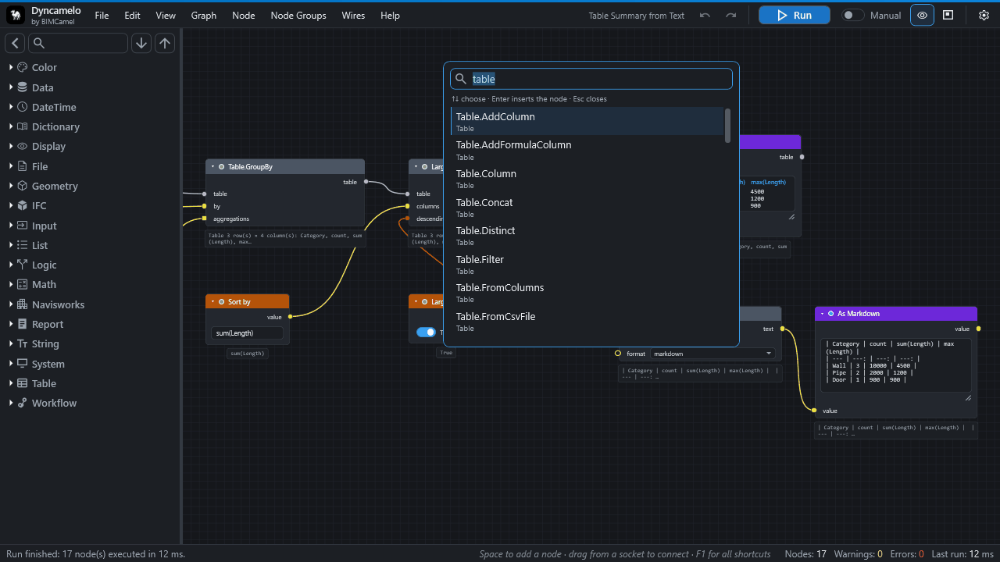
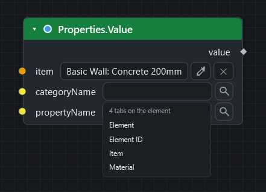
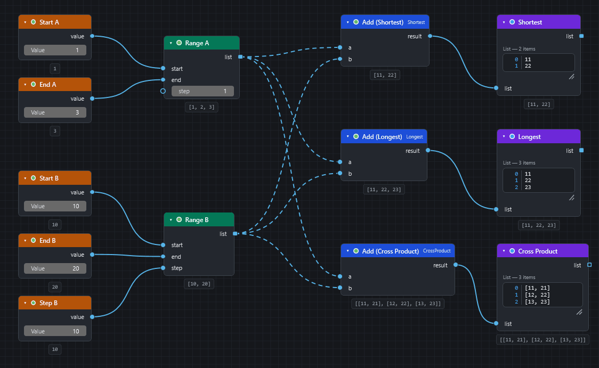
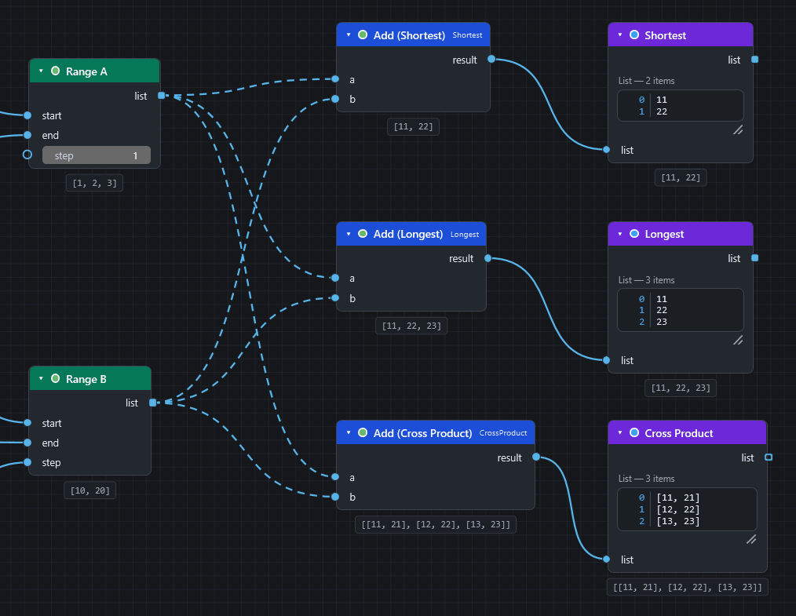
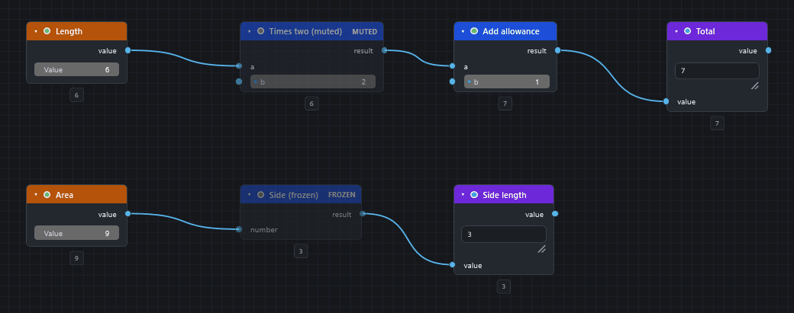
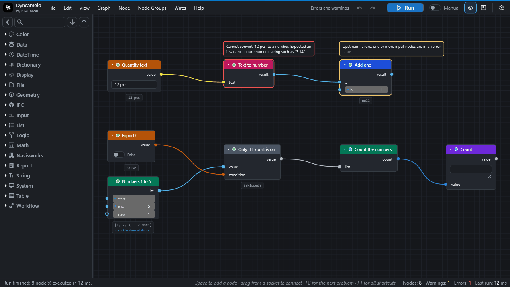

# Frequently asked questions

Short answers, grouped by theme. Click a question to open it. Every answer links to the page that explains it in full. The search box at the top finds words inside closed questions too.

## Which copy do I need?

CamelGraph comes in two copies: the same program with the same features, and a different licence.

| Are you using it for work or in a paid project or product? | Get |
|---|---|
| **Yes** | The professional copy for the **Autodesk App Store**. It is coming soon. Until it is there, get in touch through [bimcamel.com](https://www.bimcamel.com). |
| **No** | The free copy from [GitHub releases](https://github.com/mrshoma99-rgb/Dyncamelo/releases/latest) or [bimcamel.com](https://www.bimcamel.com/plugins/dyncamelo). |

"Personal use" in practice:

| Personal use (free) | Professional use |
|---|---|
| A student learning CamelGraph | A contractor's BIM coordinator running checks on a live project |
| A hobbyist trying it on their own models | A consultancy producing deliverables for clients |
| A university research group | An in-house team at a company |

This is not legal advice. The text of the licence counts. See [Licence](licence.md#which-copy-do-i-need).

## The basics

??? question "What is CamelGraph?"
    A visual programming add-in for Autodesk Navisworks. You build a graph of nodes on a canvas and run it against the open model, instead of clicking through the same steps by hand or writing code. It follows the ideas Dynamo made familiar in Revit. See [Concepts](concepts.md).

    

??? question "Is CamelGraph the same as Dyncamelo?"
    Yes. CamelGraph is the new name of Dyncamelo (versions up to 0.48): the same program, the same node library, the same `.dyc` graph files and the same free personal-use copy. The installer, the plug-in files and the folders carry the new name too. Installing the new version replaces the old install, and your settings, recent files and scripts carry over. Your saved graphs open as before.

??? question "Is it free?"
    The copy from GitHub or bimcamel.com is free for personal use: learning, hobby projects, research, charities, schools and universities, public research bodies and government institutions. Using it for your job at a company, or in a paid project or product, needs the professional copy, which is coming soon to the Autodesk App Store. Until it is there, get in touch through bimcamel.com. See [Licence](licence.md).

??? question "Which versions of Navisworks does it support?"
    Navisworks **Manage** and **Simulate** **2024, 2025 and 2026** on 64-bit Windows. Other products and years are not supported. Only Manage 2024 has been seen running it in the field so far; see [Requirements](requirements.md#what-has-been-tested).

??? question "Do I need Simulate or Manage?"
    Either. The clash nodes need Manage, because Simulate does not include Clash Detective.

??? question "Do I need to know how to program?"
    No. A graph is built by dragging and wiring nodes. If you want a node that does not exist, you can write one as a single C# method ([Writing your own nodes](extending.md)).

??? question "Can it open my Dynamo graphs?"
    No. CamelGraph has its own graph format (`.dyc`) and its own node library, built for Navisworks. It does not run Dynamo graphs or Revit nodes.

??? question "How many nodes are there?"
    More than 570, in about 46 categories, from maths and text to clash triage. Browse them in the [node library](nodes/index.md), or press ++space++ in the editor to search.

??? question "What do the words mean?"
    The [Glossary](glossary.md) explains every term with a link to the page that covers it.

## Installing

??? question "Where is the installer?"
    On the releases page and at bimcamel.com ([Installation](installation.md#where-to-get-it)). Some releases carry the source code only, with no installer; the page explains how to build and install from source.

??? question "Do I need administrator rights?"
    No. The installer works per user. Only an install for all users, or into the classic Navisworks `Plugins` folder, writes somewhere that needs them.

??? question "Can I install it for all users of a computer?"
    Yes. Copy the bundle to `C:\ProgramData\Autodesk\ApplicationPlugins\` instead of your own folder. That needs administrator rights and the files must be unblocked. See tab C of [Choose how to install](installation.md#choose-how-to-install).

??? question "Windows SmartScreen warns about the installer."
    The installer is not code-signed unless the publisher set a certificate up. Compare its SHA-256 checksum with the one published next to it, then choose **More info ▸ Run anyway**.

??? question "Navisworks shows PLUGIN_LOAD_02 when it starts."
    Windows still marks the DLLs as downloaded. Run `Get-ChildItem "$env:APPDATA\Autodesk\ApplicationPlugins\CamelGraph.bundle" -Recurse -File | Unblock-File` in PowerShell and restart Navisworks. The installer does this for you. See [Troubleshooting](troubleshooting.md#navisworks-reports-plugin_load_02-or-0x80131515-at-start).

??? question "I cannot find the CamelGraph button."
    Look on the **BIMCamel** ribbon tab, panel **Visual Programming**. If it is not there, see [Troubleshooting](troubleshooting.md#the-bimcamel-ribbon-tab-or-the-camelgraph-button-is-missing).

??? question "How do I know which version I have?"
    Click **About** on the **BIMCamel** tab, or look at the start screen of an empty canvas. [Updating](updating.md#which-version-do-i-have) lists the other places.

??? question "How do I remove it?"
    [Uninstalling](uninstall.md). Your graphs and settings stay unless you delete them.

## First steps

??? question "Where do I start?"
    [Your first script](first-steps.md) takes about ten minutes. The [sample scripts](samples.md) are on the start screen of an empty canvas.

??? question "Do I need a model open?"
    For most nodes, yes. CamelGraph works against the active Navisworks document. A few nodes, such as the maths and text nodes, run without one, and the sample *Getting Started - Math and Watch* needs no model. See [Requirements](requirements.md).

??? question "How do I add a node?"
    Press ++space++ over the canvas, type part of its name and press ++enter++. You can also double-click it in the library on the left, or drag it onto the canvas. See [Node library and search](library-and-search.md).

    

??? question "How do I see the value a node produced?"
    Wire the output into a **Watch** node, or look at the small preview bubble under the node after a run. Hover a socket to see its type and the value it holds. See [Inputs, outputs and kinds](ports-and-kinds.md#the-watch-nodes).

??? question "Where can I find a step-by-step guide for my job?"
    The **How-to guides** in the menu cover colouring, selection sets, quantities, clash reports, BCF, IFC, viewpoints and more, each with a graph you can download. Start with [Colour elements by a property](howto/colour-elements-by-property.md).

## Using the model

??? question "Does a graph change my model?"
    Only if it contains nodes that do. Reading nodes (search, properties, selection) do not. Writing nodes change the open document: colour, hide and transparency overrides, selection sets, viewpoints, custom properties, transforms. The description of every node in the [node library](nodes/index.md) says what it does. The source files of the model (a Revit file, an IFC) are never modified; custom properties, for example, travel with the NWF or NWD only.

??? question "Can I undo what a graph did?"
    Use the nodes made for it (`Appearance.Reset`, `Appearance.ResetAll`, `Appearance.ResetTemporary`, `Appearance.ShowAll`), or close without saving the model. Whether one Navisworks **Undo** reverses a whole run has not been confirmed, so save the model first. The editor's own undo changes the graph only. See [Running a graph](running-graphs.md#changing-the-model-and-undoing-it).

??? question "Can one graph run for every project?"
    Yes. A graph stores no results and uses the active document, so open it with any model and run it. Pin down only what is specific to a project (names, levels, folders) in input nodes or in the values on the nodes.

## Search and properties

??? question "Why did my search find nothing?"
    The tab and property names must be the ones Navisworks displays, including their language. Select an element in Navisworks and use the **magnifier** next to the name boxes to pick them from a list. See [Troubleshooting](troubleshooting.md#a-search-returns-nothing-or-the-magnifier-next-to-a-tab-or-property-shows-no-names).

    

??? question "How do I find the exact name of a tab or property?"
    Use the magnifier, or send a few selected items through `Properties.Discover` into a `Watch Table` to list everything they carry. See [Find the name of a tab or property](howto/find-property-names.md).

??? question "How do I search for numbers, such as pipes with a diameter over 100?"
    Use `Search.ByProperty` and choose `>`, `>=`, `<` or `<=` in the `mode` drop-down. Wire a `Number` node into the `value` input; the number is in document units. The other modes are `equals`, `contains` and `wildcard` (`*` matches any text, `?` one character). See the [Search nodes](nodes/navisworks-search.md#node-search-byproperty).

??? question "Is the text search case sensitive?"
    The documentation of the contains search says it is case sensitive, like Find Items, so type the capitals as Navisworks shows them. If a search finds less than you expect, wire the result into a `Watch List` and try `wildcard`. See the [Search nodes](nodes/navisworks-search.md#node-search-byproperty).

??? question "Can I search on two properties?"
    Yes. Chain searches: wire the `items` of a `Search.ByProperty` into a `Search.InItems`, which looks only inside the items it is given. See [Search nodes](nodes/navisworks-search.md#node-search-initems).

??? question "What is the difference between a selection set and a search set?"
    `SelectionSet.Create` keeps the items it was given. A search set keeps a rule and follows the model when it changes. See [Save selection sets](howto/save-selection-sets.md).

## Lists and lacing

??? question "What do the dashed wires mean?"
    A list is going into an input that expects one value, so the node runs once per item. See [Concepts](concepts.md#lists-replication-and-lacing).

    

??? question "My list of search values did not run the search once per value."
    Inputs of kind *Any*, such as the `value` of `Search.ByProperty`, take a whole list as one value. They also have no box of their own: you wire a `String` or `Number` node into them. Only inputs that want a single text, number or item run once per item by themselves. Right-click the socket, choose **List Levels** and then `@L1 — items`. See [Your first script](first-steps.md#8-one-search-for-many-values).

??? question "What is lacing?"
    The rule for pairing two lists that both go into one-value inputs: **Shortest** (the default), **Longest** or **Cross-Product**. Right-click the node to change it.

    

??? question "A list has empty items. How do I remove them?"
    Put `List.Clean` after the node that made them. A node that gets an empty item inside a list returns an empty result for it, and shows one amber warning that counts them. See [Concepts](concepts.md#lists-replication-and-lacing).

??? question "Can I wire several searches into one input?"
    Yes, if the socket is a pill. A pill takes any number of wires and combines them into one list in the order the wires were made. See [Inputs, outputs and kinds](ports-and-kinds.md#shape-one-value-or-a-list).

## Running

??? question "Why does nothing happen when I press Run?"
    Run only executes what changed. If nothing changed, nothing runs. Change an input, or check for frozen nodes, a false `Flow.When`, or an empty required input. See [Troubleshooting](troubleshooting.md#nothing-happens-when-i-press-run).

??? question "What is the difference between muting and freezing a node?"
    A **muted** node (++m++) is bypassed: it passes its first matching input straight through and everything after it still runs. A **frozen** node (++shift+m++) and everything after it is skipped and keeps its old results. Mute switches a step off inside a live chain; freeze stops a whole slow branch from recomputing. See [Running a graph](running-graphs.md#running-part-of-a-graph).

    

??? question "A node is red. What now?"
    Hover it for its message, press ++i++ with it selected, or open the Errors count in the status bar. See [Read errors and warnings](howto/read-errors-and-warnings.md) and [Running a graph](running-graphs.md#node-states).

    

??? question "Do I have to press Run after every change?"
    In **Manual** mode, yes. Switch the run bar to **Auto** and a run starts after every edit; only the nodes after your edit run again. Leave Auto off on large models. See [Running a graph](running-graphs.md#run-auto-and-manual).

??? question "How do I stop a run?"
    Press ++esc++. The run halts before the next node. What finished nodes already changed in Navisworks is kept, and the next **Run** carries on where it stopped. See [Running a graph](running-graphs.md#stopping-a-run).

??? question "Navisworks is busy while my graph runs. Is that normal?"
    Yes. Runs happen on the Navisworks main thread, so Navisworks waits until the run ends. A progress overlay shows which node is working. See [Speed up a slow graph](howto/speed-up-slow-graph.md).

??? question "Can I run graphs automatically, without a person?"
    The plug-in `CamelGraph.Run.DYNC` runs a script by path for the Navisworks Automation API and the Batch Utility, and the command-line tool runs graphs that use only the general nodes. See [Running a graph](running-graphs.md#running-without-the-editor).

??? question "Where are my graphs and settings?"
    Graphs are `.dyc` files where you saved them. Settings, the error log and autosaved copies are in `%APPDATA%\CamelGraph`. See [Privacy and safety](privacy-and-safety.md#what-it-keeps-on-your-computer).

??? question "My graph was lost when Navisworks closed."
    If **Autosave** was on (it is by default), CamelGraph offers the autosaved copy the next time the editor opens on an empty canvas. See [Troubleshooting](troubleshooting.md#navisworks-closed-while-i-was-working).

## Clash and BCF

??? question "Do the clash nodes work in Simulate?"
    No. Simulate does not include Clash Detective, and the clash nodes report "Clash Detective is not available in this Navisworks edition." Use Manage. See [Make a clash report](howto/clash-report.md).

??? question "Can a graph create and run clash tests?"
    Yes. `ClashTest.Create`, `ClashTest.Run` and `Clash.RunAllTests` are in the library (*Navisworks ▸ Clash*), next to the filters, groupings and result nodes. See the [Clash nodes](nodes/navisworks-clash.md).

??? question "Which BCF versions are supported?"
    `BCF.ImportIssues` reads BCF 2.0 and 2.1. `BCF.ExportIssues` writes BCF 2.1. See [Send clashes to BCF](howto/clash-issues-bcf.md).

??? question "Another tool does not find the elements of my BCF file."
    Elements are identified by their IFC GlobalId when the item has one, and by its InstanceGuid otherwise. For models that did not come from IFC this can be lossy. Add IFC GlobalIds to the source model when the receiver must match elements. See [IFC, BCF, Excel and CSV](exchange-formats.md#export-bcfexportissues).

## IFC, Excel and CSV

??? question "Do I need Excel installed?"
    No. CamelGraph reads and writes `.xlsx` files itself. The old `.xls` format is not supported. See [IFC, BCF, Excel and CSV](exchange-formats.md#excel).

??? question "Does the IFC export need another plug-in?"
    No. The export engine ships inside CamelGraph. See [Export model items to IFC](howto/export-to-ifc.md).

??? question "Which IFC versions can it write?"
    `IFC4` (the default) and `IFC2x3`, set with the `schema` input of `Export.ToIfc`. See [Export model items to IFC](howto/export-to-ifc.md).

??? question "A file node fails with 'access denied'."
    The folder is one you cannot write to. A relative path goes next to the graph file (or into `Documents\CamelGraph` for a graph you have not saved), so save the graph somewhere you can write, or give a full path, for example `C:\Users\you\Documents\report.xlsx`. See [Troubleshooting](troubleshooting.md#a-file-node-fails-with-access-denied-or-writes-to-the-wrong-place).

??? question "Dates from Excel arrive as numbers."
    `Excel.ReadFromFile` gives dates as Excel serial numbers. See [IFC, BCF, Excel and CSV](exchange-formats.md#excel).

??? question "Will writing to an existing workbook keep my formulas and styles?"
    No. `append` adds a sheet to an existing workbook, but styles and formulas that were not written by CamelGraph are not preserved. Write to a new file when the formatting matters.

??? question "How do I put spreadsheet data back into the model?"
    Join the sheet to the model's items by GUID and write the columns with `Properties.SetCustom`. See [Write spreadsheet data onto model items](howto/write-excel-data-onto-items.md).

## The Script Player

??? question "How do I give a graph to a colleague who does not use the editor?"
    Save it in `Documents\CamelGraph\Scripts` (or a shared folder added in the Player), give it input nodes for what should change, and they run it from the [Script Player](player.md). A colleague who only needs the result can also be given the output of the graph, such as the Excel file. See [Give colleagues a form](howto/form-for-colleagues.md).

    

??? question "Which nodes become fields in the Player?"
    Every input node (`Number`, `Integer`, the sliders, `Boolean`, `String`, `Date`, `Choice`, `File Path`, `Directory Path`, `Color Picker`), plus any unwired input you chose to show. Inputs inside a node group are not offered. See [The Script Player](player.md#the-form).

??? question "Why does the Player ask 'Run it?'"
    The script contains nodes that change the model, write files, run programs or use the network. The Player lists them and asks the first time, and again whenever the file changes. See [Troubleshooting](troubleshooting.md#the-script-player-asks-me-to-confirm-a-script).

??? question "Does the Player remember what I typed?"
    Yes, for each script, in your CamelGraph settings on your computer, not in the script file. ↺ puts a field back to the saved value. See [The Script Player](player.md#remembered-values).

## Safety and privacy

??? question "Does CamelGraph send my model or data anywhere?"
    No. It has no account, analytics or licence server. Its one network request is a once-a-day look for a newer version, which you can switch off. See [Privacy and safety](privacy-and-safety.md).

??? question "Is it safe to run a graph someone sent me?"
    Treat a `.dyc` like a macro. A graph contains no code of its own, but its nodes can run programs, call web addresses and delete or overwrite files. CamelGraph lists such nodes and asks before it runs a graph from a file. Look at a graph before you run it, and try it on a copy of the model. See [Privacy and safety](privacy-and-safety.md#what-a-graph-can-do).

??? question "Are node packs safe?"
    A node pack is code. CamelGraph loads every `.dll` in a `Packages` folder, and that code runs inside Navisworks with your rights. Install packs only from authors you trust. See [Privacy and safety](privacy-and-safety.md#what-a-graph-can-do).

??? question "Should I save the model before I run a graph?"
    Yes, when the graph changes the model. A run is not atomic: if it is cancelled or a node fails, nodes that already ran have already changed the model. See [Running a graph](running-graphs.md#changing-the-model-and-undoing-it).

## Troubleshooting

??? question "The editor says 'Something went wrong'."
    CamelGraph's crash guard caught a failure in its own code. Save your graph, then look at `%APPDATA%\CamelGraph\errors.log`. See [Troubleshooting](troubleshooting.md#the-editor-says-something-went-wrong).

??? question "A graph opens with a warning or with missing nodes."
    The file was saved by another version or needs a node pack you do not have. The missing node is kept as a placeholder, so saving loses nothing. See [Troubleshooting](troubleshooting.md#a-graph-opens-with-a-warning-or-with-missing-nodes).

??? question "How do I report a bug or ask for a feature?"
    Write to <support@bimcamel.com>, or on GitHub: <https://github.com/mrshoma99-rgb/dyncamelo/issues>. The bug report form asks for the CamelGraph and Navisworks versions, the end of `%APPDATA%\CamelGraph\errors.log` and the result of **Help ▸ Copy Diagnostics**. See [Troubleshooting](troubleshooting.md#how-to-collect-diagnostics). Security problems go through the private route described in [Privacy and safety](privacy-and-safety.md#reporting-a-security-problem).

??? question "Is there a quick check that the Navisworks nodes work on my model?"
    Yes. **Help ▸ Run Self-Test…** runs a set of read-only Navisworks nodes on the open model and shows pass or fail for each. Run it once after installing, especially on 2025 or 2026. See [Requirements](requirements.md#what-has-been-tested).

## For developers

??? question "How do I write my own node?"
    A public static C# method with a couple of attributes is a node. [Writing your own nodes](extending.md) has a tutorial for a zero-touch node pack, including nodes that use the Navisworks API.

??? question "Can I contribute nodes?"
    Yes. [Writing your own nodes](extending.md) describes the pack format. Pull requests are welcome; read `CONTRIBUTING.md` in the repository first.

??? question "Can I run a graph from the command line?"
    The command-line tool `CamelGraph.Cli`, built from source, runs graphs that use only the general nodes, with no Navisworks. It exits with `0` when no node failed, `1` when one did and `2` for unreadable input, and it never asks before running. See [Running a graph](running-graphs.md#running-without-the-editor).

??? question "Can another add-in or the Batch Utility run a script?"
    Yes, through the plug-in `CamelGraph.Run.DYNC`: `Execute("C:\\Scripts\\audit.dyc")`. It returns `0` when no node failed and `1` otherwise, and asks the same confirmation as the Player. See [The Script Player](player.md#running-a-script-from-other-tools).

??? question "Is CamelGraph connected to Autodesk?"
    No. It is not affiliated with or endorsed by Autodesk. Autodesk, Navisworks, Revit and Dynamo are trademarks of Autodesk, Inc. See [Licence](licence.md#trademarks).
