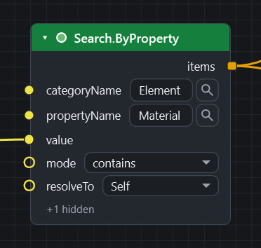

# Your first script

In about ten minutes you will build a real graph: **find every item whose Material contains "Concrete", colour it red, and save it as a selection set**. About six nodes, no code.

You need CamelGraph [installed](installation.md) and a model open in Navisworks (a Revit, IFC or DWG model appended to a new `.nwd` is fine).

## 1. Open the editor and meet the screen

On the **BIMCamel** ribbon tab, click **Dyncamelo**. The editor opens as a pane. Its parts:

* **Library** (left): every node, in a category tree, with a search box. Double-click a node, or drag it onto the canvas.
* **Canvas** (middle): your graph. Pan by dragging with the right or middle mouse button, zoom with the wheel, box-select with the left button.
* **Run bar** (bottom): the **Run** button, the **Manual / Auto** switch and the status line.

While the canvas is empty the **start screen** shows cards: **New script**, your recent scripts and the examples. It disappears when you add a node or open a script.


Every node shows its **inputs on the left** and its **outputs on the right**. Drag from an output socket to an input socket to make a **wire**. The wire is the data flow.

Three habits that save time from day one:

* Press ++space++ over the canvas to search for a node right where the cursor is. Type part of the name, ++up++ and ++down++ to choose, ++enter++ to insert, ++esc++ to close.
* **Hover a socket** to see what it expects: its name, its [kind](ports-and-kinds.md), whether it is required, its default and a description.
* Press ++ctrl+shift+p++ for the command palette: type a word of any command or setting.

## 2. Find the names in Navisworks

Click a concrete element in Navisworks and look at the **Properties** window. Find the tab (also called *category*) and the row (the *property*) that holds the material text. In Revit-sourced models this is usually category **Element**, property **Material**; other formats often use **Item** and **Material**. CamelGraph searches by exactly the names you see, including their language.

## 3. The search

1. Add a **String** node (category *Input*): press ++space++, type `String` and insert it. Double-click its title, rename it `Material text` and type `Concrete` into it.
2. Press ++space++, type `Search.ByProperty`, and insert **Search.ByProperty** (category *Navisworks ▸ Search*).
3. Type into its inputs:
    * `categoryName`: `Element` (or what you found),
    * `propertyName`: `Material`,
    * `mode`: choose `contains` from the drop-down. The other modes are `equals`, `wildcard`, `>`, `>=`, `<` and `<=`.
4. Wire the `value` output of the **String** node into the `value` input of the search. The `value` input accepts any kind of value (a text, a number, a date), so it has no box of its own: you wire a **String** or **Number** node into it.
5. Leave `document` alone. A **Document** input uses the active document when nothing is wired to it.
6. Add a **Watch List** node (category *Display*) and wire `items` from the search into its `list`.
7. Press **Run** (++f5++).



The Watch List fills with every matching item. If it is empty, the names do not match what Navisworks shows. The `categoryName` and `propertyName` boxes have a small **magnifier** button: select an element in Navisworks, press the magnifier, and pick the tab and then the property from a list that shows only what that element has. Nothing is read until you press it.


!!! tip "The search text is case sensitive"
    The contains search is documented as case sensitive, like Find Items in Navisworks. Type `Concrete` the way the Properties window shows it. To see all the ways to find a name, read [Find the name of a tab or property](howto/find-property-names.md).

## 4. Colour the result

1. Add **Appearance.OverrideColor** (*Navisworks ▸ Appearance*).
2. Wire `items` from the search into its `items` input.
3. Click the colour swatch on its `color` input and choose red.
4. Press **Run**. Every concrete item in the viewport turns red.

This is a real Navisworks colour override, as if you had used *Item Tools ▸ Override Color*. To take it back from a graph, use **Appearance.Reset** (or **Appearance.ResetAll** for a clean slate before you colour again).

!!! warning "Save the model before you experiment"
    Whether one Navisworks **Undo** reverses a whole run has not been confirmed. The editor's own undo (++ctrl+z++ while the pane has the focus) changes the graph only.

## 5. Save it as a selection set

1. Add **SelectionSet.Create** (*Navisworks ▸ SelectionSets*).
2. Wire the `items` output of **Appearance.OverrideColor** into its `items` input. Nodes that change the model pass their items through for exactly this reason, so you can chain them.
3. Type `Concrete elements` into its `name` input.
4. Press **Run**. The set appears in the Navisworks **Sets** window. `SelectionSet.Create` replaces a top-level set with the same name, so running again updates it instead of duplicating it.

The finished graph:

```
String ──value──▶ Search.ByProperty ──items──▶ Appearance.OverrideColor ──items──▶ SelectionSet.Create
(Concrete)        (Element / Material /           (colour: red)                (name: Concrete elements)
                   contains)
                          └──items──▶ Watch List
```


The same steps with a download, and a version that gives every value its own colour, are in [Colour elements by a property](howto/colour-elements-by-property.md) and [Save selection sets](howto/save-selection-sets.md).

## 6. Make it live

Switch the run bar from **Manual** to **Auto**. Change the text of the **String** node from `Concrete` to `Steel`: the graph runs again by itself and recolours the model. Only the nodes **after** your edit run again; the rest serve their stored results, which is what keeps large graphs fast.

## 7. Save the graph

Press ++ctrl+s++ and save a `.dyc` file. It stores the nodes, wires and the values you typed, not the results, so a graph you open later computes afresh on its first run. It is plain text, so it can be emailed or kept in version control. Save it in `Documents\Dyncamelo\Scripts` and the [Script Player](player.md) lists it.

## 8. One search for many values

Lists are where CamelGraph pays off. Add a **String.Split** node (category *String*) with the text `Concrete,Steel,Masonry` and the separator `,`. Its result is a list of three texts.

1. Wire the result into the `name` input of **SelectionSet.Create**. `name` wants **one** text, so the node runs three times, once for each text. The wire is drawn dashed to show this.
2. Wire the same result into the `value` input of the search, instead of the single **String** node. This input accepts any kind of value, so it takes a list as one single value unless you ask for more. Right-click the `value` socket, choose **List Levels** and then `@L1 — items`. A small `@L1` badge appears, and the search now runs three times and gives three lists of items.
3. Press **Run**. The three lists pair up with the three names, and one run makes three sets.

This is *replication*, and how several lists pair up is *lacing*. Both are explained in [Concepts](concepts.md#lists-replication-and-lacing).


## When something is red

A node that fails shows a red border and a message; hover it, or open the **Errors** count in the status bar. Press ++i++ with a node selected to hear in words why it did or did not run. The full list of what red, amber and idle mean is in [Running a graph](running-graphs.md#node-states) and [Troubleshooting](troubleshooting.md#a-node-is-red-or-amber).

## Where next

* The **How-to guides** in the menu each solve one job with a graph you can download, for example [Take quantities out to Excel](howto/quantity-takeoff-to-excel.md) and [Read errors and warnings](howto/read-errors-and-warnings.md).
* [Concepts](concepts.md) and [Inputs, outputs and kinds](ports-and-kinds.md) explain how graphs behave.
* [Sample scripts](samples.md) are finished graphs to open, run and take apart.
* [Recipes](recipes.md) list node chains for the jobs of a BIM coordinator, a manager and a model maintainer.
* The [node library](nodes/index.md) lists every node with its inputs and outputs.
