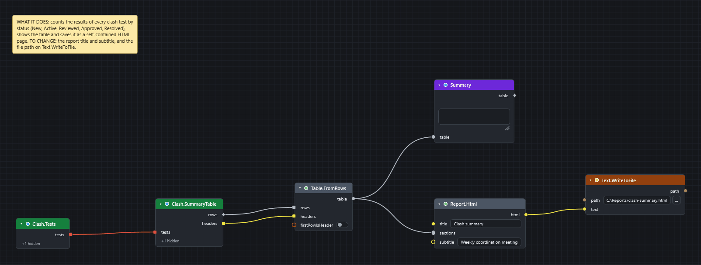

# Make a clash report

Goal: write an HTML page that shows, for each clash test, how many results are New, Active, Reviewed, Approved and Resolved.

## Before you start

* Use **Navisworks Manage**. Simulate does not include Clash Detective, so the clash nodes cannot work there.
* Open a model that already has clash tests, and **run them** in Clash Detective. A test that has not run has no results to count.
* Open the CamelGraph editor.

[Download the graph](../graphs/clash-report.dyc)

## Steps

1. Add `Clash.Tests` (*Navisworks ▸ Clash ▸ Tests*). It gives every clash test in the document, including those inside folders.
2. Add `Clash.SummaryTable` (*Navisworks ▸ Clash ▸ Report*). Wire `tests` from `Clash.Tests` into its `tests`. It makes one row for each test with the columns Test, Total and one for each status (New, Active, Reviewed, Approved, Resolved). Leave `tests` unwired to cover every test without `Clash.Tests`.
3. Add `Table.FromRows` (*Table*). Wire `rows` into `rows` and `headers` into `headers`. The summary node gives rows and headers separately, and this node joins them into one table.
4. Add `Report.Html` (*Report*). Wire the table into `sections`. Type a title, such as `Clash summary`, into `title`, and a line such as the model name and date into `subtitle`.
5. Add `Text.WriteToFile` (*File*). Wire `html` into `text`. Type a **full path** into `path`, for example `C:\Reports\clash-summary.html`.
6. Add a `Watch Table` (*Display*) on the `table` output of `Table.FromRows` to see the numbers on the canvas.
7. Press ++f5++, then open the file in a browser.

## What you get

A self-contained HTML page with a light and a dark style, ready to print or paste into an e-mail. A line in a section that starts with `# ` becomes a heading, so you can add text sections above or below the table. Wire several tables or texts into the one `sections` socket; they appear top to bottom in wire order.

!!! tip "Quick alternatives"
    * `Export.ClashReport` (*Navisworks ▸ Export*) with an `.html` path writes a single-file HTML report with one section per test and one row per result, and can embed a snapshot of each result (Advanced: `includeImages`). With a `.csv` path it writes the same detail as a file you can open in Excel.
    * `Report.Markdown` builds the same report as Markdown for Teams or an issue tracker.

!!! note "Keep a weekly history"
    `Clash.SnapshotToFile` saves a snapshot of all results as JSON, and `Clash.CompareSnapshots` compares two snapshot files and lists the clashes that are new, resolved and persisting. See [Recipes](../recipes.md#bim-coordinator).

## If it does not work

* All counts are 0 or the table is empty: the tests have not been run, or the document has no tests.
* A clash node is red with "Clash Detective is not available in this Navisworks edition.": you are in a product without Clash Detective, such as Simulate.
* The file node fails with "access denied": use a full path ([why](../troubleshooting.md#a-file-node-fails-with-access-denied-or-writes-to-the-wrong-place)).
* A node is red: see [Read errors and warnings](read-errors-and-warnings.md).

## Next

* [Send clashes to BCF](clash-issues-bcf.md).
* [Clash nodes](../nodes/navisworks-clash.md#node-clash-summarytable) lists filters, groupings and the result nodes.
* [Sample scripts](../samples.md#clash) includes *Clash Triage and BCF Export*.
