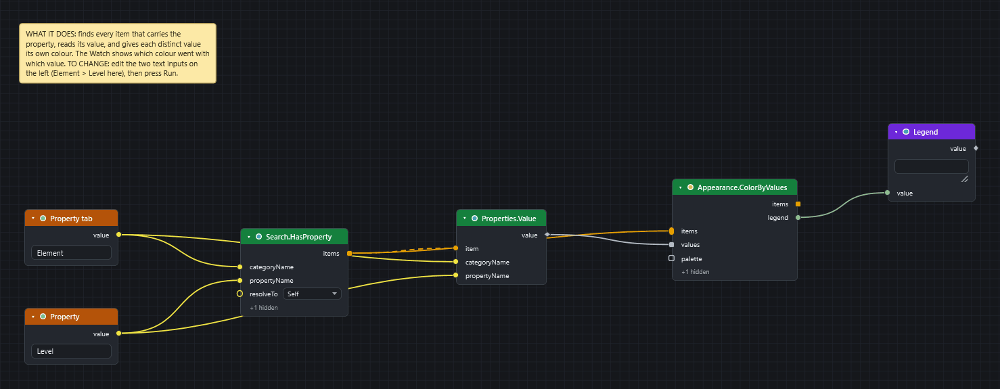

# Colour elements by a property

Goal: paint model items by what a property says, first with one colour for a match, then with a different colour for every value.

## Before you start

* Open a model in Navisworks (any product) and open the Dyncamelo editor from the **BIMCamel** ribbon tab.
* Know the tab and the property you want. If you do not, read [Find the name of a tab or property](find-property-names.md) first.
* Save the model. A run changes colours in the open document.

## Part A: one colour for everything that matches

[Download the graph](../graphs/first-script.dyc)

1. Press ++space++ over the canvas, type `Search.ByProperty` and press ++enter++. The node is in *Navisworks ▸ Search*.
2. Fill its inputs: `categoryName` = `Element`, `propertyName` = `Material`, `value` = `Concrete`, and choose `contains` in the `mode` drop-down. Use the names your model shows.
3. Add `Appearance.OverrideColor` (*Navisworks ▸ Appearance*). Wire `items` from the search into its `items`.
4. Click the swatch on its `color` input and choose red. You can also wire a `String` node that holds `#FF0000`.
5. Press ++f5++. Every matching item turns red in the Navisworks view.

To take the colour back, use `Appearance.Reset` on the same items, or `Appearance.ResetAll` for the whole model (both in *Navisworks ▸ Appearance*).

## Part B: a different colour for every value

[Download the graph](../graphs/colour-by-value.dyc)

This colours, for example, every item by its level.

1. Add `Search.HasProperty` (*Navisworks ▸ Search*) with `categoryName` = `Element` and `propertyName` = `Level`. It finds every item that carries the property.
2. Add `Properties.Value` (*Navisworks ▸ Properties*). Wire the search `items` into its `item` input and type `Element` and `Level` into the two name inputs. The wire is dashed: the node runs once per item and gives one value per item.
3. Add `Appearance.ColorByValues`. Wire the search `items` into its `items` and the `value` output of `Properties.Value` into its `values`.
4. Add a `Watch` node (*Display*) and wire the `legend` output into it.
5. Press ++f5++.

## What you get

* Part A: a normal Navisworks colour override on the matching items. It is saved with the model file.
* Part B: each distinct value gets its own colour from a built-in palette. When every value is a number, the colours run from blue to red instead. The `legend` output lists each value with its colour as `#RRGGBB`.
* To choose the colours yourself, wire a list of colours into the optional `palette` input. They are used in turn, one per distinct value.

!!! tip "Keep the lists the same length"
    `Appearance.ColorByValues` needs one value for each item. If it says "Got 40 items but 38 values", the two lists came from different searches. Wire the same list into both.

## If it does not work

* The search finds nothing: see [A search returns nothing](../troubleshooting.md#a-search-returns-nothing-or-the-magnifier-next-to-a-tab-or-property-shows-no-names).
* Nothing changes when you press Run: see [Nothing happens when I press Run](../troubleshooting.md#nothing-happens-when-i-press-run).
* A node is red: see [Read errors and warnings](read-errors-and-warnings.md).

## Next

* [Save selection sets](save-selection-sets.md) to keep what you found.
* [Appearance nodes](../nodes/navisworks-appearance.md#node-appearance-colorbyvalues) lists every colour, transparency and hide node.
* [Your first script](../first-steps.md) builds Part A step by step.
