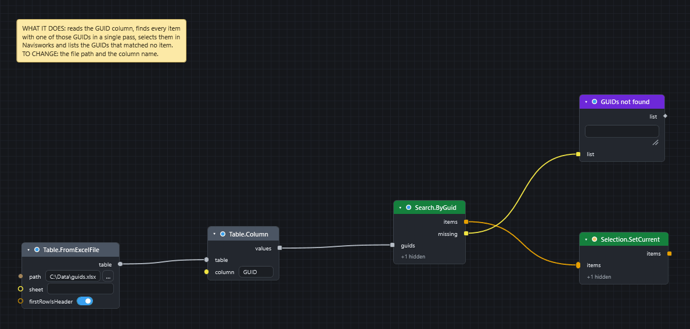

# Find elements from a list of GUIDs

Goal: take a column of element GUIDs from an Excel sheet, select those elements in Navisworks, and see which GUIDs were not found.

## Before you start

* Open a model in Navisworks and the Dyncamelo editor.
* Have an `.xlsx` file with the GUIDs in one column, with a header in the first row, for example `GUID`. Write the cells as text. `Search.ByGuid` accepts a GUID such as `3f81e10a-25b0-49ff-9520-63f2a763150a` or a 22-character IFC GlobalId.
* This graph replaces the current Navisworks selection.

[Download the graph](../graphs/find-by-guid.dyc)

## Steps

1. Add `Table.FromExcelFile` (*Table*). Type the full path of your workbook into `path`, for example `C:\Data\guids.xlsx`. Leave `sheet` empty to read the first sheet and leave `firstRowIsHeader` ticked.
2. Add `Table.Column` (*Table*). Wire the `table` in and type the header of your GUID column, such as `GUID`, into `column`. It gives the cells top to bottom.
3. Add `Search.ByGuid` (*Navisworks ▸ Search*). Wire `values` into its `guids`.
4. Add `Selection.SetCurrent` (*Navisworks ▸ Selection*). Wire the `items` output of `Search.ByGuid` into its `items`.
5. Add a `Watch List` (*Display*) and wire the `missing` output of `Search.ByGuid` into it. Double-click its title to rename it `GUIDs not found`.
6. Press ++f5++.

## What you get

* The items whose GUID is in the sheet are selected in Navisworks. The order of `items` follows the order of the GUIDs.
* The Watch List holds every GUID that matched no item. An empty list means all were found.

`Search.ByGuid` makes **one pass** over the whole model for the whole list, so give it all the GUIDs at once. Do not run it once per GUID.

!!! note "Which GUID does it match?"
    The node matches an item's **instance GUID**. If your sheet holds IFC GlobalIds from an IFC export, the 22-character form is accepted. To convert by hand, use `IFC.GuidDecode` and `IFC.GuidEncode`, and `ModelItem.IfcGuid` to read the GlobalId of an item ([IFC, BCF, Excel and CSV](../exchange-formats.md#ifc-identity-globalids)).

## If it does not work

* Every GUID is in `missing`: the sheet and the model use different kinds of identity, or the cells are not plain text. Compare one GUID in the sheet with `ModelItem.InstanceGuid` and `ModelItem.IfcGuid` of an item you picked in Navisworks.
* `Table.Column` is red: the column name does not match a header in the sheet. Check the spelling with a `Watch Table` on the table.
* The run is slow: the node walks every item once. See [Speed up a slow graph](speed-up-slow-graph.md).

## Next

* [Write spreadsheet data onto model items](write-excel-data-onto-items.md).
* [Colour elements by a property](colour-elements-by-property.md) to paint what you found, or [save them as a set](save-selection-sets.md).
* [Search nodes](../nodes/navisworks-search.md#node-search-byguid).
