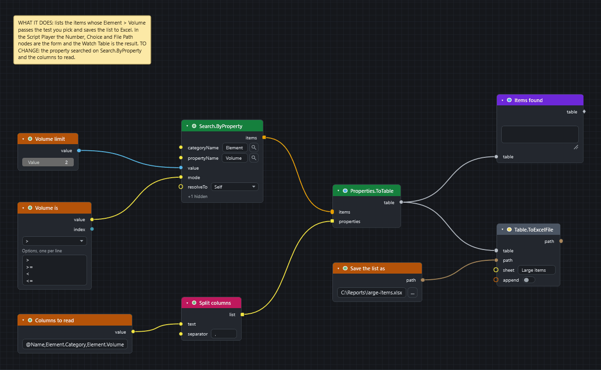
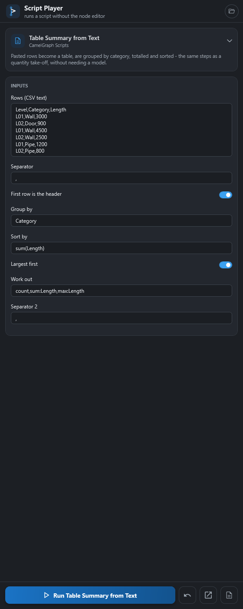
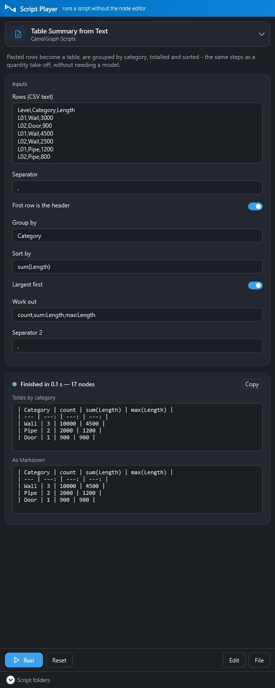

# Give colleagues a form with the Script Player

Goal: build a graph whose inputs appear as a form in the **Script Player**, so a colleague fills in a few fields, presses **Run** and reads the result.

## Before you start

* Open a model in Navisworks and the Dyncamelo editor.
* You build and test the graph. Your colleague only needs Dyncamelo installed and a model open.
* The example finds items by their volume and writes them to an Excel file. Replace the names with your own.

[Download the graph](../graphs/player-form.dyc)

## Steps: build the graph

1. Add a `Number` node (*Input*). Double-click its title and rename it `Volume limit`. The name becomes the label of the field. Type `2` as the value.
2. Add a `Choice` node (*Input*) and rename it `Volume is`. In its **Options, one per line** box type `>`, `>=`, `<` and `<=` on four lines. The drop-down above the box then offers all four and starts on the first.
3. Add a `File Path` node (*Input*) and rename it `Save the list as`. Type a full path such as `C:\Reports\large-items.xlsx` into its box. The `…` button only picks a file that exists, so type the path of a new file.
4. Add `Search.ByProperty` (*Navisworks ▸ Search*) with `categoryName` = `Element` and `propertyName` = `Volume`. Wire `value` from `Choice` into its `mode` and `value` from `Number` into its `value`.
5. Add `Properties.ToTable` (*Navisworks ▸ Properties*) and wire the search `items` into it. Feed `properties` from a `String.Split` (*String*) with the separator `,`, fed by a `String` node with the text `@Name,Element.Category,Element.Volume`.
6. Add `Table.ToExcelFile` (*Table*). Wire the table into `table` and `path` from `File Path` into `path`. Type `Large items` into `sheet`.
7. Add a `Watch Table` (*Display*), rename it `Items found`, and wire the table into it. Press ++f5++ and check it works.
8. Choose **Graph ▸ Script Description…** and type what the script does. It is shown above the form.
9. Save with ++ctrl+s++ into `Documents\Dyncamelo\Scripts`.

The Player shows every input node by default, top to bottom in the order the nodes sit on the canvas, and the Watch nodes in its results. Other nodes are hidden. To offer any other unwired input as a field, right-click its socket and choose **Show in Player**. A small ▶ badge marks nodes the Player uses. Press ++ctrl+alt+p++ on selected nodes to show or hide them in the Player. Put inputs at the top level of the graph: inputs inside a [node group](../node-groups.md) are not offered.

## Steps: run it as your colleague

1. Click **Player** on the **BIMCamel** ribbon tab. Choose the script from the list.
2. Fill in the form: a number, a choice, a file path.
3. Press **Run**. Because the script writes a file, the Player lists the nodes responsible and asks "Run it?" the first time, and again whenever the file changes.

## What you get

After the run the Player shows a results card: a green or red dot with a summary line, the value of each Watch node, and below it any node that failed or warned. **Copy** puts the report on the clipboard as text for an e-mail. The values your colleague typed are remembered for that script.

## If it does not work

* The script is not in the list: save it in `Documents\Dyncamelo\Scripts` or add its folder under **Script folders**, then press ↻.
* The Player says a node is not installed: the script cannot run until it is. See [A graph opens with a warning, or with missing nodes](../troubleshooting.md#a-graph-opens-with-a-warning-or-with-missing-nodes).
* The confirmation question appears: [that is a safety check, not an error](../troubleshooting.md#the-script-player-asks-me-to-confirm-a-script).

## Next

* [The Script Player](../player.md) describes the form, results and safety in full.
* [Reuse a piece of graph as a node group](reusable-node-group.md).
* [Saving and opening scripts](../saving-opening.md#script-description-and-the-scripts-folder).
