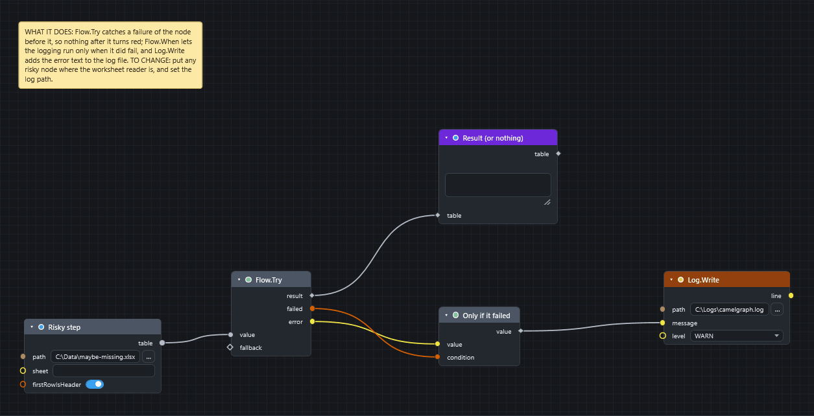

# Keep a graph going when a node fails

Goal: let a graph carry on when one step can fail, for example reading a file that may be missing, and record what went wrong in a log.

## Before you start

* Open the CamelGraph editor. No model is needed for this example.
* Without `Flow.Try`, a node that fails turns red and the nodes after it wait with an amber "Upstream failure" warning. The rest of the graph and Navisworks are not affected.
* The failing node itself still shows its red error. `Flow.Try` stops that error from stopping the nodes after it.

[Download the graph](../graphs/keep-going-after-failure.dyc)

## Steps

1. Add the node that may fail. In the example it is `Table.FromExcelFile` (*Table*) with `path` set to a file that may not exist, such as `C:\Data\maybe-missing.xlsx`. Rename it `Risky step`.
2. Add `Flow.Try` (*Workflow*). Wire the output of the risky node (`table`) into its `value`. Leave `fallback` empty, or wire in what the rest of the graph should use when the step fails.
3. Add `Flow.When` (*Workflow*) and rename it `Only if it failed`. Wire the `error` output of `Flow.Try` into its `value` and the `failed` output into its `condition`. When `failed` is true the error text passes on. When it is false the nodes after `Flow.When` are skipped and shown idle, not red.
4. Add `Log.Write` (*File*). Wire the `value` output of `Flow.When` into its `message`. Type a full path such as `C:\Logs\dyncamelo.log` into `path` and `WARN` into `level`. `level` can also be `INFO`, `ERROR` or `DEBUG`.
5. Wire the `result` output of `Flow.Try` to the rest of your graph, for example a `Watch Table` (*Display*) named `Result (or nothing)`.
6. Press ++f5++.

## What you get

* **File missing:** `Flow.Try` gives your fallback in `result`, `failed` is true and `error` holds the message. `Log.Write` appends one line such as `2026-10-01 10:20:35  WARN  message` to the log file.
* **File found:** `result` is the table, `failed` is false, `error` is empty. `Flow.When` is false, so `Log.Write` is skipped and shown idle.

!!! tip "Where else to use it"
    Put `Flow.Try` around anything that can fail without it being your fault: a file that may be missing, a web call (`Web.Get`, `Web.Post`), a program (`System.Run`), or one bad file in a list of files to append. Turn the `failed` output into a decision with `Flow.When`, or into text with `String.Format`.

!!! note "Failures inside a list"
    When a node runs once per item of a list and some items fail, you do not need `Flow.Try`. The failed items give an empty result, the others still compute, and the node shows one amber warning that counts the failures. `List.Clean` removes the empty results.

## If it does not work

* Everything after `Flow.Try` is still red: the node wired into `value` is not the one that failed, or a second failing node feeds the same branch. Press ++i++ on a red node and read the status bar.
* `Log.Write` fails: use a full path to a folder you can write to ([why](../troubleshooting.md#a-file-node-fails-with-access-denied-or-writes-to-the-wrong-place)).
* Nothing runs after `Flow.When`: that is correct when `failed` is false. See [Nothing happens when I press Run](../troubleshooting.md#nothing-happens-when-i-press-run).

## Next

* [Read errors and warnings](read-errors-and-warnings.md).
* [Concepts](../concepts.md#doing-things-in-order) covers `Flow.When`, `Flow.Try` and loops.
* [Recipes](../recipes.md#model-maintainer--compiler) uses `Flow.Try` when compiling files.
