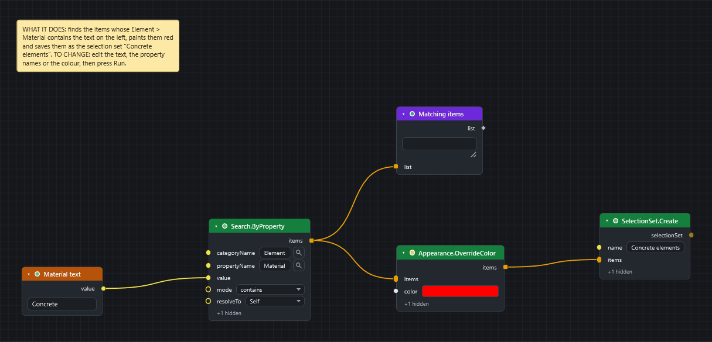
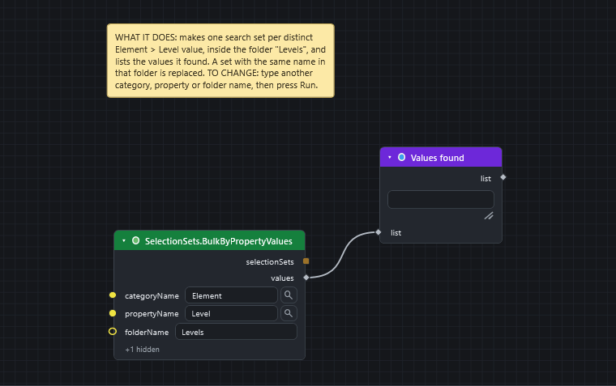

# Save selection sets

Goal: store search results in the Navisworks **Sets** window, either as one set or as one set per value of a property.

## Before you start

* Open a model in Navisworks and the Dyncamelo editor.
* Know the tab and property to search by ([find the names](find-property-names.md)).

## Part A: one set from a search

[Download the graph](../graphs/first-script.dyc)

1. Add `Search.ByProperty` (*Navisworks ▸ Search*). Type `Element` into `categoryName`, `Material` into `propertyName` and `Concrete` into `value`, and choose `contains` for `mode`.
2. Add `SelectionSet.Create` (*Navisworks ▸ SelectionSets*). Wire `items` from the search into its `items`.
3. Type `Concrete elements` into its `name` input.
4. Press ++f5++.

The set appears in the Navisworks **Sets** window. `SelectionSet.Create` replaces a top-level set with the same name, so a second run updates the set instead of adding another. It stores the items that were found when you ran it.

## Part B: one set per value

[Download the graph](../graphs/bulk-selection-sets.dyc)

1. Add `SelectionSets.BulkByPropertyValues` (*Navisworks ▸ SelectionSets*).
2. Type `Element` into `categoryName` and `Level` into `propertyName`.
3. Type `By Level` into `folderName`. Leave it empty to put the sets at the top level.
4. Add a `Watch List` (*Display*) and wire the `values` output into it. This shows the distinct values the node found.
5. Add `List.Count` (*List*), wire `selectionSets` into its `list`, and wire its `count` into a `Watch`.
6. Press ++f5++.

## What you get

* Part A: a saved selection set with the name you typed.
* Part B: one **search set** for every distinct value, filed in the folder you named. A search set is live: it re-evaluates as the model changes. `selectionSets` and `values` are in the same order, so the first set belongs to the first value.
* Running again replaces sets with the same name in that folder.

!!! note "Selection set or search set?"
    `SelectionSet.Create` keeps the items it was given. `SelectionSet.CreateFromSearch` and `SelectionSets.BulkByPropertyValues` keep a rule, so they follow the model when it changes.

## If it does not work

* The Watch List is empty or the count is 0: the names do not match what Navisworks shows. See [A search returns nothing](../troubleshooting.md#a-search-returns-nothing-or-the-magnifier-next-to-a-tab-or-property-shows-no-names).
* A node is red: see [Read errors and warnings](read-errors-and-warnings.md).

## Next

* [Colour elements by a property](colour-elements-by-property.md).
* [SelectionSets nodes](../nodes/navisworks-selectionsets.md) lists the rest, such as `SelectionSet.MoveToFolder` and `SelectionSet.Rename`.
* [Sample scripts](../samples.md) includes *Bulk Selection Sets from Values*.
