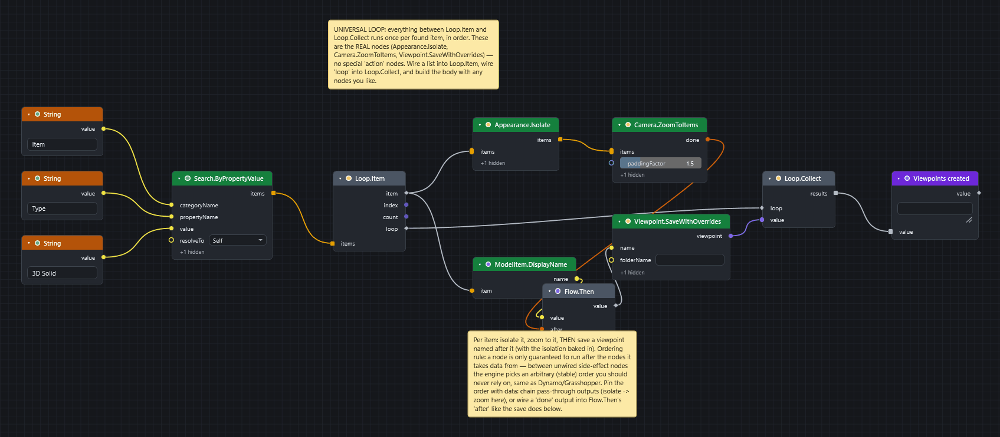
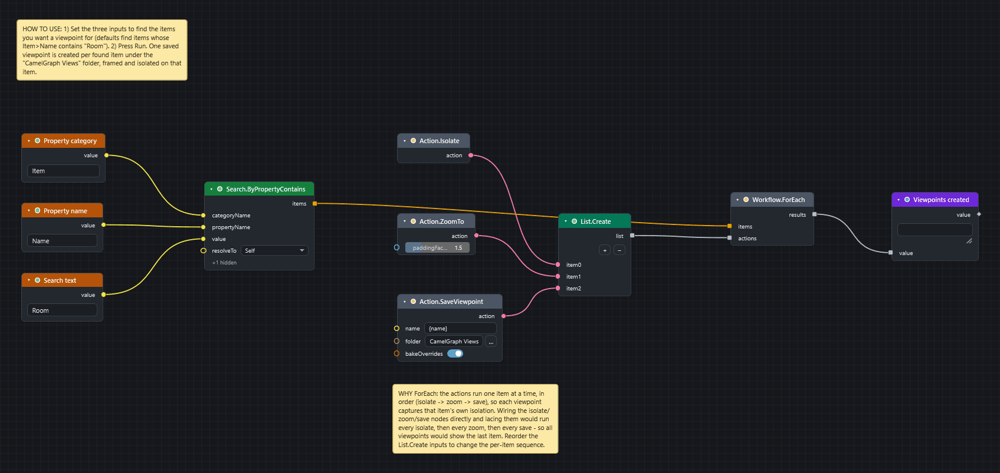

# Save one viewpoint for every item

Goal: for every item a search finds, isolate it, frame it in the view and save a viewpoint named after it.

## Before you start

* Open a model in Navisworks and the CamelGraph editor.
* Save the model. The loop isolates items one after another and leaves the last one isolated.
* The quickest way to try it is to open the finished sample: **File ▸ Sample Graphs ▸ Isolated Viewpoints (Loop)**, or its card on the start screen.

## Steps: build the loop

1. Add a `String` node (*Input*) with the text `Room`. Add `Search.ByProperty` (*Navisworks ▸ Search*) to find the items: type `Item` into `categoryName` and `Name` into `propertyName`, choose `contains` in `mode`, and wire the `String` into `value`. That input accepts any kind of value, so it has no box of its own.
2. Add `Loop.Item` (*Workflow*). Wire the search `items` into its `items`. Everything you wire between `Loop.Item` and `Loop.Collect` runs once for each item, in order.
3. Add `Appearance.Isolate` (*Navisworks ▸ Appearance*). Wire the `item` output of `Loop.Item` into its `items`.
4. Add `Camera.ZoomToItems` (*Navisworks ▸ Camera*). Wire the `items` output of `Appearance.Isolate` into its `items`. Passing the items on makes the zoom wait for the isolate.
5. Add `ModelItem.DisplayName` (*Navisworks ▸ ModelItem*). Wire `item` from `Loop.Item` into its `item`. This is the name for the viewpoint.
6. Add `Flow.Then` (*Workflow*). Wire `name` into its `value` and the `done` output of `Camera.ZoomToItems` into its `after`. The name now reaches the next node only after the zoom is done.
7. Add `Viewpoint.SaveWithOverrides` (*Navisworks ▸ Viewpoints*). Wire the `value` output of `Flow.Then` into its `name`. Type `Dyncamelo Views` into `folderName`.
8. Add `Loop.Collect` (*Workflow*). Wire `loop` from `Loop.Item` into its `loop` and `viewpoint` into its `value`.
9. Add a `Watch List` (*Display*) on `results`, then press ++f5++.

When it finishes, open the Navisworks **Saved Viewpoints** window. There is one viewpoint for each item, in the folder you named.

## The shorter way: Workflow.ForEach

The sample *Isolated Viewpoints per Item* does the same with ready-made steps. Add `Action.Isolate`, `Action.ZoomTo` and `Action.SaveViewpoint` (*Workflow ▸ Actions*), gather them in this order with `List.Create` (*List*), and wire the list into the `actions` input of `Workflow.ForEach` (*Workflow*) and the search `items` into its `items`. `Action.SaveViewpoint` names each view `{name}` (the item's name) and files it in the folder `Dyncamelo Views` by default. Add `{index1}` or `{count}` to the name to number them.

## What you get

* One saved viewpoint for every item. `Viewpoint.SaveWithOverrides` stores the current view **and** the isolation, so recalling a viewpoint shows exactly that item.
* A viewpoint with the same name as an existing one replaces it. Items that share a name therefore leave one viewpoint.

!!! warning "Why Flow.Then?"
    A node is only guaranteed to run after the nodes it takes data from. Two side-effect nodes with no data between them run in an order you must not rely on. Pass the items on from one node to the next, or wire a `done` output into `Flow.Then`, so the order is isolate, zoom, then save.

After the run, the model stays isolated on the last item. Use `Appearance.ShowAll` to bring everything back.

## If it does not work

* Every viewpoint looks the same or shows the last item: the order is not pinned. Check the wires in steps 4 and 6.
* The run is slow, because each pass does real work in Navisworks: press ++esc++ to stop it. It halts between the passes and carries on at the next **Run**. See [Speed up a slow graph](speed-up-slow-graph.md).
* Nothing is found: see [A search returns nothing](../troubleshooting.md#a-search-returns-nothing-or-the-magnifier-next-to-a-tab-or-property-shows-no-names).

## Next

* [Sample scripts](../samples.md#viewpoints-and-loops) also has *Spotlight Viewpoints per Item* and *Section Box Viewpoints per Group*.
* [Concepts](../concepts.md#doing-things-in-order) explains data order and loops.
* [Workflow nodes](../nodes/workflow.md#node-loop-item).
