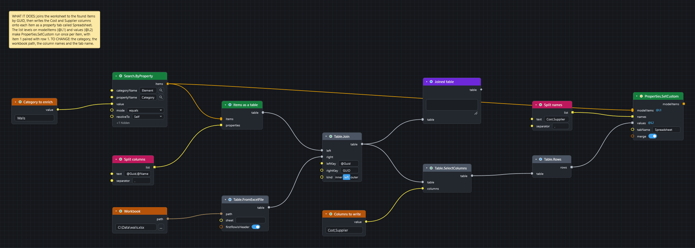

# Write spreadsheet data onto model items

Goal: take columns such as `Cost` and `Supplier` from an Excel sheet and store them as a searchable property tab on the matching items.

## Before you start

* Open a model in Navisworks and the Dyncamelo editor.
* Have an `.xlsx` file with one row for each item. One column holds the item's instance GUID (here with the header `GUID`), and the other columns hold the data (here `Cost` and `Supplier`). The first row holds the headers.
* Keys are compared as exact text. A GUID in capitals does not match one in lower case.
* Save the model first. The values are written into the open document. The source files of the model are never changed.

[Download the graph](../graphs/properties-from-excel.dyc)

## Steps

1. Add `Search.ByProperty` (*Navisworks ▸ Search*) to find the items that should get the data, for example `Element` / `Category` / `Walls` / `equals`.
2. Add `Properties.ToTable` (*Navisworks ▸ Properties*). Wire the search `items` into `items`. For `properties`, add a `String.Split` (*String*) with the text `@Guid,@Name` and the separator `,`, and wire its `list` in. `@Guid` is the item's instance GUID.
3. Add a `File Path` (*Input*) with the full path of the workbook, and a `Table.FromExcelFile` (*Table*). Wire the path in.
4. Add `Table.Join` (*Table*). Wire the `Properties.ToTable` table into `left` and the Excel table into `right`. Type `@Guid` into `leftKey`, `GUID` into `rightKey` and choose `left` in `kind`. A left join keeps every item, in the same order as the search.
5. Add a `Watch Table` (*Display*) on the joined table and press ++f5++. Check that `Cost` and `Supplier` are filled. An empty cell means the sheet has no row for that item.
6. Add `Table.SelectColumns` (*Table*) with `columns` = `Cost,Supplier`, then `Table.Rows` (*Table*). `rows` is a list with one list of cells for each item.
7. Add `Properties.SetCustom` (*Navisworks ▸ Properties*). Wire the search `items` into `modelItems` and `rows` into `values`. For `names`, add another `String.Split` with the text `Cost,Supplier` and the separator `,`. Type `Spreadsheet` into `tabName`.
8. Right-click the `modelItems` socket, choose **List Levels** and then `@L1 — items`. Right-click the `values` socket, choose **List Levels** and then `@L2 — lists of items`.
9. Press ++f5++ again.

## What you get

Every matched item has a property tab called `Spreadsheet` with the properties `Cost` and `Supplier`. Open the Navisworks **Properties** window on an item to see it. The values are searchable, can be used in schedules, and travel with the NWF or NWD.

Why step 8: `Properties.SetCustom` writes one list of names and values to **all** the items it is given. The levels make it run once for each item, with item 1 paired with row 1, item 2 with row 2, and so on. Both lists come from the same join, so they line up.

!!! warning "One row per GUID"
    If the sheet holds the same GUID twice, the join adds a second row for that item and the lists no longer line up. Remove duplicates in the sheet first.

To remove the tab again, run `Properties.RemoveCustomTab` with the same items and `tabName`. Running `Properties.SetCustom` again with `merge` on (the default) keeps other properties in the tab and lets the new values win.

## If it does not work

* Every cell from the sheet is empty: the keys do not match. Compare one `@Guid` with the sheet cell.
* A socket shows no `@L1` badge: List Levels was not set. See [Concepts](../concepts.md#lists-replication-and-lacing).
* A node is red: see [Read errors and warnings](read-errors-and-warnings.md).

## Next

* [Find elements from a list of GUIDs](find-elements-from-guids.md).
* [Table nodes](../nodes/table.md#node-table-join) for `Table.Join` and the rest of the table toolkit.
* [IFC, BCF, Excel and CSV](../exchange-formats.md#excel).
