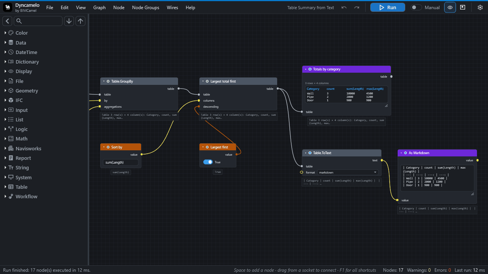

# CamelGraph for Navisworks

*Previously called **Dyncamelo**: the same program, with the same files and the same free personal-use copy. Version 0.48 still shows the old name on screen; the next release uses the new one.*

CamelGraph brings **Dynamo-style visual programming** to Autodesk Navisworks 2024, 2025 and 2026. You drag **nodes** onto a canvas, wire the output of one into the input of the next and press **Run**. The graph reads and changes the model you have open: no code, no macros, no SDK boilerplate.

> Search a federated model by property, colour-code it by system, create selection sets in bulk, take quantities out to Excel, triage clashes by rule and make a saved viewpoint for each issue, as graphs you can save, share and run again.

[Browse the node library](nodes/index.md){ .md-button .md-button--primary }
[Your first script](first-steps.md){ .md-button }
[Installation](installation.md){ .md-button }

*It docks inside Navisworks as a pane, and has a light theme too.*

!!! note "Personal use or professional use?"
    The copies from GitHub and bimcamel.com are **free for personal use**: learning, hobby projects, research, and charities, schools, universities, public research bodies and government institutions. For **work** at a company, a consultancy or a design office, or in a paid project or product, the professional copy is **coming soon** to the **Autodesk App Store**. Until it is there, get in touch through [bimcamel.com](https://www.bimcamel.com). It is the same program with the same features. See [Licence](licence.md#which-copy-do-i-need).

## Where to start

| I want to… | Read |
|---|---|
| Install it | [Installation](installation.md), after a look at the [requirements](requirements.md) |
| Build my first graph in ten minutes | [Your first script](first-steps.md) |
| Understand how graphs work | [Concepts](concepts.md), then [Inputs, outputs and kinds](ports-and-kinds.md) |
| Find a node and see its inputs and outputs | [Node library](nodes/index.md), or search the whole site with the box at the top |
| Follow a step-by-step guide for one job | [Colour elements by a property](howto/colour-elements-by-property.md), [Take quantities out to Excel](howto/quantity-takeoff-to-excel.md), [Make a clash report](howto/clash-report.md), and the other **How-to guides** in the menu |
| Learn from a finished graph | [Sample scripts](samples.md) and [Recipes](recipes.md) |
| Exchange data with IFC, BCF, Excel or CSV | [IFC, BCF, Excel and CSV](exchange-formats.md) |
| Run a tested script without the node editor | [The Script Player](player.md) |
| Look up a word | [Glossary](glossary.md) |
| Fix a problem | [Troubleshooting](troubleshooting.md) and the [FAQ](faq.md) |
| Update or remove CamelGraph | [Updating](updating.md), [Uninstalling](uninstall.md) |
| Write my own nodes in C# | [Writing your own nodes](extending.md) |

## What it can do

* **A real dataflow engine.** Nodes run in dependency order, results are cached, and when you change one input only the nodes after it run again. Run by hand, or let it re-run after every edit.
* **Lists work the way Dynamo users expect.** Feed a list into an input that wants one value and the node runs once per item; *lacing* (shortest, longest, cross product) and *list levels* (`@L`) choose how lists pair up.
* **Loops over items.** Put any nodes between `Loop.Item` and `Loop.Collect` and they run once per item, in order, so jobs like "isolate, zoom, save a viewpoint, next" use the real nodes.
* **A deep Navisworks library.** Properties and quantities, Find-Items-grade search, selection sets, colour, transparency and hide overrides, transforms, saved viewpoints, clash tests and results, BCF exchange, IFC export, grids, TimeLiner, and CSV, Excel and HTML reports. The general library adds maths, logic, text, dates, lists, dictionaries, tables and files.
* **Robust by design.** A node that fails shows its own error and never stops the graph run or Navisworks.
* **Portable graphs.** A graph is a small, versioned, plain-text `.dyc` file that you can email, review and keep in version control.
* **The Script Player.** Run a saved graph from a simple form, for colleagues who should not have to open the editor.
* **Extensible.** A public static C# method with a couple of attributes is a node.

See [Concepts](concepts.md) for the vocabulary, and the [node library](nodes/index.md) for every node.

## Good to know before you start

* **Personal use is free. A professional copy for the Autodesk App Store is coming soon.** Using CamelGraph for your job at a company, or in a paid project, needs the professional copy, which will come with a commercial licence. Until it is there, get in touch through bimcamel.com. See [Licence](licence.md).
* It **sends nothing about you or your models anywhere**. It makes one optional request a day to look for a newer version, which you can switch off. See [Privacy and safety](privacy-and-safety.md).
* **A graph is a program.** Only run graphs you trust. CamelGraph asks before it runs a graph from a file that can run programs, use the network or change files.
* Only **Navisworks Manage 2024** has been seen running it in the field so far; 2025, 2026 and Simulate are built and installed the same way but not yet confirmed. The [requirements](requirements.md) page says exactly what is and is not verified.
* CamelGraph is not affiliated with or endorsed by Autodesk. Autodesk, Navisworks, Revit and Dynamo are trademarks of Autodesk, Inc.

This site belongs to the version it was built from (shown at the top of every page). The source code, issues and release notes are on [GitHub](https://github.com/mrshoma99-rgb/dyncamelo).
