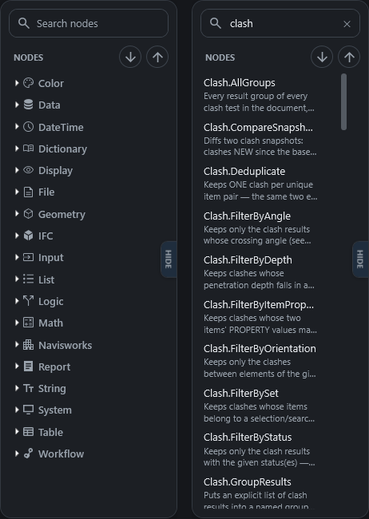

# Node library and search

The node library is the list of every node you can add to a script, and CamelGraph gives you three quick ways to find one: the library panel, the quick search that opens when you press ++space++, and the search that opens when you drop a wire on empty canvas.

For the full list of nodes with their inputs and outputs, see the [node library](nodes/index.md).

## The library panel

The panel is a rounded card that floats on the left of the canvas. Drag the gap between the card and the canvas to change its width.

| Control | What it does |
|---|---|
| Search box | The full-width box at the top of the card. Type to search all nodes (see below). The ✕ at the right of the box clears it, and so does ++esc++. |
| Small round **+** button (under the search box) | **Expand all categories.** |
| Small round **−** button (next to the +) | **Collapse all categories.** |
| **HIDE** tab on the right edge of the card | **Hides the whole panel.** A **NODES** tab at the left edge of the canvas brings it back. |

You can also hide or show the panel with ++ctrl+b++ or **View ▸ Node Library Panel**, and **Settings ▸ Appearance ▸ Node library panel** controls whether it is shown. **Settings ▸ Appearance ▸ Descriptions in the library** adds or removes the grey description line under each node name (see [Settings](settings.md)).

### Categories

Nodes are grouped in a folder tree. The top-level folders are the families of nodes, such as Input, Math, Logic, String, List, Table, Color, File, Geometry, Workflow and **Navisworks**. Most top-level folders have a small icon beside the name. Folders can hold sub-folders: the Navisworks folder, for example, contains Appearance, Clash, Properties, Search, Selection, SelectionSets, Viewpoints and more.

Inside the lowest folders the nodes are sorted under three small headings that tell you at a glance what a node does:

* **Create** produces something new: a model element, a saved view, set or folder, an exported file, or a new data value.
* **Modify** acts on or changes existing things or the scene: overrides, transforms, isolate, move, rename, delete.
* **Info** reads and returns data without changing anything: property reads, searches, counts, names, measures.

The same dot appears on a node's title bar on the canvas; hover it to see which of the three it is.

If your script contains [node groups](node-groups.md), the library also lists them in a **Node Groups** folder, so you add an instance the same way as any node. Nodes that have been retired are not listed, although old scripts that use them still open and run.

### Favourites

Hover a node in the list and a **star** appears at its right. Click it to add the node to **Favourites** (click again to remove it). Starred nodes are collected in a **★ Favourites** folder pinned at the top of the tree. Your stars are kept between sessions and are not lost by **Reset all settings** (see [Settings](settings.md)).

### Adding a node from the panel

* **Double-click** a node to put it in the middle of what you see on the canvas.
* **Drag** it onto the canvas where you want it. If you drop it on a wire it fits, the node is spliced into the wire.
* To go the other way, right-click a node on the canvas and choose **Find in Library**: the panel opens the right folders and highlights the entry.

### Searching the panel

!!! tip "Search by what you want to do"
    Every word you type has to appear in a node's name, folder, search keywords or description, so `clash status` finds clash nodes about status, and `average` finds `List.Average` even if you do not know its name.

Type in the search box and the folder tree is replaced by a flat list of matches. Clear the box and the tree comes back exactly as you left it.

* Every word you type has to appear somewhere in a node's **name, folder, search keywords or description**, in any order. Case does not matter, and British and American spellings are the same word: `colour` finds `Color.ByHSV`, and `grey`, `centre` and `metre` find `gray`, `center` and `meter`.
* The input, display and loop nodes answer to the words people use for them: `dropdown` finds `Choice`, `checkbox` finds `Boolean`, `preview` or `debug` find `Watch`, `for each` finds `Loop.Item` and `Loop.Collect`, `picture` finds `Watch Image`, `calendar` finds `Date` and `folder` finds `Directory Path`.
* Matches are ranked: names that start with your first word come first, then names that contain it, then folder or keyword matches, then description-only matches. Starred nodes come before others of equal rank, then recently added ones.
* At most 200 results are shown. If there are more, a line at the bottom says so; type another word to narrow it down. If nothing matches, it says "No nodes match" followed by your text.
* ++esc++ in the panel clears the search. A second ++esc++ clears the highlight.

## Quick search with `Space`

Press ++space++ while the pointer is over the canvas and a small search box opens near the top of it. This is the fastest way to add a node.

1. Type a few letters of what you want. The list updates as you type (up to 50 matches).
2. Move through the list with the up and down arrow keys, or click a result.
3. Press ++enter++ (or click) to insert the node **where your pointer was when you pressed ++space++**. ++esc++, or a click anywhere else, closes the box without adding anything.

Hover a result for a tooltip with the node's description and its inputs and outputs.

**Starred and recent nodes.** Before you type anything, the list shows your **starred nodes first, then the nodes you added most recently** (CamelGraph remembers the last 12). While you type, starred and recent nodes come first among equally good matches. With no stars, pressing ++space++ then ++enter++ simply adds the node you added last.

You can also open the quick search from the menu with **Graph ▸ Add Node…**, which inserts the node in the middle of the view.

## Search when you drop a wire

If you drag a wire from a socket and let go on empty canvas, the same search box opens, with a line under it such as "Nodes that accept a Number from …" or "Nodes that produce … for …". It shows only nodes that can connect to that wire, with exact and convertible fits first and looser fits after them. Pick one and CamelGraph adds it and connects its best matching socket in a single step (one undo). If you type nothing, you see starred and recent nodes first.

## Finding a node that is already on the canvas

The `@` search is for nodes you have already placed, not for the library. Press ++ctrl+f++ (**Find Node on Canvas…**) or open the command palette (++ctrl+shift+p++) and start with `@`. Type part of a node's name or folder, move to a result and press ++enter++: the node is selected and brought into view. Without the `@`, the palette lists matching commands first, then a few canvas nodes, then matching settings. See [The editor: canvas and nodes](canvas-and-nodes.md).

## Tooltips and help

| Hover over… | You see |
|---|---|
| A node in the library, or a quick-search result | The node's name, its folder, a description, and a signature line listing its inputs and outputs with their types. |
| A node's title on the canvas | What the node does. |
| A socket | The socket's name and type, whether it is required or optional (and its default), what it does, and, after a run, the value it holds or the value arriving on its wire. |

++f1++ is **not** node help. It opens the sheet of keyboard shortcuts and mouse gestures. The full node documentation is in the [node library](nodes/index.md).

## How nodes are named and organised

* Node names follow a `Category.Verb` or `Category.Noun` pattern, for example `Search.ByProperty`, `Appearance.OverrideColor` or `List.GetItemAtIndex`. The part before the dot tells you the family, which makes names easy to search and easy to read on a node.
* The name and the library folder are related but not identical. The node `Appearance.OverrideColor`, for example, lives in the library folder Navisworks ▸ Appearance. You can search by either.
* The interactive input and display nodes have plain names instead: `Number`, `Number Slider`, `Boolean`, `String`, `Choice`, `Watch`, `Watch List`, `Color Picker` and so on.
* Nodes you add yourself (see [Writing your own nodes](extending.md)) are placed in whichever folder their author chose. They are loaded when Navisworks starts, from `%APPDATA%\CamelGraph\Packages`; **Help ▸ Node Packs…** shows which packs loaded.

## Next steps

* [The editor: canvas and nodes](canvas-and-nodes.md), [Concepts](concepts.md) and the [keyboard and mouse reference](shortcuts.md).
* [Your first script](first-steps.md) uses the quick search from the first minute.
* [Node library](nodes/index.md) lists every node by category.
