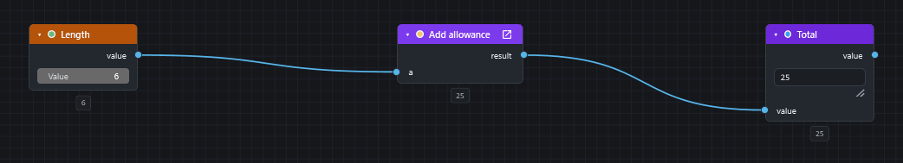
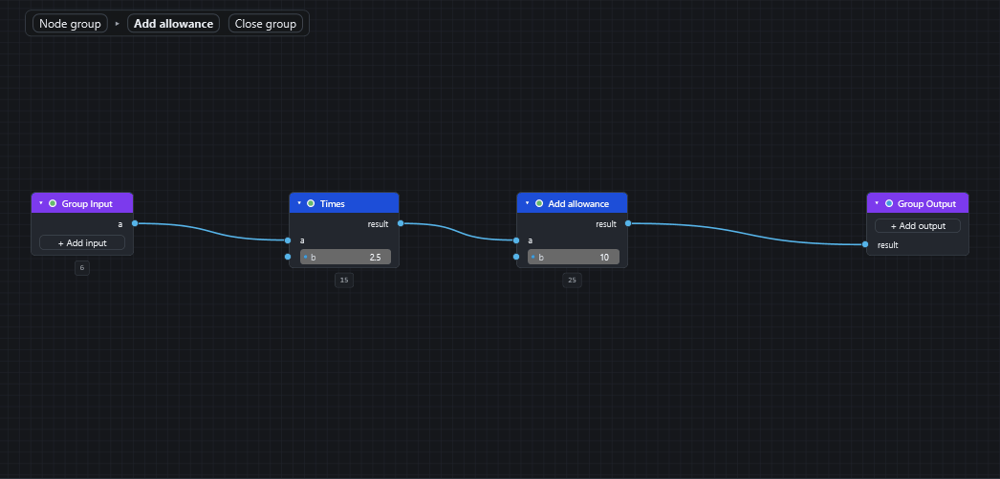

# Node groups

A node group packs a few nodes that do one job into a single reusable node with its own inputs and outputs, much like a group node in Blender.

Use a group to tidy up a big script, or to build a routine once (for example "find the elements on a level and colour them") and reuse it as often as you like. A group lives inside the `.dyc` file, so it travels with the script.

Do not confuse node groups with **frames**. A frame (++ctrl+g++, "Group Selection" in the Graph menu) is only a coloured rectangle drawn behind some nodes. See [The editor: canvas and nodes](canvas-and-nodes.md#notes-and-frames).

!!! tip "Learn it by doing"
    [Make and reuse a node group](howto/reusable-node-group.md) builds a group from two nodes in eight steps.

## The pieces

* The **group** is the definition: the nodes inside it and its interface.
* The **interface** is the list of the group's **inputs** and **outputs**. Inside the group they appear as two special nodes, **Group Input** (on the left) and **Group Output** (on the right).
* An **instance** is one use of the group on the canvas. It looks like an ordinary node whose sockets are the group's interface. A script can hold many instances of one group.

Editing the group changes **every instance**.

All of the commands below are in the **Node Groups** menu, and several are also in a node's right-click menu.

## Make a group

1. Select the nodes that should become the group.
2. Choose **Node Groups ▸ Make Node Group** (++ctrl+alt+g++).

The wires that crossed the edge of your selection become the group's sockets: one **input** for every outside source feeding the selection, and one **output** for every output socket that leaves it. An instance takes the place of your selection and is wired to the same neighbours, so the script computes exactly what it did before. The new group is called "Node Group" (with a number if that name is taken).

**Nodes the Script Player uses stay outside.** The Player shows only the top level of a script, so an input node (`Number`, a slider, `String`, `Boolean` and so on), a Watch node, a node you marked **Show in Player**, and a node with an input you offered as a field are not moved into the group even when they are selected. They keep their place and are wired to the group through its sockets (an input node feeds a new Group Input socket). The status bar says which nodes stayed out: "Kept outside the group because the Player uses them: Gap, Result." This applies to groups made at the top level of the script; inside an open group everything selected goes in. A Player node that sits *between* the nodes that go in cannot stay out without a loop, so the group is refused and the message names it: hide that node from the Player or leave out the nodes after it.

CamelGraph will not make a group in a few cases, and the status bar says why:

* nothing is selected, or everything selected is used by the Player (and so stays outside);
* a node that sits **between** the selected nodes is not selected (it would have to be both inside and outside), so select it too;
* a loop is split: `Loop.Item` and `Loop.Collect` must go into the same group, together with the nodes between them;
* the selection includes a group's own Group Input or Group Output.

## Open a group and get back out

* Select an instance and press ++tab++, or click the small arrow in its title bar (or right-click ▸ **Open Node Group**). The canvas now shows the group's nodes between a **Group Input** and a **Group Output** node, fitted to the window.
* A **breadcrumb bar** appears at the top left of the canvas, such as `My script ▸ Level colours`. Click any step to go back to that level, or click **Close group**. ++shift+tab++ also closes the group, and ++tab++ closes it when no group is selected. When you leave, the view returns to where it was and the instance you opened is selected again.
* Groups can contain other groups, so you can go several levels deep; the breadcrumb shows the whole path.

While a group is open you edit it like any other script. You can add nodes with ++space++, wire, move, mute, freeze and so on. Running (++f5++) still runs the **whole script**, so you see the effect of an edit at once. ++esc++ stops a run from inside a group too, and the progress text names the path, for example `Outer ▸ Inner ▸ node`. You cannot open or close a group while a run is in progress.

Each level keeps its **own undo history**, so ++ctrl+z++ inside a group never reaches into the script outside it.

## Edit the interface

Inside a group, the Group Input and Group Output nodes are where you add, rename and remove sockets.

* Click **+ Add input** on the Group Input node, or **+ Add output** on the Group Output node. The same commands are in the menu as **Add Group Input Socket** and **Add Group Output Socket**.
* A quicker way: **drag a wire onto the Group Output node itself** (from the output socket you want to hand out), or from an unwired input onto the Group Input node, and release. A new socket is created, named and typed after the socket you dragged from, and connected.
* **Right-click a group socket** to **Rename Socket…**, **Remove Socket**, **Move Up** or **Move Down**, or to set its **Socket Type**.
* Removing a socket also removes the wires on it, **everywhere the group is used**; undo brings them back.
* Socket names are kept unique on each side ("Input", "Input 2" and so on).

The **socket type** (Any, Number, Integer, Boolean, Text, Colour, Geometry, Model item, Selection, Viewpoint, or a list of those) colours the socket in the usual way (see [Inputs, outputs and kinds](ports-and-kinds.md)) and, on instances, gives the input a normal inline editor. Sockets pass **whole values**, so a list travels through a group as one list.

The Group Input and Group Output nodes cannot be deleted, copied or duplicated; they belong to their group.

## Instances share the group

* **Rename Node Group…** renames the group. Instances that still carry the group's name follow the rename; an instance you named yourself keeps its name.
* **Make Node Group Single User** gives one instance its own copy of the group (named "… copy") so editing it no longer changes the others. It only does something when the group is used more than once.
* **Ungroup Node Group** (++ctrl+alt+u++) puts a copy of the group's nodes back in place of an instance, wired through the interface to whatever the instance was wired to. The group itself stays in the file for any other instances.
* **Delete Unused Node Groups** removes the groups that no instance uses any more. Until you do this, a group stays in the file even after its last instance is gone.

A group can hold other groups but never itself. If you try to place a group inside itself, CamelGraph refuses and says so.

## Groups in the library

The document's groups are listed in the node library under **Node Groups**, so adding another instance is as easy as adding any node (double-click, drag, or ++space++ and type the group's name). The list follows the open script, so it changes when you open another file. See [Node library and search](library-and-search.md).

Copying an instance and pasting it into another script brings its group along.

## Good to know

* **Errors inside a group** are reported on the instance, for example "Inside 'Level colours', Appearance.OverrideColor: …", for up to three nodes, followed by a count of the rest. A failure that a `Flow.Try` inside the group took care of is not reported on the instance. Warnings inside are summarised as a count; the Group Input and Group Output nodes, and nodes that only waited for a failed one, are not counted.
* **A switched-off or failed input stops only what depends on it.** A `Flow.When` that is false inside a group, or an input that comes from a node that is switched off or failed, crosses the edge of the group **socket by socket**: the outputs that depend on it leave the group switched off (idle) or as a failure, and every other output delivers its value. Inside the group only the nodes downstream of the bad input wait, so independent chains still run. If every output is switched off, the instance is idle ("Skipped"). A `Flow.Try` inside a group can catch a failure that arrives from outside.
* **A frozen node inside a group** freezes everything after it in the group. The instance then keeps the outputs it had and shows an amber warning that says so.
* **Everything inside runs each time.** Whenever an instance runs, all the nodes inside it run again.
* **A Watch inside a group shows the last run.** All instances share one group, so a Watch (or Watch List, Watch Table, Watch Image) inside it shows what the instance that ran last sent through it. To see the result of one instance, wire that instance's output to a Watch outside the group.
* **An input node inside a group is one value for all instances.** A `Number`, `String` or slider inside the group cannot differ between instances. To give each instance its own value, add a socket to the group's inputs and wire an input node into it from outside.
* **Older versions refuse files with groups.** A script that contains node groups needs a CamelGraph that knows about them; older versions say so instead of silently dropping the groups. Keep this in mind when you [share a script](saving-opening.md#sharing-a-script).
* **The Script Player** shows only the top level of the script: it does not offer inputs that sit inside a group in its form, and it does not show a Watch inside a group as a result. If you want a value to appear as a field or a result, put that node at the top level of the script, outside any group, and wire it into (or out of) the group. See [The Script Player](player.md). **Show in Player** is switched off while a group is open for the same reason.
* **Undo** treats each group operation (make, ungroup, add or remove a socket, rename, single user, delete) as one step.

## Commands at a glance

| Command | Shortcut |
|---|---|
| Make Node Group | ++ctrl+alt+g++ |
| Ungroup Node Group | ++ctrl+alt+u++ |
| Open / Close Node Group | ++tab++ |
| Close Node Group | ++shift+tab++ |
| Rename Node Group… | none |
| Make Node Group Single User | none |
| Add Group Input Socket / Add Group Output Socket | none |
| Delete Unused Node Groups | none |

You can change any of these in **Settings ▸ Shortcuts** (see [Settings](settings.md)). The complete list of keys is in the [keyboard and mouse reference](shortcuts.md).

## Next steps

* [Make and reuse a node group](howto/reusable-node-group.md) walks through the commands above.
* [The Script Player](player.md) explains why inputs should stay outside a group.
* [Keyboard and mouse reference](shortcuts.md#node-groups).
