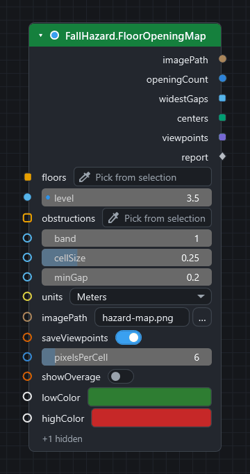
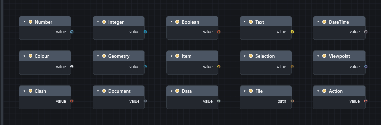
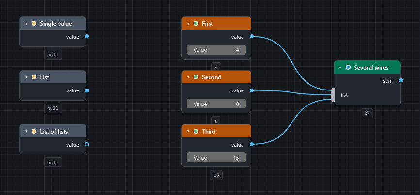
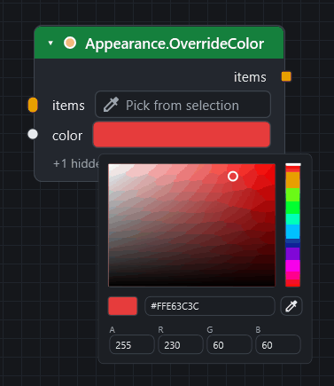
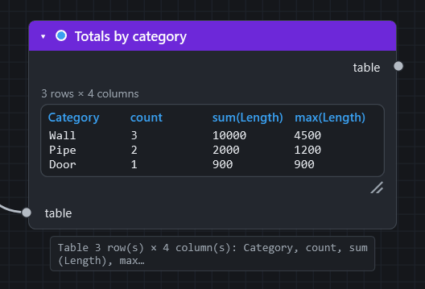

# Inputs, outputs and kinds

Every node has **inputs** (sockets on its left edge) and **outputs** (on its right edge). This page explains what the sockets tell you, how to give an input a value, and how values are converted between kinds.

## Hover to find out

Hover any socket for a tooltip. It shows:

* the socket's **name** and **kind**;
* for an input, whether it is **required** or **optional**, and its **default**;
* a **description** of what to connect (written from the node's documentation);
* after a run, the **value it holds**: for a list the number of items and the first few; for a wired input, what arrives on the wire.

The same information for every node is on the [node library](nodes/index.md): each node lists its inputs with their type, default and meaning, and its outputs with their type.

## Kind: the colour (and letter) of a socket

The colour of a socket names the kind of data. With **Settings ▸ Appearance ▸ Type letters in sockets** on, a letter is drawn inside each socket too, so the kind never depends on colour alone.

| Kind | What it is | Letter |
|---|---|---|
| Any | Accepts anything. | |
| Number | A decimal number. | `N` |
| Integer | A whole number. | `I` |
| Boolean | True or false. | `B` |
| Text | A string. | `T` |
| DateTime | A date, a time span, or a TimeLiner task. | `D` |
| Colour | A colour. | `C` |
| Geometry | A point, vector, bounding box, line, plane or transform. | `G` |
| Item | A Navisworks model item (or a model, or units). | `E` |
| Selection | A selection set, a search, or a collection of items. | `S` |
| Viewpoint | A saved viewpoint, a folder of them, or a camera. | `V` |
| Clash | A clash test, a result, or a group of results. | `X` |
| Document | A Navisworks document. | `F` |
| Data | A table, dictionary or other structured data. | `{` |
| File | A path to a file or folder (a text input whose name says it is a path). | `P` |
| Action | A recipe step for `Workflow.ForEach`. | `A` |

On the node library pages the type is written as a programming type: `string`, `number`, `integer`, `boolean`, `ModelItem`, `Document`, `CamelGraphTable` and so on. A type ending in `[]` is a **list**.

## Shape: one value or a list

| Shape | Meaning |
|---|---|
| **Circle** | One value. |
| **Rounded square** | A list. |
| **Square with a hole** | A list of lists. |
| **Diamond** | A value whose structure is not known until the graph runs. |
| **Pill** (an elongated socket) | A **multi-input**: it takes any number of wires and combines them into one list. |

A **dashed wire** means a list is going into a one-value input, so the node will run once per item (see [replication](concepts.md#lists-replication-and-lacing)).

!!! note "Diamond sockets take a list as one value"
    An input of kind *Any* (a diamond) gets the value as it is. A list wired into it is **not** run once per item, and no dashed wire is drawn. To run the node once per item, right-click the input, choose **List Levels** and then `@L1 — items` (see [Concepts](concepts.md#lists-replication-and-lacing)).

## Giving an input a value

An input can get its value from four places. The first that applies wins:

1. **A wire.** Connecting a wire always overrides the rest. A *muted* wire is ignored and the next place is used.
2. **The editor on the node.** An unwired input shows an inline editor you can type into. Inputs of kind *Any* (a diamond, such as the `value` of `Search.ByProperty`) and inputs that take a list or a table (such as `properties` of `Properties.ToTable` or `aggregations` of `Table.GroupBy`) have **no editor**. Wire a `String`, `Number` or `String.Split` node into them.
3. **The default.** Optional inputs have one. It is shown in the tooltip and on the node's reference entry.
4. **Nothing.** A **required** input with no wire and no value stops that node: it stays idle and says "Input 'x' is not connected."

### The inline editors

| Editor | For | Notes |
|---|---|---|
| Number field | Number, integer | Drag it, or click and type. A dot at its left edge shows it differs from the default; hover and press ++backspace++ to restore the default. ++ctrl+c++ and ++ctrl+v++ while hovering copy and paste the value. |
| Check box | Boolean | |
| Text box | Text | Grows with long or multi-line text. |
| Drop-down or switch | Named choices | For example `mode` on `Search.ByProperty`. |
| Colour swatch | Colour | Click it for a picker with an eyedropper; the dropper can pick any colour on screen, the Navisworks view included. The picture below shows the popup. |
| File field with `…` | File and folder paths | |
| Element picker | A Navisworks item or items | Press it to take the **current selection**. |
| Vector fields | Points and vectors | Paste `1, 2, 3` (or cells from a spreadsheet) into the first field and the values spread over the next fields. |

Optional inputs that are unconnected can be hidden: **Hide / Show Unused Sockets** (++ctrl+h++). Rarely-used inputs of some nodes sit in an **Advanced** panel.

### Choosing a tab or a property name

On nodes that read a property of an element, the **tab** (category) and **property** inputs are ordinary text boxes. Type the name and it works. Next to each is a small **magnifier**. Press it and CamelGraph lists the tabs, or the properties of the chosen tab, **of the element on that node's own element input**; click one to fill the box. What you have typed narrows the list.

* Nothing is read until you press the magnifier.
* Only that element is read, at most the first 100 if the input carries a longer list. The model is never searched to fill the list.
* Pick an element on the node, or wire one in and run the graph, before you search.
* On `Search.ByProperty`, `Search.HasProperty`, `Search.HasCategory`, `SelectionSet.CreateFromSearch` and `SelectionSets.BulkByPropertyValues` there is no element input, so the magnifier lists the tabs and properties of the **elements selected in Navisworks right now**.

!!! tip "Step by step"
    [Find the name of a tab or property](howto/find-property-names.md) walks through both kinds of magnifier and `Properties.Discover`.

## Defaults for documents

An input of kind **Document** that has nothing wired to it uses the **active Navisworks document**. Most graphs never wire a document.

## How values are converted

When a wire joins two different kinds, CamelGraph converts the value if it can:

* numbers widen (an integer is accepted where a number is expected);
* values with a standard conversion are converted (a number can become text, text such as `"12"` can become a number);
* an input of kind **Any** accepts anything;
* some inputs also accept several forms on purpose. For example, colour inputs accept a colour or a text such as `#FF0000`; GUID inputs accept text, a 22-character IFC GlobalId, or a GUID.

When a conversion fails, the node shows a warning or an error that names the input. It never crashes the graph. If a value arrives empty or a node complains about an input, compare the kinds at both ends of the wire.

## Outputs

* Most nodes have **one output**. Some have several, each named: `Search.ByGuid` gives `items` and `missing`; `Flow.Try` gives `result`, `failed` and `error`; `BCF.ImportIssues` gives `topics` and `modelItems`.
* An output can feed any number of inputs.
* A node that **changes the model** usually passes its items through on an output with the same name, so you can chain writing nodes and so that the second one only runs after the first.
* An output is `null` when the node did not run, failed, or has nothing to say. A `null` among the items of a list that is being replicated gives a `null` result at that position and one amber warning for the node; a `null` on an ordinary single input is handed to the node as it is.

## The Watch nodes

Wire any output into a **Watch** node to see the value: **Watch** (text), **Watch List** (one entry per line, with an index gutter), **Watch Table** (a table) and **Watch Image** (a picture, such as a heat-map PNG). Under every node, **value previews** show the first results after a run (toggle with **Preview** in the toolbar); click a preview that says "… N more" to expand the full list.

## Next steps

* [The editor: canvas and nodes](canvas-and-nodes.md) shows how to wire, move and tidy nodes.
* [Running a graph](running-graphs.md) explains what happens when you press Run.
* [Glossary](glossary.md) for the words used here.
