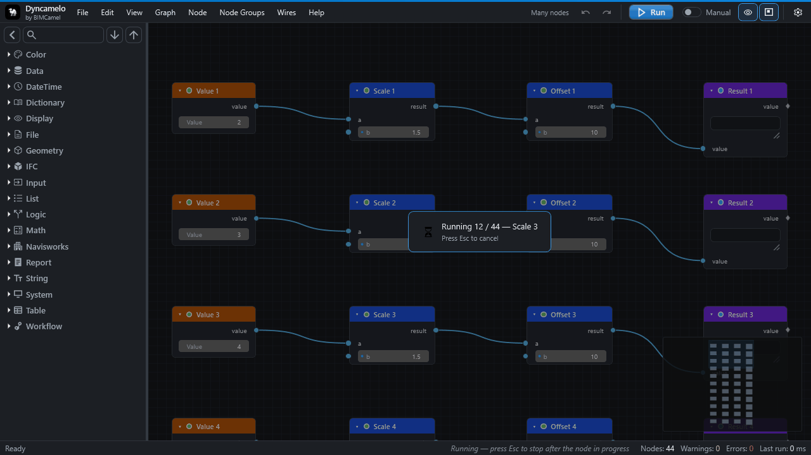
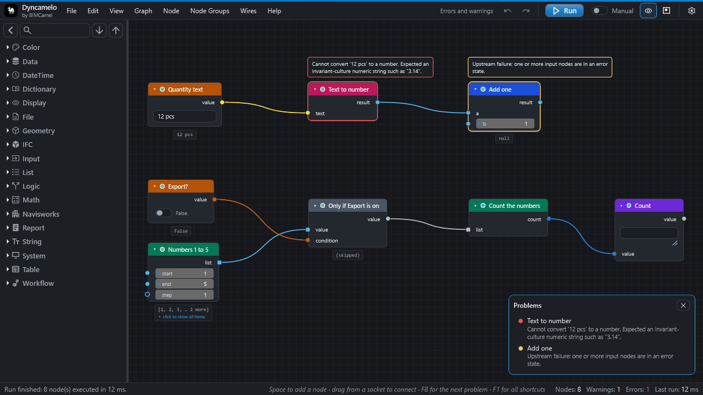

# Running a graph

## Run, Auto and Manual

The run bar at the bottom of the editor has the **Run** button, a **Manual / Auto** switch and the status line.

| Mode | What happens |
|---|---|
| **Manual** | Edits only mark nodes as changed. Press **Run** (++f5++) when you are ready. Best on large models. |
| **Auto** | A run starts after every edit. A burst of edits, such as dragging a slider, gives one trailing run. The same switch is **Graph ▸ Auto-Run**. |

**A run executes only what changed.** CamelGraph marks the node you edited and everything after it as changed, and a run executes those nodes and serves the stored results of all the others. If nothing changed, nothing runs, and the status bar says "Run finished: 0 node(s) executed". A change of the active document, or models added or removed, marks every node as changed.

A graph saved with run mode Auto is **not** run when you open it from a file. The status bar says so, and you press **Run**. That gives you the chance to look at what a graph from someone else will do first ([Privacy and safety](privacy-and-safety.md#running-graphs-from-other-people)).

## What happens during a run

1. The nodes are put in dependency order (a node never runs before the nodes that feed it).
2. For each changed node: its inputs are gathered (from wires, then the values you typed, then defaults), converted to the kind the node wants, [replicated](concepts.md#lists-replication-and-lacing) if a list meets a one-value input, and the node is called.
3. The outputs are stored and the node gets its state.
4. A node that throws is caught: it turns red with its own message, its outputs are empty, and the run goes on. A failing node never stops the run or Navisworks.

While a graph runs, the window says which node is working (`12 / 40 - name`; inside a node group the path is shown). Runs happen on the Navisworks main thread, so Navisworks is busy until the run ends.

## Stopping a run

Press **++esc++** (switchable in **Settings ▸ Editing ▸ Esc cancels a running graph**). The run halts:

* before the next node;
* between the items of a node that is working through a list;
* between the passes of a loop.

A single Navisworks call already under way cannot be interrupted. What nodes already finished changed in Navisworks is kept. A node or loop that was cut short keeps its previous results and waits, with everything after it, so the next **Run** carries on where this one stopped.

## Running part of a graph

* **Run up to a node** (++shift+f5++): runs only the selected nodes and what they depend on, then stops. Everything after them keeps its previous results and stays pending; the next ordinary **Run** finishes the job. Useful while you build a graph whose later steps are slow.
* **Freeze** (++shift+m++, badge *FROZEN*): a frozen node **and everything after it** is skipped by runs and keeps its results from the last run, shown ghosted. Use it to stop a slow branch from recomputing while you work elsewhere. ++shift+m++ again unfreezes.
* **Mute** (++m++, badge *MUTED*): the node is bypassed. Each output passes the first input of a matching kind straight through, the node counts as done, and everything after it **still runs** on the passed-through data. Use it to switch a step off inside a live chain, such as a filter or a recolour.
* **Mute a wire** (hold ++ctrl++ while cutting): only that connection is ignored and the input uses its own value instead. A quick way to switch a branch off without deleting it.
* **Flow.When**: nodes after a `Flow.When` whose condition is false are skipped and shown idle.

Mute, freeze and muted wires are undoable and saved with the graph.

!!! tip "Mute or freeze?"
    Mute a step you want switched off while the rest still runs, such as a recolour. Freeze a slow branch you do not want recalculated while you work elsewhere.
## Node states

After a run, the border and badge of each node show its state. Hover the node, or read the balloon above it, for the message.

| Look | State | Meaning |
|---|---|---|
| none / grey | **Idle** | Not run yet. Or a required input is empty ("Input 'x' is not connected."). Or an input comes from a branch that was switched off ("Skipped: an input comes from a branch that was switched off (Flow.When was false)."). Not an error. |
| green | **Executed** | Ran fine. |
| amber | **Warning** | Ran with a recoverable problem: a property missing on 12 of 500 items (those results are empty), some items of a list failed, or an input node before it failed ("Upstream failure…"). |
| red | **Error** | The node failed (or cannot be found). Its message is the node's own error text. Nodes after it wait until it is fixed. |
| ghosted, *FROZEN* | Frozen | Held, with stale values. |
| bypassed, *MUTED* | Muted | Passing data through. |

## Finding out why

* The **Errors** and **Warnings** counts in the status bar are buttons (or press ++ctrl+shift+e++). They list every node that failed or warned in the last run, errors first. Click a row to select the node and bring it into view. ++f8++ and ++shift+f8++ step through them.
* Select a node and press ++i++ (*Why Didn't This Run?*). The status bar explains in words whether the node is frozen, sits after a frozen node, is muted, failed (and with what), is waiting for an input, or is just waiting for the next Run, and names the node responsible when it is another one.
* Put **`Flow.Try`** after a node that may fail: it gives your fallback plus the error text, and nothing after it turns red.

See also [Troubleshooting: Nothing happens when I press Run](troubleshooting.md#nothing-happens-when-i-press-run).

## Speed on large models

The status bar shows the time of each run and, when a run takes a second or more, the slowest node. To keep a run fast:

* Switch **Auto** off on big models and run with ++f5++ when you are ready.
* Freeze a slow branch, or run up to the node you are working on.
* Pass nodes a smaller list of items where you can. Some nodes touch every item of the model and say so in their description, for example `Model.Statistics` and `Search.ByGuid` ("walks every item of the document once"), `Appearance.Focus`, and `Distance.BetweenItems` and `Proximity.NearestDistance` with `method` set to `mesh`. Prefer `bbox` where it is accurate enough.
* A loop runs its body once per item, so a slow node inside it is slow once per item.
* On very large graphs (many nodes, not many items), turn on **Settings ▸ Canvas ▸ Straight wires**.
* The **Performance HUD** (**View ▸ Performance HUD**) measures the canvas, not the model: frames per second, frame time, visuals and node counts.

## Changing the model, and undoing it

Nodes that change the model do so in the open Navisworks document. Many are real overrides (a colour, a hide, a transparency) saved with the file, and **Appearance.Reset** or **Appearance.ResetAll** undo them from a graph. Others are *temporary* overrides that live until you reset or close the view.

!!! warning "Save the model before you try something new"
    Whether a single Navisworks **Undo** reverses a whole run has not been checked.

* The editor's own **Undo** (++ctrl+z++ while the pane has the focus) changes the **graph** only, and says so.
* A run is not atomic. If it is cancelled or a node fails, nodes that already ran have already changed the model.

## Running without the editor

* The **[Script Player](player.md)** runs a saved graph from a form built out of its input nodes.
* The add-in plugin **`Dyncamelo.Run.DYNC`** runs a script by path, for other add-ins, the Navisworks Automation API (`ExecuteAddInPlugin`) and the Batch Utility: `Execute("C:\\Scripts\\audit.dyc")`. It returns `0` when no node failed and `1` otherwise, and applies the same confirmation as the Player. In an unattended run nobody can answer that question, so run the script once by hand in the Player first.
* The command line tool `Dyncamelo.Cli` (built from source) runs graphs that use only the general nodes, with no Navisworks: `dotnet run --project src/Dyncamelo.Cli -- run samples/hello-math.dyc`. It exits with `0` when no node ended in the error state, `1` when at least one did, and `2` for unreadable input. It never asks before running a graph.

## Next steps

* [Read errors and warnings](howto/read-errors-and-warnings.md) is a short walk through the Problems list and the messages.
* [Speed up a slow graph](howto/speed-up-slow-graph.md) turns the tips above into steps.
* [Keep a graph going when a node fails](howto/keep-going-after-failure.md) shows `Flow.Try` in a graph.
* [The Script Player](player.md) runs a saved graph from a form.
