# Sample scripts

Dyncamelo ships with example graphs. Open them from the **start screen** (the cards on an empty canvas), from **File ▸ Sample Graphs**, or from the `Samples` folder inside each year folder of the installed bundle. Each one explains its editable inputs in notes on the canvas. Press **Run** to see what it does; read the nodes to learn how.

Except for the first two, the samples need Navisworks with a **model open**. They are saved so that you decide when they run: a graph opened from a file is not run until you press Run.

## Without a model

| Sample | What it shows |
|---|---|
| **Getting Started - Math and Watch** | Two sliders multiplied into an area, shown in a Watch node and formatted into a text report with `String.FromObject` and `String.Concat`. Expected results: **32** and **`Area = 32`**. |
| **Table Summary from Text** | Pasted CSV text becomes a table (`String.Lines`, `String.Split`, `Table.FromRows`), grouped by category with a count, total and maximum (`Table.GroupBy`), sorted largest first (`Table.Sort`) and shown in a **Watch Table** and as Markdown (`Table.ToText`). Expected first row: **Wall, 3, 10000, 4500**. With model data the first three nodes are replaced by `Properties.ToTable`, and `Table.ToExcelFile` or `Report.Html` publishes the result. |

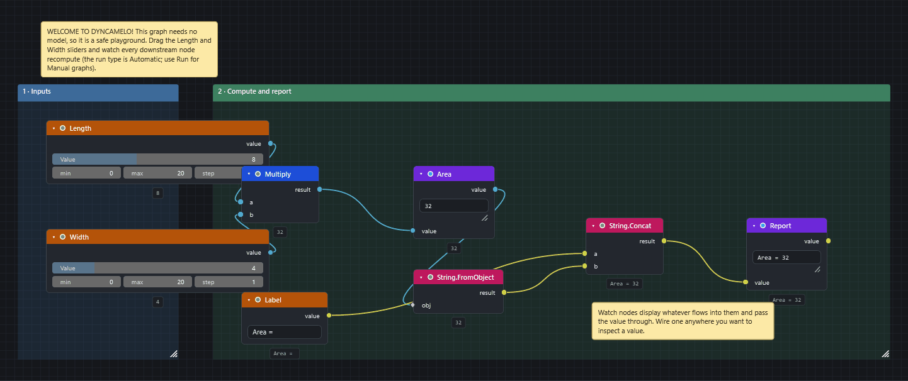

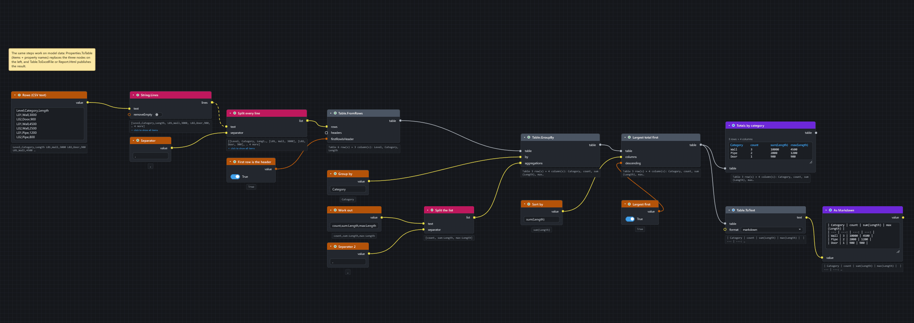

!!! note "Older search nodes in some samples"
    Some samples were made before `Search.ByProperty` existed and use the older search nodes `Search.ByPropertyValue` and `Search.ByPropertyContains`. They are retired: they no longer appear in the library, but old graphs keep loading and running. In a graph you build now, use `Search.ByProperty`.

## Searching, colouring and exporting

| Sample | What it does |
|---|---|
| **Color Elements by Property** | `Search.ByProperty` finds every item whose property contains a text (default: Item ▸ Name contains "Wall") and `Appearance.OverrideColor` paints it; `List.Count` reports how many. |
| **Export Properties to Excel** | Finds items, reads three properties of each with `Properties.ValueAsString` and writes a worksheet with `Excel.WriteToFile`. Item names become the header row; replication turns the single-item property node into a per-item list. |
| **Bulk Selection Sets from Values** | `SelectionSets.BulkByPropertyValues` makes one live search set per distinct value of a property (default: Element ▸ Level), filed under a folder in the Sets window. |
| **QTO Rollup by Category** | `Search.HasProperty` finds items, `Takeoff.SumPropertyByGroup` sums a numeric property (default: Element ▸ Volume) grouped by another (default: Element ▸ Category) and `Excel.WriteToFile` writes the rollup. |

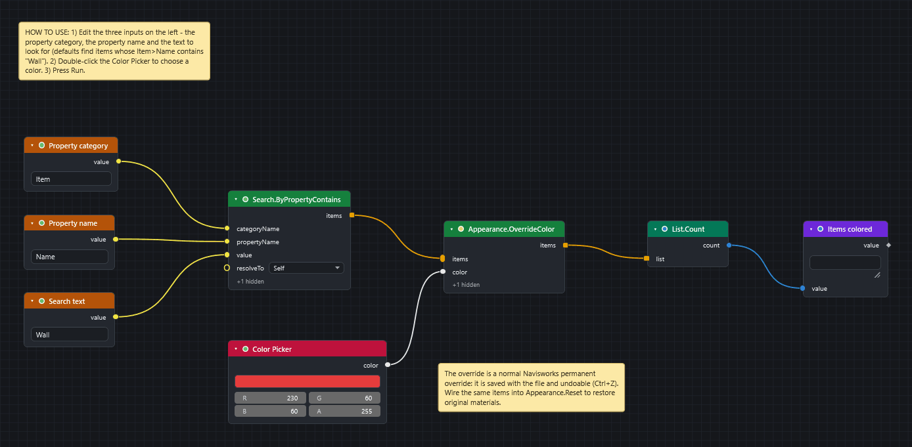

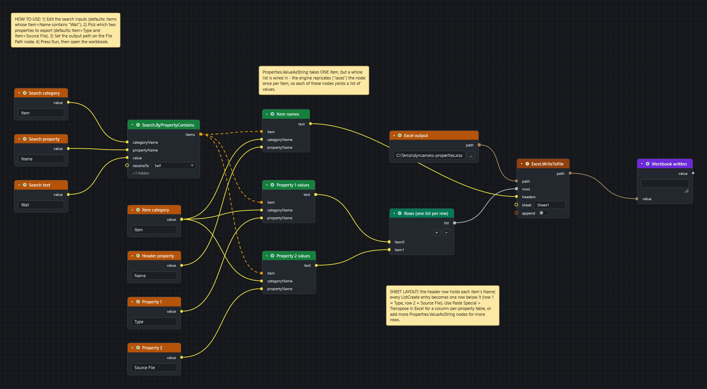

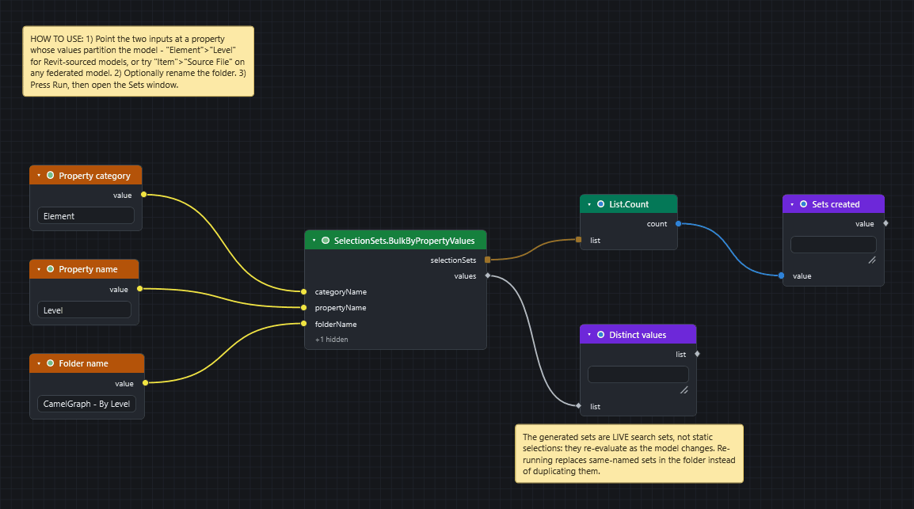

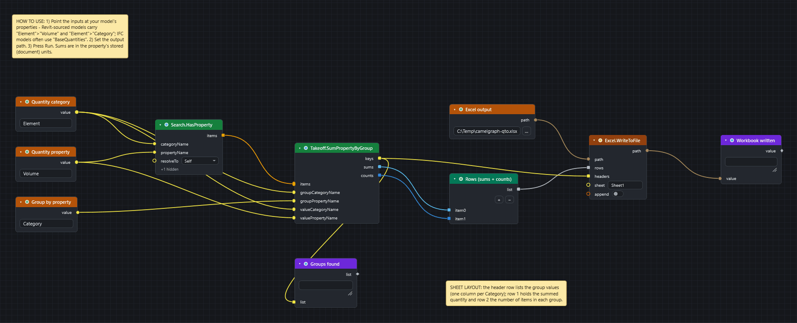

## Clash

| Sample | What it does |
|---|---|
| **Clash Triage and BCF Export** | `Clash.Tests`, `List.GetItemAtIndex`, `Clash.GroupResultsByStatus`, `ClashTest.Results` and `BCF.ExportIssues`, plus `Export.ClashReportCsv` for a CSV summary of every test. Needs Navisworks Manage. |
| **Clash Group Viewpoints per Test** | For every result group of every clash test: isolates the group's clashing elements, colours each clash's first element red and its second green (temporary overrides) and saves a viewpoint named after the group, in a folder named after its test. Needs an open model with clash tests that have run and have groups. `Flow.Then` pins the order isolate, zoom, red, green, save inside each pass of the loop. |

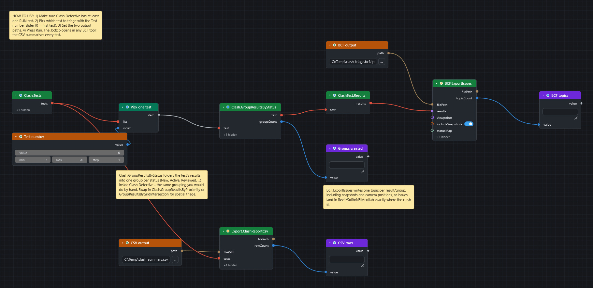

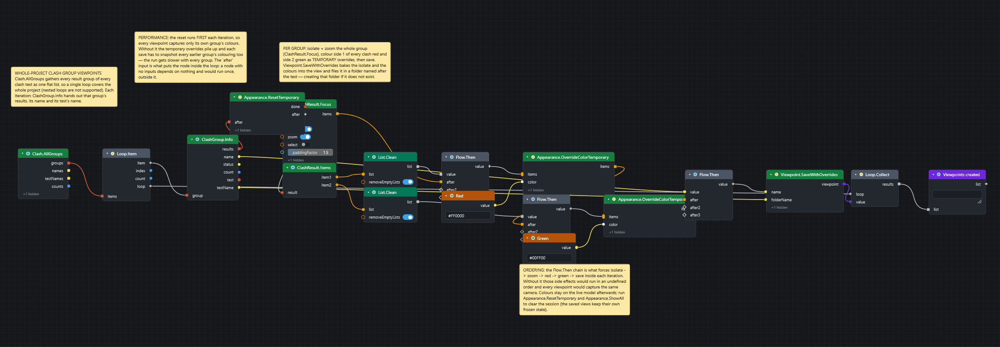

## Viewpoints and loops

| Sample | What it does |
|---|---|
| **Isolated Viewpoints per Item** | The per-item loop built from **reified actions**: a search finds items, and a recipe (`Action.Isolate`, `Action.ZoomTo`, `Action.SaveViewpoint`) gathered with `List.Create` is replayed by `Workflow.ForEach` for every item. One saved viewpoint per element, framed on its own item and named from the item with the `{name}` template. |
| **Spotlight Viewpoints per Item** | The same loop for presentation: for each item the recipe ghosts the whole model, highlights the current item in a chosen colour, zooms to it and saves a viewpoint. The temporary overrides are captured into each viewpoint, so every view keeps its own look. |
| **Isolated Viewpoints (Loop)** | The same result built from ordinary nodes: `Loop.Item` and `Loop.Collect` bracket a body (`Appearance.Isolate`, `Camera.ZoomToItems`, `Viewpoint.SaveWithOverrides`) that the engine re-runs once per item. Any subgraph between the two boundaries becomes a loop. |
| **Section Box Viewpoints per Group** | Clusters the current selection into touching groups with `Proximity.Cluster`, then for each group applies a section box from its combined bounding box (padded), zooms to the group and saves a viewpoint named "Group &lt;n&gt;" in the "Group Views" folder. The cluster tolerance is in metres and must be smaller than the space between separate groups. Needs a live Navisworks session. |

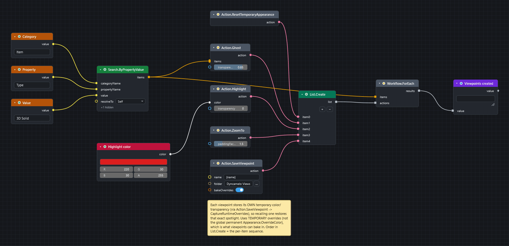

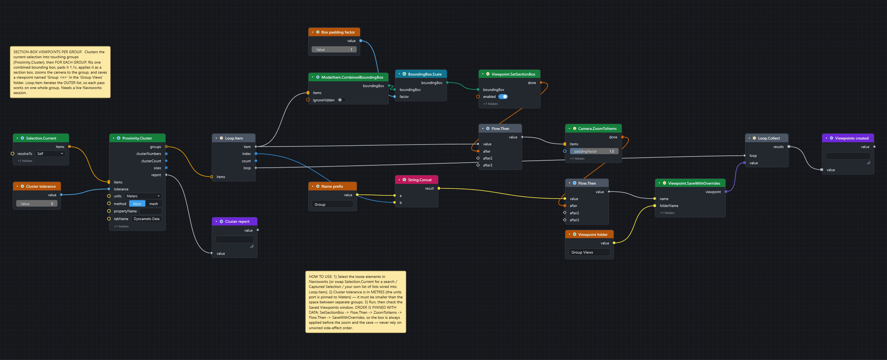

[Save one viewpoint for every item](howto/viewpoint-per-item.md) builds the loop step by step.

## Safety analysis

| Sample | What it does |
|---|---|
| **Floor Opening Fall-Hazard Map** | `FallHazard.FloorOpeningMap` slices the model at a level, reads the real floor and equipment mesh, finds the openings fully enclosed by floor and grades each by how far its centre is from the nearest edge. It writes a top-down heat-map PNG and saves one viewpoint per opening whose widest gap is at least your threshold. Needs a live Navisworks session; `Cell size` trades accuracy for speed. |
| **Floor Openings Needing Handrails** | Part 1 measures each item of the selection to its nearest handrail with `Proximity.NearestDistance` and flags the ones with none close by. Part 2 uses `BoundingBox.PlanGap` to find the widest gap between an opening and the equipment through it. Part 2 is self-contained and reports `0.8`. |

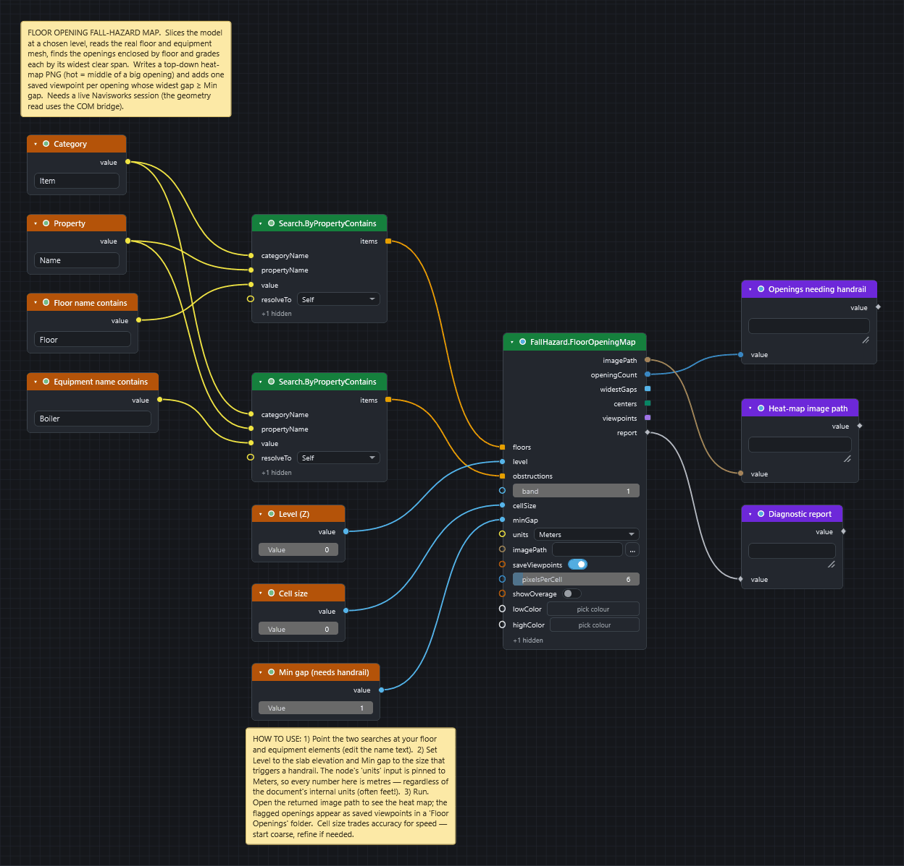

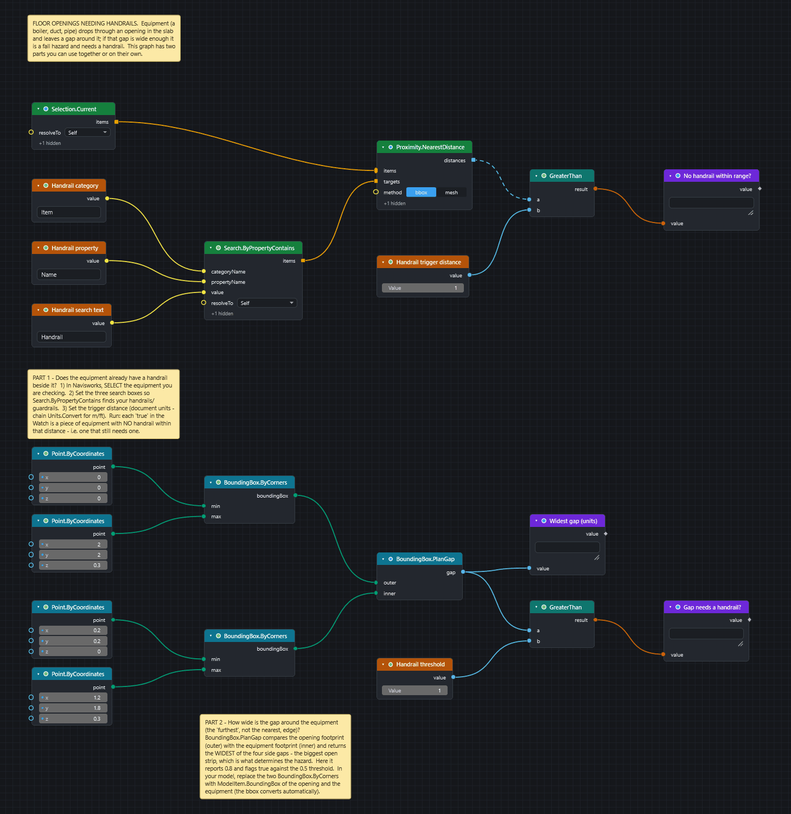

## For developers (not installed)

Four small graphs in the repository's `samples` folder exercise the engine without Navisworks and run on the command line: `hello-math` (result **85**), `list-lacing` (the three lacing modes side by side), `string-report` (**`Word count: 4`**) and `csv-roundtrip` (writes and reads a CSV file). The last one writes a relative path, which is why it is not shipped: see [Troubleshooting](troubleshooting.md#a-file-node-fails-with-access-denied-or-writes-to-the-wrong-place).

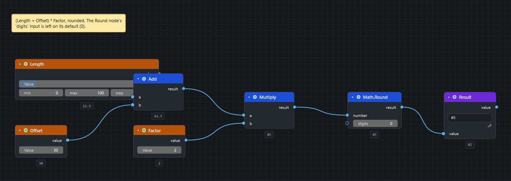

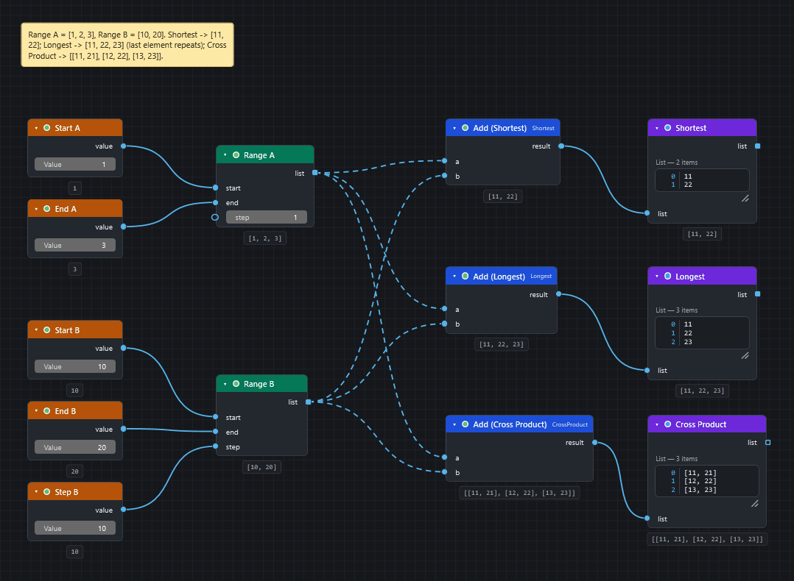

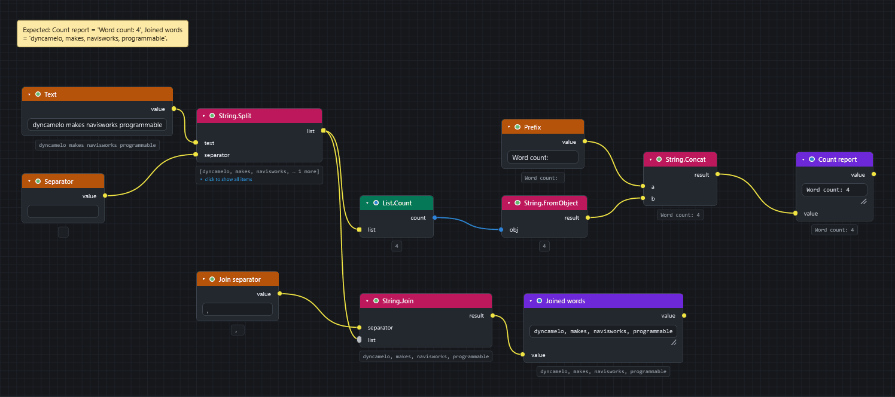

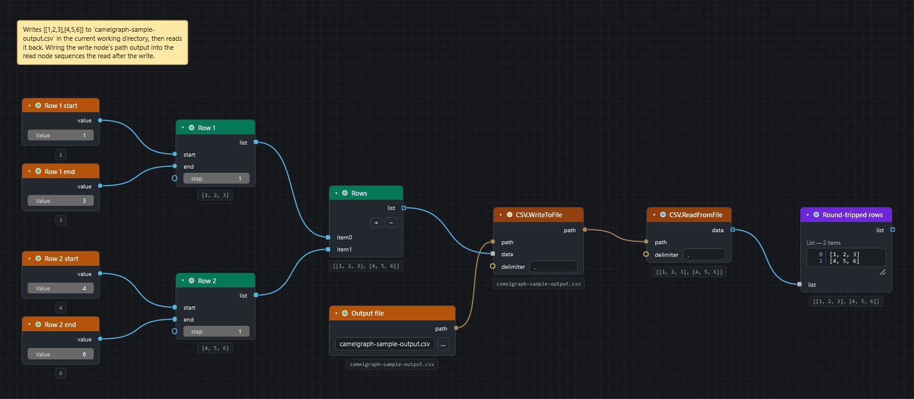

## Use a sample as a starting point

* Save it under a new name first (**File ▸ Save As…**, ++ctrl+shift+s++) so the original stays as it was.
* Change the typed inputs: the notes on the canvas say which ones are meant to be edited.
* Replace a search or a property name with your own, and press **Run**.
* Find where the sample's nodes live in the library: right-click a node and choose **Find in Library**.

!!! tip "Not sure where to begin?"
    Start with *Getting Started - Math and Watch*. It needs no model, and its Watch nodes should show **32** and **Area = 32**.

## Next steps

* The [How-to guides](howto/colour-elements-by-property.md) rebuild several of these samples step by step, with graphs to download.
* [Recipes](recipes.md) lists node chains by role.
* [IFC, BCF, Excel and CSV](exchange-formats.md) explains the file formats the samples read and write.
