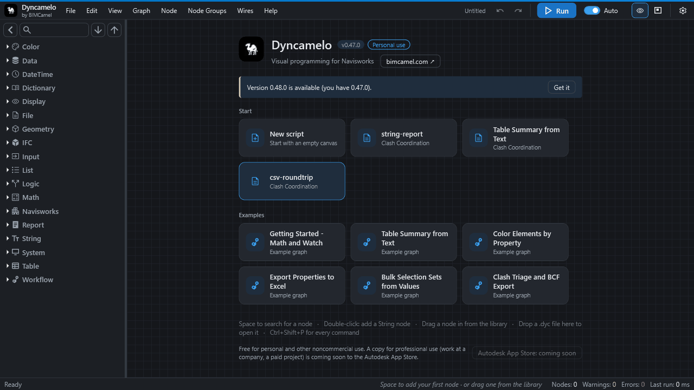

# Saving and opening scripts

A CamelGraph script is saved as a small `.dyc` file that you can keep, copy and send to a colleague.

This page covers the File menu, how CamelGraph protects unsaved work, where to keep scripts so the [Script Player](player.md) finds them, and what to know before you share one.

## What a `.dyc` file is

A `.dyc` file is plain text (JSON) with a version number. It stores the script itself: the nodes and their positions, the wires, the values you typed into inputs, notes, frames, lacing settings, mute and freeze marks, bookmarks, the script's name and description, whether it is set to run automatically, and which nodes and inputs the Script Player shows. If the script uses [node groups](node-groups.md), the groups are stored in the file too.

It does **not** store results, and it does not contain your model. A script works on whichever Navisworks model is open when you run it, so one script serves every project. When you open a script, every node starts "not run yet" and calculates when you press **Run**. If you switch to a different document in Navisworks, CamelGraph marks every node out of date, so the next run recalculates the whole script against the new document.

## The File menu

| Command | Shortcut | What it does |
|---|---|---|
| **New** | ++ctrl+n++ | Starts an empty script called "Untitled". |
| **Open…** | ++ctrl+o++ | Opens a `.dyc` file you choose. |
| **Recent Files** | | The ten files you opened or saved most recently, newest first. A file that no longer exists is removed from the list when you try it. |
| **Sample Graphs** | | The example scripts that ship with CamelGraph (see [Sample scripts](samples.md)). |
| **Save** | ++ctrl+s++ | Saves to the current file. A script that has never been saved asks for a name, like Save As. |
| **Save As…** | ++ctrl+shift+s++ | Asks for a file name. The suggested name is the script's name. |

Other ways in and out:

* **Drag a `.dyc` file from Windows Explorer onto the canvas** to open it. Only `.dyc` files are accepted; if you drop several files, the first `.dyc` is opened.
* On the [start screen](canvas-and-nodes.md#the-start-screen), the cards for **recent scripts** and **examples** open them with one click.

* **Rename Graph** (++f2++, Graph menu) renames the `.dyc` file on disk. For a script that has not been saved yet, it works like Save As.
* The sample scripts open as read-only templates: **Save** asks you for a new name, so the shipped sample is never overwritten.

After a successful open or save, the status bar confirms it. If a node has been changed since the script was saved so that some wires or typed-in values no longer fit, the status bar says how many connections or values could not be restored.

## The modified marker and the save prompt

A `*` after the script's name in the header (next to the buttons; the name is hidden when the pane is very narrow) means there are **unsaved changes**. Saving removes it. If you undo back to the state you saved, the `*` stays on purpose, to be on the safe side.

**New**, **Open…**, opening a recent file, opening a sample, and dropping a `.dyc` file on the canvas all check first. When something is unsaved, CamelGraph asks "Save changes to '…' before continuing?" with **Yes** (save first), **No** (go on without saving) and **Cancel**. A cancelled or failed save cancels the whole action, so nothing is thrown away by accident.

## Autosave and recovery

Closing the editor pane cannot show a question, so CamelGraph keeps a safety copy instead.

* **Autosave** (on by default; **Settings ▸ Editing ▸ Autosave unsaved work**) writes a copy of a script that has unsaved changes about once a minute, and once more when the pane closes. It does not write during a run. The copies live in the folder `%APPDATA%\Dyncamelo\recovery`.
* The next time the editor opens on an **empty canvas**, CamelGraph offers the work back: "Dyncamelo found work that was not saved when the last session ended … Restore it?" Answer **Yes** to restore it, or **No** to throw it away. Either answer deletes that safety copy, and so does saving normally.
* A restored script counts as unsaved until you save it. If its original file still exists, **Save** writes back to that file; otherwise it asks for a name.
* Safety copies older than 14 days are deleted without asking. A copy that belongs to another Navisworks window that is still open is left alone.

Autosave protects you from a crash or a forgotten **Save**. It is not a version history: keep your own copies of important scripts.

!!! warning "Autosave is not a backup"
    A safety copy is deleted when you save, and also when you answer *No* to the restore question. Keep a saved copy of any script you cannot afford to lose.

## Script description and the scripts folder

**Graph ▸ Script Description…** lets you type what the script does. The text is saved in the file and shown above the form in the Player.

The Script Player looks for scripts in the folder **`Documents\Dyncamelo\Scripts`** (your own Documents folder) and its sub-folders, down to four levels. Save scripts you want to run from the Player there, or add other folders, such as a shared network folder, in the Player itself. The editor's Save As dialog does not default to that folder, so browse to it the first time.

## Sharing a script

!!! tip "Before you send a script"
    Add a **Script Description** and a few notes, and replace paths such as `C:\Projects\…` with ones the other person has. Open the file in a text editor first: it can hold file paths, names and values.

A `.dyc` file is small and can be emailed, put on a shared drive or kept in version control. Before you send one, think about what the other person needs:

* **CamelGraph itself**, in the same or a newer version. A file asks for a minimum file-format version; an older CamelGraph that cannot read it says so instead of opening it wrongly. In particular, older versions refuse a file that contains node groups rather than silently dropping them.
* **The same nodes.** Everything that ships with CamelGraph is available to anyone who has it installed. Nodes from a node pack that someone wrote ([Writing your own nodes](extending.md)) must be installed on the other computer too.
* **Paths that exist there.** A `File Path` or `Directory Path` node saves the path exactly as it was chosen, so a path such as `C:\Projects\…` will not exist on another computer. Change the paths, or let the person set them in the Player.
* **A short description and notes**, so the next person knows what the script does and which inputs to set. Add a **Script Description** and a few notes on the canvas.

### What happens when someone opens your script

A script is a small program, and CamelGraph treats a file that came from somewhere else with care. When you **run** a script opened from a file, and it contains nodes that **start other programs, use the network, or delete, move or overwrite files**, CamelGraph lists those nodes and asks whether to go ahead. You are asked once per file, and again only if the file changes. Scripts you build in the editor and the built-in samples never ask. A script saved with **Auto** on starts running as soon as it opens, but if it came from a file and contains such nodes, CamelGraph waits for you to press **Run** and say so in the status bar.

You can turn the question off in **Settings ▸ Editing ▸ Ask before running graphs from files**, but the safer choice is to leave it on. The Script Player asks a similar question for scripts that change the model. See [Privacy and safety](privacy-and-safety.md).

### Missing nodes

If a script uses a node that is not installed (a pack you do not have, or a node from a newer CamelGraph), the script still opens. The missing node appears as a **placeholder in the error state** whose message says which node could not be found. Its wires still attach, and **everything about it is kept**: when you save, the placeholder is written back with all its original data, so nothing is lost. Install the missing pack, or the newer CamelGraph, and open the file again. In the Script Player, a script with missing nodes is listed with a note such as "1 node is not installed, so this script cannot run".

Nodes that CamelGraph has retired in newer versions keep loading and running in old scripts, so scripts you made earlier continue to open.

## Where CamelGraph keeps its own files

Everything CamelGraph stores about you is under `%APPDATA%\Dyncamelo`: your settings and recent files (`ui-settings.json`), the autosave folder (`recovery`), and a log of caught errors (`errors.log`). Your `.dyc` scripts are never stored there; they are wherever you saved them. See [Privacy and safety](privacy-and-safety.md).

## Next steps

* [The Script Player](player.md) runs a saved script from a form.
* [Give colleagues a form with the Script Player](howto/form-for-colleagues.md) builds one.
* [The editor: canvas and nodes](canvas-and-nodes.md), [Settings](settings.md) and [Troubleshooting](troubleshooting.md).
