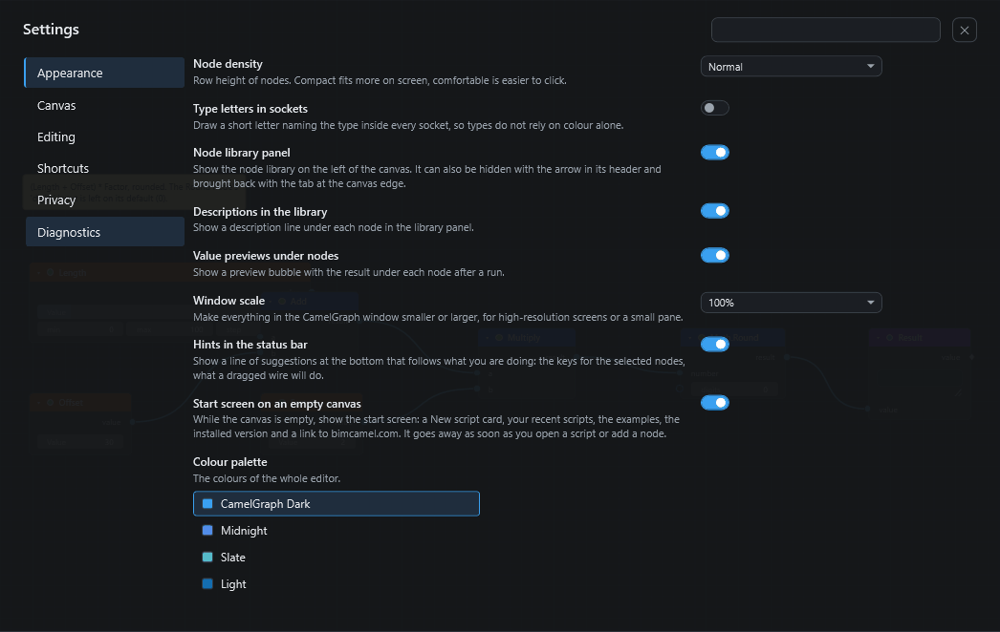
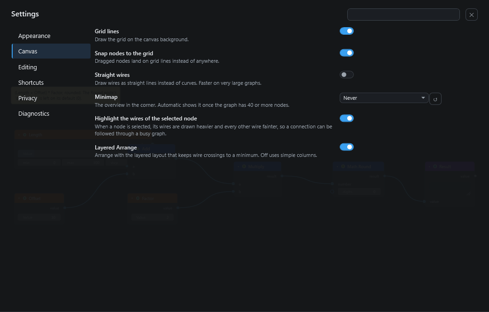
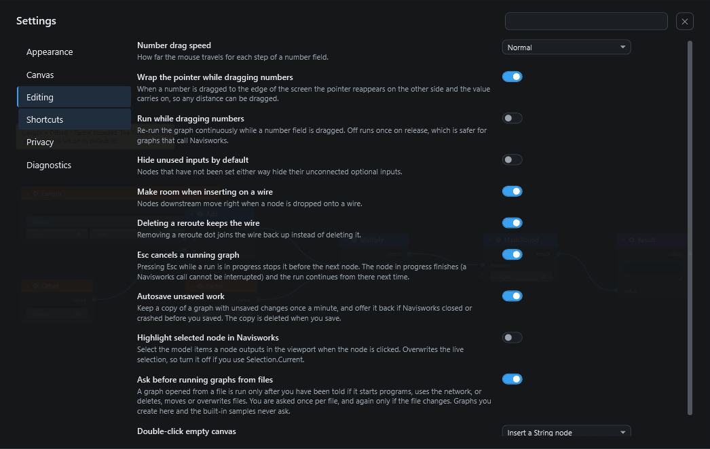
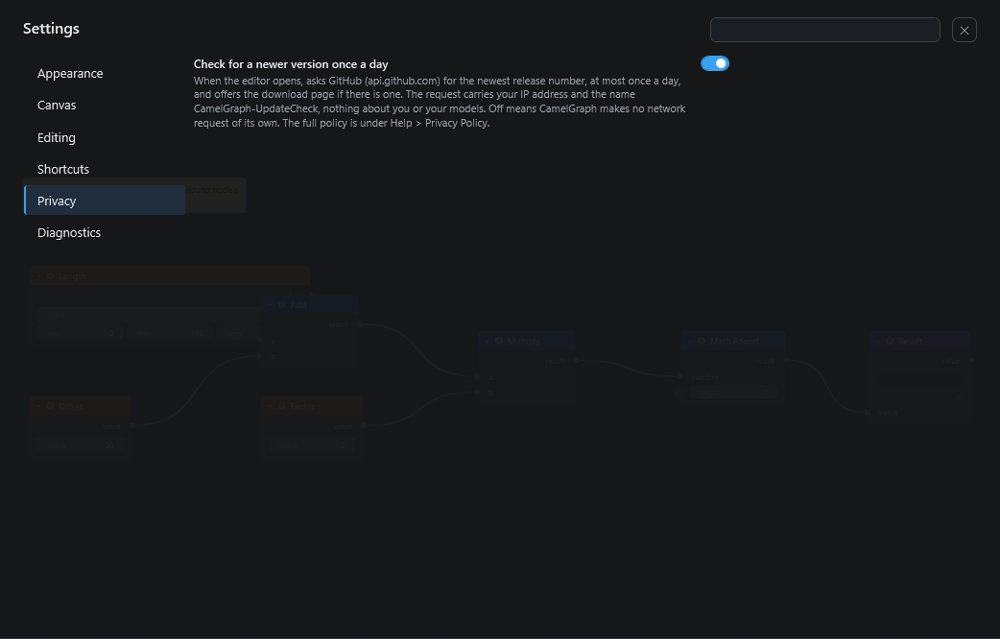

# Settings

The Settings page lists every option of the CamelGraph editor, grouped into sections, with a search box, a colour palette picker and a table where you can change keyboard shortcuts.

## Opening the Settings page

Use any of these:

* the **gear** button at the right of the menu bar;
* **View ▸ Settings…**;
* the command palette (++ctrl+shift+p++): type the name of a setting and choose it, and the page opens already filtered to that setting.

The page covers the canvas. Close it with the **✕** at its top right or with ++esc++.

On the left is the list of sections: **Appearance, Canvas, Editing, Shortcuts, Privacy, Diagnostics**. The **search box** at the top right finds a setting in any section by words from its name or description. A small **↺** button appears beside any setting you have changed; it puts that one back to its default.

Settings are saved automatically, per Windows user, in `%APPDATA%\CamelGraph\ui-settings.json`, and are shared by the editor and the [Script Player](player.md). They apply at once.

## Appearance

The **colour palette** of the whole editor is chosen at the top of this section: **CamelGraph Dark** (the default), **Midnight**, **Slate** and **Light**. The Script Player follows the palette you choose.

| Setting | Values | Default | What it does |
|---|---|---|---|
| Node density | Compact / Normal / Comfortable | Normal | Row height of nodes. Compact fits more on screen; comfortable is easier to click. |
| Type letters in sockets | On / Off | Off | Draws a short letter naming the data kind inside every socket, so kinds never depend on colour alone. Helpful for colour-blind users. The letters are listed in [Inputs, outputs and kinds](ports-and-kinds.md). |
| Node library panel | On / Off | On | Shows the node library on the left of the canvas. It can also be hidden with the HIDE tab on its right edge (or ++ctrl+b++) and brought back with the NODES tab at the left edge of the canvas. |
| Descriptions in the library | On / Off | On | Shows a description line under each node in the library panel. |
| Value previews under nodes | On / Off | On | Shows a bubble with the result under each node after a run. |
| Window scale | 90% / 100% / 110% / 125% / 150% | 100% | Makes everything in the CamelGraph window smaller or larger, for high-resolution screens or a small pane. |
| Hints in the status bar | On / Off | On | Shows a line of suggestions at the bottom that follows what you are doing: the keys for the selected nodes, what a dragged wire will do. |
| Start screen on an empty canvas | On / Off | On | While the canvas is empty, shows the start screen: a New script card, your recent scripts, the examples, the installed version and a link to bimcamel.com. It goes away as soon as you open a script or add a node. |

## Canvas

| Setting | Values | Default | What it does |
|---|---|---|---|
| Grid lines | On / Off | On | Draws the grid on the canvas background. |
| Snap nodes to the grid | On / Off | On | Dragged nodes land on grid lines instead of anywhere. |
| Straight wires | On / Off | Off | Draws wires as straight lines instead of curves. Faster on very large scripts. |
| Minimap | Automatic / Always / Never | Automatic | The overview in the corner. Automatic shows it once the script has 40 or more nodes. |
| Highlight the wires of the selected node | On / Off | On | When a node is selected, its wires are drawn heavier and every other wire fainter, so a connection can be followed through a busy script. |
| Layered Arrange | On / Off | On | Arrange uses the layered layout that keeps wire crossings to a minimum. Off uses simple columns. |

## Editing

| Setting | Values | Default | What it does |
|---|---|---|---|
| Number drag speed | Slow / Normal / Fast | Normal | How far the mouse travels for each step of a number field. |
| Wrap the pointer while dragging numbers | On / Off | On | When you drag a number to the edge of the screen, the pointer reappears on the other side and the value carries on, so any distance can be dragged. |
| Run while dragging numbers | On / Off | Off | Re-runs the script continuously while a number field is dragged. Off runs once when you let go, which is safer for scripts that call Navisworks. |
| Hide unused inputs by default | On / Off | Off | Nodes that have not been set either way hide their unconnected optional inputs. |
| Make room when inserting on a wire | On / Off | On | Nodes after the insertion point move right when you drop a node onto a wire. |
| Deleting a reroute keeps the wire | On / Off | On | Removing a reroute dot joins the wire back up instead of deleting it. |
| Esc cancels a running graph | On / Off | On | Pressing ++esc++ during a run stops it before the next node. The node in progress finishes (a Navisworks call cannot be interrupted) and the run continues from there next time. |
| Autosave unsaved work | On / Off | On | Keeps a copy of a script with unsaved changes once a minute, and offers it back if Navisworks closed or crashed before you saved. The copy is deleted when you save. See [Saving and opening scripts](saving-opening.md). |
| Highlight selected node in Navisworks | On / Off | Off | Selects the model items a node outputs in the Navisworks viewport when you click the node. This overwrites the live selection, so turn it off if you use `Selection.Current`. |
| Ask before running graphs from files | On / Off | On | A script opened from a file is run only after you have been told if it starts programs, uses the network, writes, deletes, moves or overwrites files, or changes the model. You are asked once per file, and again only if the file changes. Scripts you create in the editor and the built-in samples never ask. |
| Double-click empty canvas | Insert a String node / Insert a Number node / Add a note / Do nothing | Insert a String node | What double-clicking empty canvas does. |

Notes on a few of these:

* **Number drag speed.** Slow needs 16 pixels of mouse travel per step, Normal 8 and Fast 4.
* **Run while dragging numbers.** Leave it off for scripts that change the model. A node that talks to Navisworks would otherwise run again and again while you drag.
* **Ask before running graphs from files.** Turning it off removes a safety question. See [Privacy and safety](privacy-and-safety.md) before you do.

!!! warning "Leave the safety question on"
    **Ask before running graphs from files** is how CamelGraph warns you before a graph from a file starts programs, uses the network, writes, deletes, moves or overwrites files, or changes the model. Leave it on.

## Shortcuts

This section is a table of **every command** with its shortcut, including commands that have none. Use the search box to find a command by name or by key.

To change a shortcut:

1. Press **Change** on the command's row.
2. Press the keys you want. ++esc++ cancels, and ++backspace++ removes the shortcut.
3. If the keys are already used, the row tells you which command uses them and keeps listening, so nothing is taken away silently.

Other buttons on each row: **✕** removes the shortcut, and **↺** (shown only when you have changed it) restores the default. **Reset all shortcuts** at the top restores every one.

Two rules matter:

* Commands that also work while you are typing in a text box (marked "Everywhere" in the [shortcut tables](shortcuts.md)) must use ++ctrl++, ++alt++ or a function key. Plain letters, and keys such as ++ctrl+c++, ++ctrl+v++, ++ctrl+x++, ++ctrl+z++, ++ctrl+y++, ++ctrl+a++, ++delete++, ++space++, ++backspace++, ++enter++, ++esc++ and ++tab++, are used for typing, so those commands cannot take them.
* A command can be unbound. It then stays reachable from its menu and the command palette.

The menus, the key handling, the ++f1++ help sheet and the palette all read the same keymap, so a change shows up everywhere at once and is remembered between sessions.

## Privacy

| Setting | Values | Default | What it does |
|---|---|---|---|
| Check for a newer version once a day | On / Off | On | When the editor opens, asks GitHub (api.github.com) for the newest release number, at most once a day, and offers the download page if there is a newer one. The request carries your IP address and the name `CamelGraph-UpdateCheck`, nothing about you or your models. Off means CamelGraph makes no network request of its own. |

This is the only network request CamelGraph makes by itself. A copy installed from the Autodesk App Store never makes it. The full policy is in **Help ▸ Privacy Policy** and on the [Privacy and safety](privacy-and-safety.md) page.

## Diagnostics

This section has buttons rather than switches. Each one is also available from a menu and the palette.

| Button | What it does |
|---|---|
| Performance HUD | Shows frame rate, node counts and input state on the canvas (++ctrl+shift+f12++). |
| Keyboard and mouse help | Opens the ++f1++ sheet of shortcuts and gestures. |
| Open the user guide | Opens the online guide in your browser. |
| Copy diagnostics | Copies the CamelGraph and Navisworks versions, installed plug-ins and the end of the error log to the clipboard, with your user name, computer name and profile folder replaced, ready to paste into a bug report. |
| Privacy policy | Shows what CamelGraph stores on your computer and the one network request it can make. |
| Run self-test | Runs read-only Navisworks nodes on the open model and reports which work. It changes nothing. |

**Reset all settings** puts every setting and shortcut back to its default. Your favourite nodes and recent files are kept, and so are your Script Player folders and remembered values. If something behaves strangely, resetting is a quick way to rule settings out. See [Troubleshooting](troubleshooting.md).

## Next steps

* [Keyboard and mouse reference](shortcuts.md) lists the shortcuts you can change.
* [Privacy and safety](privacy-and-safety.md) explains the update check and the question before running graphs.
* [Saving and opening scripts](saving-opening.md#autosave-and-recovery) covers autosave.
