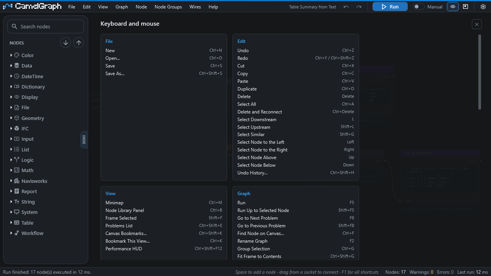

# Keyboard and mouse reference

Every keyboard shortcut and mouse gesture of the Dyncamelo editor, grouped by area.

The shortcuts shown here are the **defaults**. You can change any of them in **Settings ▸ Shortcuts** (see [Settings](settings.md#shortcuts)), and the in-app sheet that opens with ++f1++ always shows the keys currently in force. Every command can also be reached from a menu and from the command palette (++ctrl+shift+p++), so you never have to remember a key.

!!! tip "Do not memorise this page"
    Press ++f1++ in the editor for the same sheet with the keys currently in force, or press ++ctrl+shift+p++ and type a word of the command's name.

## How to read the tables

* **Canvas** in the *Works* column means the shortcut acts only while the canvas has the keyboard, so typing in a text box never triggers it.
* **Everywhere** means the shortcut also works while a text box has the focus.
* *(toggle)* marks a command that switches something on and off.
* A dash means the command has no shortcut by default. It is still in its menu and the palette, and you can give it one.
* Keys work when the Dyncamelo pane has the keyboard focus (click the canvas first). While it does, Dyncamelo's keys take priority over Navisworks's own for the same keys.

!!! note "Keys do nothing?"
    Keys work when the Dyncamelo pane has the keyboard focus. Click the canvas first.

## File

| Command | Shortcut | Works |
|---|---|---|
| New | ++ctrl+n++ | Everywhere |
| Open… | ++ctrl+o++ | Everywhere |
| Save | ++ctrl+s++ | Everywhere |
| Save As… | ++ctrl+shift+s++ | Everywhere |

The File menu also holds **Recent Files** and **Sample Graphs** (see [Saving and opening scripts](saving-opening.md)).

## Edit

| Command | Shortcut | Works |
|---|---|---|
| Undo | ++ctrl+z++ | Canvas |
| Redo | ++ctrl+y++ or ++ctrl+shift+z++ | Canvas |
| Cut | ++ctrl+x++ | Canvas |
| Copy | ++ctrl+c++ | Canvas |
| Paste | ++ctrl+v++ | Canvas |
| Duplicate | ++ctrl+d++ | Canvas |
| Delete | ++delete++ | Canvas |
| Select All | ++ctrl+a++ | Canvas |
| Delete and Reconnect | ++ctrl+delete++ | Canvas |
| Select Downstream | ++l++ | Canvas |
| Select Upstream | ++shift+l++ | Canvas |
| Select Similar | ++shift+g++ | Canvas |
| Select Node to the Left | ++left++ | Canvas |
| Select Node to the Right | ++right++ | Canvas |
| Select Node Above | ++up++ | Canvas |
| Select Node Below | ++down++ | Canvas |
| Undo History… | ++ctrl+shift+h++ | Canvas |

If you change the shortcut of **Redo**, the built-in second shortcut (++ctrl+shift+z++) goes away and only your key is used.

## View

| Command | Shortcut | Works |
|---|---|---|
| Fit to Screen | — | Canvas |
| Zoom In | — | Canvas |
| Zoom Out | — | Canvas |
| Minimap *(toggle)* | ++ctrl+m++ | Canvas |
| Node Library Panel *(toggle)* | ++ctrl+b++ | Canvas |
| Frame Selected | ++shift+f++ | Canvas |
| Problems List | ++ctrl+shift+e++ | Canvas |
| Canvas Bookmarks… | ++ctrl+shift+k++ | Canvas |
| Bookmark This View… | ++ctrl+k++ | Canvas |
| Reset Node Width | — | Canvas |
| Collapse All Nodes | — | Canvas |
| Expand All Nodes | — | Canvas |
| Node Value Previews *(toggle)* | — | Canvas |
| Settings… | — | Canvas |
| Performance HUD *(toggle)* | ++ctrl+shift+f12++ | Everywhere |
| Open Script Player | — | Canvas |

++home++ also fits the whole script into view. It is the canvas's own key rather than a command in the list above, so it does not appear in Settings ▸ Shortcuts.

## Graph

| Command | Shortcut | Works |
|---|---|---|
| Run | ++f5++ | Everywhere |
| Run Up to Selected Node | ++shift+f5++ | Everywhere |
| Go to Next Problem | ++f8++ | Everywhere |
| Go to Previous Problem | ++shift+f8++ | Everywhere |
| Find Node on Canvas… | ++ctrl+f++ | Canvas |
| Auto-Run *(toggle)* | — | Canvas |
| Rename Graph | ++f2++ | Canvas |
| Script Description… | — | Canvas |
| Add Note | — | Canvas |
| Group Selection | ++ctrl+g++ | Canvas |
| Fit Frame to Contents | ++ctrl+shift+g++ | Canvas |
| Ungroup | ++ctrl+shift+u++ | Canvas |
| Arrange Selection | ++ctrl+l++ | Canvas |
| Arrange All | ++ctrl+shift+l++ | Canvas |
| Add Node… | ++space++ | Canvas |

**Group Selection**, **Fit Frame to Contents** and **Ungroup** work on *frames*, the coloured rectangles behind nodes. For reusable node groups, see the Node Groups table below.

## Node

| Command | Shortcut | Works |
|---|---|---|
| Collapse / Expand | ++h++ | Canvas |
| Hide / Show Unused Sockets | ++ctrl+h++ | Canvas |
| Mute / Unmute | ++m++ | Canvas |
| Freeze / Unfreeze | ++shift+m++ | Canvas |
| Why Didn't This Run? | ++i++ | Canvas |
| Show / Hide in Player | ++ctrl+alt+p++ | Canvas |
| Show / Hide Unwired Inputs in Player | — | Canvas |
| Reset Inputs to Default | — | Canvas |
| Insert Into Selected Wire | — | Canvas |
| Connect Selected Nodes | ++f++ | Canvas |

## Node Groups

| Command | Shortcut | Works |
|---|---|---|
| Make Node Group | ++ctrl+alt+g++ | Canvas |
| Ungroup Node Group | ++ctrl+alt+u++ | Canvas |
| Open / Close Node Group | ++tab++ | Canvas |
| Close Node Group | ++shift+tab++ | Canvas |
| Rename Node Group… | — | Canvas |
| Make Node Group Single User | — | Canvas |
| Add Group Input Socket | — | Canvas |
| Add Group Output Socket | — | Canvas |
| Delete Unused Node Groups | — | Canvas |

See [Node groups](node-groups.md).

## Wires

| Command | Shortcut | Works |
|---|---|---|
| Mute / Unmute Selected Wires | — | Canvas |
| Swap Links | — | Canvas |
| Move Wire Earlier | — | Canvas |
| Move Wire Later | — | Canvas |
| Add Reroute to Selected Wires | — | Canvas |
| Disconnect Selected Wires | — | Canvas |

## Help

| Command | Shortcut | Works |
|---|---|---|
| Command Palette… | ++ctrl+shift+p++ | Everywhere |
| UI Guide (online) | — | Canvas |
| BIMCamel Website | — | Canvas |
| Get the Newest Version… | — | Canvas |
| Autodesk App Store… | — | Canvas |
| Keyboard & Mouse Shortcuts | ++f1++ | Everywhere |
| Copy Diagnostics | — | Canvas |
| Run Self-Test… | — | Canvas |
| Privacy Policy | — | Canvas |

## Mouse and gestures

### Moving around

| Gesture | How |
|---|---|
| Pan the canvas | Right or middle mouse drag |
| Zoom | Mouse wheel |
| Search for a node here | ++space++ over the canvas |
| Double-click empty canvas | Does what Settings ▸ Editing says (a String node by default) |
| Open a script | Drag a `.dyc` file from Explorer onto the canvas |
| Stop a running script | ++esc++ (the run halts before the next node and continues from there next time) |

### Nodes and number fields

| Gesture | How |
|---|---|
| Rename a node | Double-click its title |
| Resize a node | Drag its right edge |
| Change a number | Drag the field; ++shift++ for fine steps, ++ctrl++ to snap; the pointer wraps at the screen edge |
| Copy or paste a field's value | Hover it, then ++ctrl+c++ / ++ctrl+v++ |
| Paste a coordinate | Hover a number field, ++ctrl+v++ with "1, 2, 3" on the clipboard fills it and the fields after it |
| Reset a field to its default | Hover it, then ++backspace++ |
| Pick a colour from the screen | The dropper in a colour popup; click anywhere, ++esc++ cancels |
| Push nodes apart | ++ctrl+shift++ and drag |
| Offer an input in the Script Player | Right-click its socket ▸ Show in Player (a ▶ badge marks nodes the Player uses) |

### Wires

| Gesture | How |
|---|---|
| Connect a socket to a new node | Drag a wire onto empty canvas |
| Insert a node into a wire | Drag the node onto the wire |
| Add a reroute | Double-click a wire |
| Connect many wires to one socket | A pill-shaped socket takes any number of wires |
| Take one wire off a pill | Drag from the pill; the wire under the pointer comes off |
| Reorder the wires of a pill | Drop a picked-up wire back on the pill at the slot you want |
| Move a link to another input | Drag from a connected input |
| Swap two links | Drop a picked-up link on an occupied input with ++shift++ held |
| Cut wires | ++alt+shift++ and drag across them |
| Mute the wires you cut | Hold ++ctrl++ while releasing the cut |
| Add a node group socket | Drop a wire on the Group Input or Group Output node itself |

## Keys inside lists, boxes and panels

These belong to a particular box or pane and are not in the command list.

| Where | Key | What it does |
|---|---|---|
| Quick node search (++space++) | ++up++ / ++down++ | Move through the results |
| | ++enter++ | Insert the highlighted node |
| | ++esc++ | Close without adding anything |
| Command palette (++ctrl+shift+p++) | ++up++ / ++down++ | Move through the entries |
| | ++enter++ | Run the highlighted entry |
| | ++esc++ | Close the palette |
| | `@` at the start | List only the nodes on your canvas |
| Node library search box | ++esc++ | Clear the search; a second press clears the highlight |
| Settings page, keyboard help sheet | ++esc++ | Close it |
| Settings ▸ Shortcuts, after pressing **Change** | any shortcut | Records it |
| | ++esc++ | Cancel |
| | ++backspace++ | Remove the shortcut |
| Script Player list | ++down++ | Move from the search box into the list |
| | ++enter++ | Choose the script (then ++enter++ again runs it) |
| | ++esc++ | Fold the list |
| Script Player, while a script runs | ++esc++ | Stop the run |

## Tip: finding a key quickly

Open the command palette with ++ctrl+shift+p++, type a word of the command's name, and the palette lists the matching commands with their shortcuts at the right. To see everything at once, press ++f1++.

## Next steps

* [The editor: canvas and nodes](canvas-and-nodes.md), [Node library and search](library-and-search.md) and [Settings](settings.md#shortcuts), where you change a key.
* [Your first script](first-steps.md) uses the handful of keys you need on day one.
